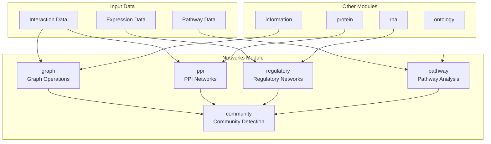
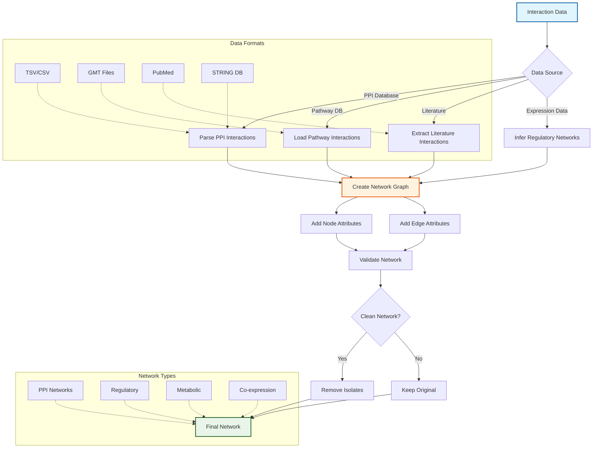
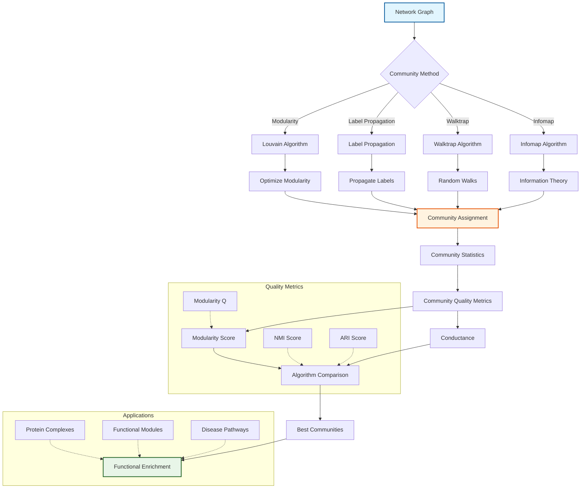
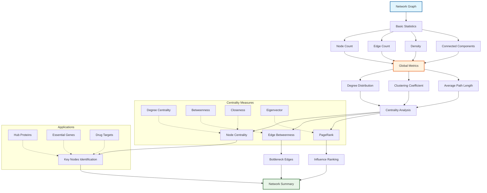
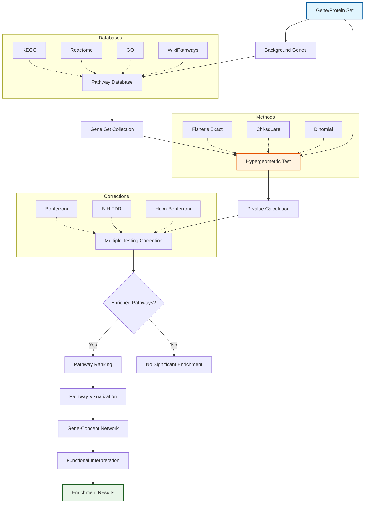

# Networks Module

The `networks` module provides tools for biological network analysis, including protein interaction networks, regulatory networks, pathway analysis, and community detection.

## Overview

This module handles various types of biological networks and provides algorithms for network construction, topology analysis, community detection, and functional enrichment. Supports both directed and undirected networks with weighted edges.

### Module Architecture



### Network Construction Pipeline



### Community Detection Framework



### Network Topology Analysis



### Pathway Enrichment Analysis



## Key Components

### Core Graph Operations (`graph.py`)
Fundamental network data structures and basic analysis.

**Usage:**
```python
from metainformant.networks import (
    create_network,
    network_metrics,
    centrality_measures,
    shortest_paths,
    export_network,
    import_network,
    network_similarity,
    filter_network,
    extract_subgraph
)

# Create network
network = create_network(["A", "B", "C", "D"], directed=False)
network.add_edge("A", "B", weight=0.8)
network.add_edge("B", "C", weight=0.6)

# Calculate metrics
metrics = network_metrics(network)
print(f"Nodes: {metrics['num_nodes']}, Edges: {metrics['num_edges']}")
print(f"Density: {metrics['density']:.3f}")

# Centrality analysis
centralities = centrality_measures(network)
print(f"Hub nodes: {sorted(centralities['degree'].items(), key=lambda x: x[1], reverse=True)[:3]}")

# Export and import networks
export_network(network, "network.json", format="json")
loaded_network = import_network("network.json", format="json")

# Network comparison
network2 = create_network(["A", "B", "C"])
network2.add_edge("A", "B", weight=0.9)
similarity = network_similarity(network, network2)
print(f"Edge Jaccard similarity: {similarity['edge_jaccard']:.3f}")

# Filter and extract subgraphs
filtered = filter_network(network, min_edge_weight=0.7, min_degree=1)
subgraph = extract_subgraph(network, ["A", "B", "C"])
```

### Protein-Protein Interaction Networks (`ppi.py`)
Analysis of protein-protein interaction networks.

**Key Features:**
- PPI network construction from databases (STRING format)
- Network topology analysis and hub identification
- Interaction prediction from feature data
- Functional enrichment analysis
- Protein complex detection
- Protein similarity calculation
- Network-based partner identification

**Usage:**
```python
from metainformant.networks import (
    ProteinNetwork,
    load_string_interactions,
    predict_interactions
)
import numpy as np

# Load from STRING database
ppi_network = load_string_interactions(
    "string_interactions.tsv",
    score_threshold=700,  # High confidence
    limit_organisms=["9606"]  # Human only
)

# Create network with confidence filtering
network = ppi_network.create_network(min_confidence=0.7)

# Network statistics
stats = ppi_network.network_statistics()
print(f"Hub proteins: {stats['hub_proteins']}")

# Get protein partners
partners = ppi_network.get_protein_partners("P12345", min_confidence=0.7)

# Pathway similarity
similarity = pathway_net.pathway_similarity("pathway1", "pathway2", method="jaccard")
print(f"Partners of P12345: {partners}")

# Calculate protein similarity
similarity = protein_similarity(ppi_network, "P12345", "P67890")
print(f"Jaccard similarity: {similarity['jaccard_similarity']:.3f}")

# Detect protein complexes
complexes = detect_complexes(ppi_network, min_confidence=0.7, min_size=3)
print(f"Found {len(complexes)} complexes")

# Predict interactions from features
features = np.random.randn(100, 50)  # 100 proteins, 50 features
protein_ids = [f"P{i:05d}" for i in range(100)]
predicted_ppi = predict_interactions(
    features, protein_ids,
    method="correlation",
    threshold=0.8
)

# Export to STRING format
export_to_string_format(ppi_network, "output.tsv", score_threshold=400)
```

### Regulatory Networks (`regulatory.py`)
Gene regulatory network inference and analysis.

**Key Features:**
- GRN inference from expression data (correlation, mutual information, Granger causality)
- Regulatory motif detection (feed-forward loops, feedback loops, bifans)
- Master regulator identification
- Pathway regulation analysis
- Regulatory cascade detection
- Regulation validation and evidence

**Usage:**
```python
from metainformant.networks import (
    GeneRegulatoryNetwork,
    infer_grn,
    regulatory_motifs
)
import numpy as np

# Infer regulatory network from expression data
expression = np.random.randn(100, 200)  # 100 samples, 200 genes
gene_names = [f"GENE_{i}" for i in range(200)]
tf_list = [f"GENE_{i}" for i in range(50)]  # First 50 are TFs

grn = infer_grn(
    expression, gene_names,
    method="correlation",
    tf_list=tf_list,
    threshold=0.75
)

# Regulatory statistics
stats = grn.regulatory_statistics()
print(f"Master regulators: {stats['master_regulators']}")

# Detect regulatory motifs
motifs = regulatory_motifs(grn, motif_types=["feed_forward_loop", "feedback_loop"])
print(f"Feed-forward loops: {len(motifs['feed_forward_loop'])}")

# Detect regulatory cascades
cascades = detect_regulatory_cascades(grn, max_length=5, min_confidence=0.6)
print(f"Found {len(cascades)} regulatory cascades")

# Validate specific regulation
validation = validate_regulation(grn, "TF1", "GENE1", min_confidence=0.5)
if validation["exists"]:
    print(f"Confidence: {validation['confidence']:.3f}")
    print(f"Network support: {validation['network_support']}")
```

### Pathway Analysis (`pathway.py`)
Biological pathway enrichment and analysis.

**Key Features:**
- Pathway database loading (GMT, CSV, TSV formats)
- Pathway overlap analysis
- Gene set enrichment analysis (with hypergeometric test)
- Network-based pathway enrichment
- Pathway similarity calculation
- Pathway activity scoring

**Usage:**
```python
from metainformant.networks import (
    PathwayNetwork,
    pathway_enrichment,
    load_pathway_database
)

# Create pathway network
pn = PathwayNetwork(name="KEGG_pathways")
pn.add_pathway(
    "path:00010",
    ["GENE1", "GENE2", "GENE3", "GENE4"],
    metadata={"name": "Glycolysis"}
)
pn.add_pathway("path:00020", ["GENE2", "GENE5", "GENE6"])

# Pathway enrichment
query_genes = ["GENE1", "GENE2", "GENE3"]
enrichment = pathway_enrichment(query_genes, pn)

for result in enrichment[:5]:  # Top 5 enriched pathways
    print(f"{result['pathway_id']}: fold_enrichment={result['fold_enrichment']:.2f}, p={result['p_value']:.4f}")

# Calculate pathway similarity
path1_genes = pn.get_pathway_genes("path:00010")
path2_genes = pn.get_pathway_genes("path:00020")
similarity = pathway_similarity(path1_genes, path2_genes, method="jaccard")
print(f"Pathway similarity: {similarity:.3f}")

# Calculate pathway activity from expression
expression_data = {"GENE1": 10.5, "GENE2": 8.2, "GENE3": 12.1, "GENE4": 9.8}
activity = pathway_activity_score(pn, "path:00010", expression_data, method="mean")
print(f"Pathway activity: {activity:.2f}")

# Load from file
pathway_db = load_pathway_database("kegg_pathways.gmt", format="gmt")
```

### Community Detection (`community.py`)
Network community/module detection algorithms.

**Key Features:**
- Multiple algorithms (Louvain, Leiden, Greedy) with improved implementations
- Modularity calculation with optimized delta-Q formula
- Community metrics and analysis
- Hierarchical community detection
- Community stability assessment
- Resolution parameter optimization
- Community comparison utilities

**Usage:**
```python
from metainformant.networks import (
    detect_communities,
    modularity,
    community_metrics
)

# Detect communities using Louvain algorithm
communities = detect_communities(
    network,
    method="louvain",
    resolution=1.0,
    seed=42
)

# Calculate modularity
mod = modularity(network, communities)
print(f"Modularity: {mod:.3f}")

# Community metrics
metrics = community_metrics(network, communities)
print(f"Number of communities: {metrics['num_communities']}")
print(f"Average community size: {metrics['avg_community_size']:.1f}")

# Hierarchical community detection
hierarchies = hierarchical_communities(network, levels=3, resolution=1.0)
print(f"Level 0 (finest): {len(set(hierarchies[0].values()))} communities")
print(f"Level 2 (coarsest): {len(set(hierarchies[2].values()))} communities")

# Community stability assessment
stability = community_stability(network, method="louvain", n_runs=10)
print(f"Stability score: {stability['stability_score']:.3f}")
print(f"Average modularity: {stability['avg_modularity']:.3f}")

# Optimize resolution parameter
optimization = optimize_resolution(network, resolution_range=(0.5, 2.0), n_points=20)
print(f"Optimal resolution: {optimization['optimal_resolution']:.2f}")

# Compare community partitions
communities2 = detect_communities(network, method="leiden", resolution=1.5)
comparison = compare_communities(communities, communities2)
print(f"Normalized mutual information: {comparison['normalized_mutual_information']:.3f}")
```

## Integration with Other Modules

### With Multi-Omics Module
```python
from metainformant.multiomics import MultiOmicsData, joint_pca
from metainformant.networks import predict_interactions, create_network

# Use multi-omics data for network construction
omics_data = MultiOmicsData(
    genomics=genomics_df,
    transcriptomics=transcriptomics_df,
    proteomics=proteomics_df
)

# Predict protein interactions from proteomics data
features = omics_data.get_layer("proteomics").values.T
protein_ids = omics_data.get_layer("proteomics").columns.tolist()
ppi = predict_interactions(features, protein_ids, method="coexpression")

# Create network from predicted interactions
network = create_network(protein_ids, directed=False)
for prot1, prot2, score in ppi:
    network.add_edge(prot1, prot2, weight=score)
```

### With Ontology Module
```python
from metainformant.networks import detect_communities, pathway_enrichment
from metainformant.ontology import load_go_obo, ancestors

# Functional enrichment of network modules
network_modules = detect_communities(protein_network, method="louvain")

# Load GO for enrichment analysis
go_onto = load_go_obo("go-basic.obo")

# Enrich each module with GO terms
for module_id, module_genes in network_modules.items():
    # Pathway enrichment for module
    enriched = pathway_enrichment(list(module_genes), pathway_db)
    # Use GO for functional annotation
    for gene in module_genes:
        broader_terms = ancestors(go_onto, f"GO:0008150")
```

### With Pathway Module
```python
from metainformant.networks import PathwayNetwork, pathway_enrichment
from metainformant.networks import detect_communities

# Pathway-based network analysis
pathway_db = PathwayNetwork.load_from_database("kegg_pathways.json")

# Enrich network communities with pathways
communities = detect_communities(protein_network, method="leiden")
for module_id, module_genes in network_modules.items():
    enriched_pathways = pathway_enrichment(
        list(module_genes), 
        pathway_db,
        background_size=20000
    )
    # Analyze pathway overlap and regulation
```

### With Visualization Module
```python
from metainformant.networks import ProteinNetwork, load_string_interactions
from metainformant.visualization import network_plot, heatmap

# Visualize protein interaction networks
ppi_network = load_string_interactions("string_file.tsv", score_threshold=400)
network = ppi_network.create_network()

# Create network visualization
ax = network_plot(network, layout="spring", node_size=100)

# Visualize community structure
communities = detect_communities(network, method="louvain")
# Create heatmap of community membership
community_matrix = create_community_matrix(network, communities)
ax = heatmap(community_matrix, title="Network Community Structure")
```

## Performance Features

- Efficient graph algorithms for large networks
- Parallel community detection
- Memory-optimized network storage
- Streaming processing for very large networks

## Testing

Comprehensive tests cover:
- Network construction accuracy
- Algorithm correctness validation
- Performance with large networks
- Integration with external databases

## Advanced Features

### Network Export/Import
- Export networks to JSON, CSV, and GraphML formats
- Import networks from various file formats
- Preserve node attributes and edge weights

### Network Comparison
- Calculate Jaccard similarity between networks
- Compare edge structures and weights
- Network union and intersection operations

### Filtering and Subgraph Extraction
- Filter by node degree, edge weight, or component size
- Extract subgraphs containing specific nodes
- Remove nodes/edges with validation

### Performance Optimizations
- Optimized modularity gain calculation (delta-Q formula)
- Improved Leiden algorithm with proper refinement
- Efficient shortest path algorithms
- Community detection with incremental updates

## Troubleshooting

### Common Issues

**Import errors for mutual information:**
- Ensure either `information` or `ml.features` module is available
- The module will try both automatically and provide clear error messages

**Community detection gives different results:**
- Community detection algorithms are stochastic (use `seed` parameter for reproducibility)
- Use `community_stability()` to assess robustness
- Try different resolution parameters with `optimize_resolution()`

**Large network performance:**
- Use `filter_network()` to reduce network size before analysis
- Consider using `extract_subgraph()` for focused analysis
- Export/import can help with memory management

**Enrichment p-values are approximate:**
- Install scipy for proper hypergeometric test
- Module falls back to approximation if scipy unavailable

## Dependencies

- numpy: Core numerical operations
- pandas: Data manipulation (for STRING/CSV loading)
- scipy: Hypergeometric test for enrichment (optional but recommended)
- NetworkX: Optional, for advanced graph operations (not required)

## Performance Considerations

- **Large networks**: Use filtering and subgraph extraction to focus analysis
- **Community detection**: Louvain is fastest, Leiden is most accurate
- **Resolution optimization**: Use fewer points (n_points=10) for faster optimization
- **Stability assessment**: Reduce n_runs for faster assessment on large networks

This module provides tools for biological network analysis and interpretation.
