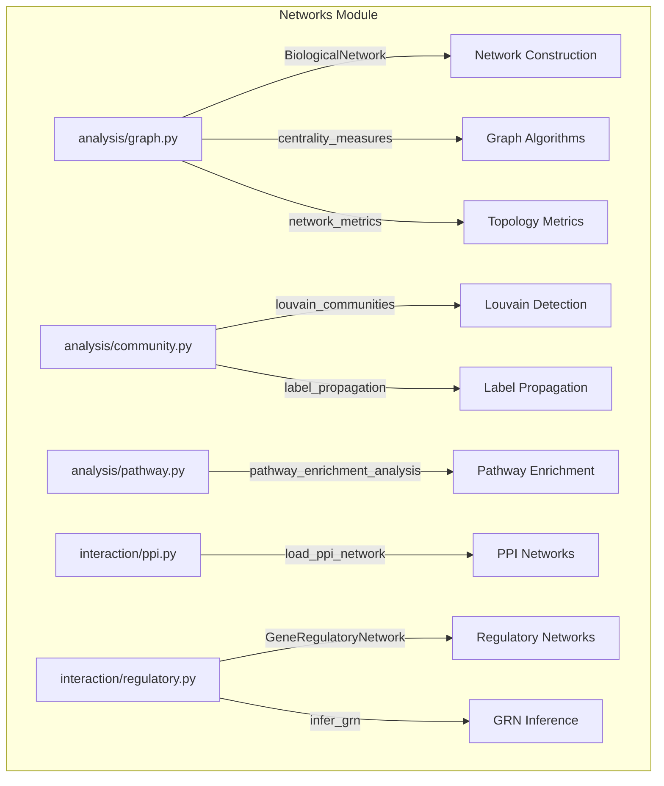

# Networks Module

Biological network construction, community detection, and pathway analysis for protein-protein interaction, regulatory, and co-expression networks.

## Architecture



## Key Capabilities

### Graph Construction and Analysis

```python
from metainformant.networks.analysis.graph import create_network, centrality_measures, network_metrics

# Build a biological network
G = create_network(nodes=["TP53", "BRCA1", "MDM2"], directed=False)

# Compute centrality and topology
centrality = centrality_measures(G, methods=["degree", "betweenness", "closeness"])
metrics = network_metrics(G)
```

### Community Detection

| Function | Module | Description |
|----------|--------|-------------|
| `louvain_communities` | `analysis.community` | Louvain modularity optimization |
| `label_propagation` | `analysis.community` | Label propagation clustering |
| `centrality_measures` | `analysis.graph` | Degree, betweenness, closeness centrality |
| `get_connected_components` | `analysis.graph` | Connected component extraction |

### Interaction Networks

| Function | Module | Description |
|----------|--------|-------------|
| `load_ppi_network` | `interaction.ppi` | Load PPI networks (TSV, BioPlex, IntAct) |
| `construct_regulatory_network` | `interaction.regulatory` | Build gene regulatory networks |
| `infer_grn` | `interaction.regulatory` | Infer GRN from expression data |
| `identify_regulatory_hubs` | `interaction.regulatory` | Find hub transcription factors |
| `analyze_regulatory_motifs` | `interaction.regulatory` | Detect feed-forward loops, cascades |

## Submodules

| Module | Purpose |
|--------|---------|
| [`analysis/`](analysis/) | Graph construction, community detection, pathway enrichment, topology |
| [`interaction/`](interaction/) | PPI network loading, regulatory network inference and motif analysis |

## Quick Start

```python
from metainformant.networks.analysis.graph import create_network, add_edges_from_interactions, centrality_measures
from metainformant.networks.analysis.community import louvain_communities
from metainformant.networks.analysis.pathway import pathway_enrichment_analysis

# Build and analyze a PPI network
G = create_network(nodes=gene_list)
G = add_edges_from_interactions(G, interaction_pairs)

# Detect protein complexes via community detection
communities = louvain_communities(G, resolution=1.0)

# Pathway enrichment on a gene set
enriched = pathway_enrichment_analysis(
    genes=["TP53", "BRCA1", "MDM2"],
    background_genes=all_genes,
    pathways=kegg_pathways,
    method="fisher",
)
```

## Integration

- **Protein** -- PPI networks from UniProt/InterPro feed into community detection
- **RNA** -- Co-expression networks from RNA-seq count matrices
- **Information** -- Transfer entropy and Granger causality for directed information flow
- **Ontology** -- GO enrichment on detected communities

## Related

- [`metainformant.protein`](../protein/) -- Protein sequence and structure analysis
- [`metainformant.information.network_info`](../information/network_info/) -- Information flow on networks
- [`metainformant.ontology`](../ontology/) -- GO and pathway enrichment
- [`docs/networks/`](../../../docs/networks/) -- Network analysis documentation
