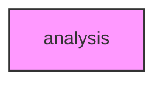

# ANALYSIS

## Overview
Functionality for analysis.

## 📦 Contents
- `[__init__.py](__init__.py)`
- `[community.py](community.py)`
- `[graph.py](graph.py)`
- `[pathway.py](pathway.py)`

## 📊 Structure



## Usage
Import module:
```python
from metainformant.metainformant.networks.analysis import ...
```
