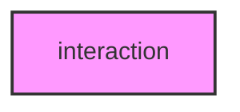

# INTERACTION

## Overview
Functionality for interaction.

## 📦 Contents
- `[__init__.py](__init__.py)`
- `[ppi.py](ppi.py)`
- `[regulatory.py](regulatory.py)`

## 📊 Structure



## Usage
Import module:
```python
from metainformant.metainformant.networks.interaction import ...
```
