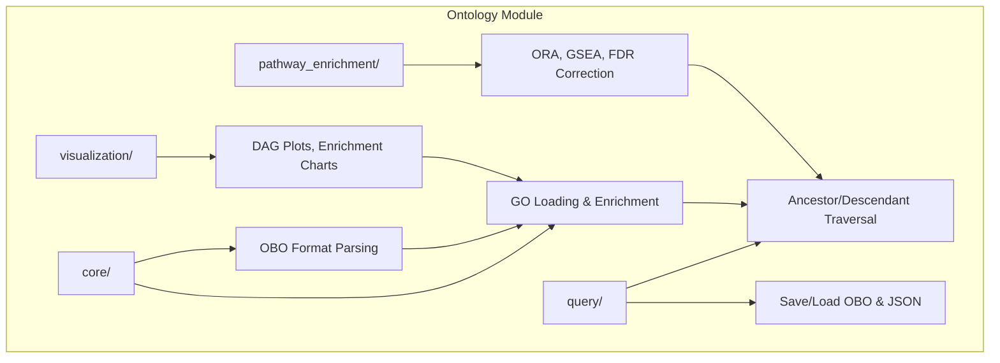

# Ontology Module

Gene ontology parsing, querying, enrichment analysis, and visualization for METAINFORMANT.

## Architecture



## Key Capabilities

### GO Loading & Enrichment

```python
from metainformant.ontology.core.obo import parse_obo
from metainformant.ontology.core.go import load_go_obo, enrich_genes, semantic_similarity

go = load_go_obo("data/go-basic.obo")
results = enrich_genes(go, gene_list=target_genes, background=all_genes)
sim = semantic_similarity(go, "GO:0008150", "GO:0003674", method="resnik")
```

| Function | Description |
|----------|-------------|
| `load_go_obo` | Load and validate GO ontology from OBO file |
| `enrich_genes` | Hypergeometric test with BH FDR correction |
| `semantic_similarity` | Resnik/Lin/Jiang semantic similarity between terms |
| `calculate_term_ic` | Information content from annotation frequency |

### Querying and Traversal

```python
from metainformant.ontology.query.query import ancestors, descendants, shortest_path

anc = ancestors(go, "GO:0008150")                           # All ancestor term IDs
path = shortest_path(go, "GO:0008150", "GO:0003674")        # Shortest connecting path
```

| Function | Description |
|----------|-------------|
| `ancestors` / `descendants` | Traverse `is_a` or custom relation types |
| `common_ancestors` / `most_informative_common_ancestor` | Shared ancestors, MICA |
| `shortest_path` / `distance` | Path length between terms |
| `get_roots` / `get_leaves` | Terminal nodes in the DAG |
| `find_terms_by_name` / `subgraph` | Pattern search, subontology extraction |

### Serialization & Visualization

```python
from metainformant.ontology.query.serialize import save_ontology, load_ontology
from metainformant.ontology.visualization.visualization import plot_go_dag

save_ontology(go, "output/ontology.json", format="json")
plot_go_dag(go, terms=["GO:0008150"], output_path="output/dag.png")
```

## Submodules

| Module | Purpose |
|--------|---------|
| [`core/`](core/) | GO ontology loading (`load_go_obo`), OBO parsing (`parse_obo`), `Ontology`/`Term`/`Relationship` types |
| [`query/`](query/) | Graph traversal (`ancestors`, `descendants`, `shortest_path`), serialization (`save_ontology`, `merge_ontologies`) |
| [`pathway_enrichment/`](pathway_enrichment/) | Over-representation analysis, GSEA, FDR correction, pathway networks |
| [`visualization/`](visualization/) | GO DAG plotting, enrichment bar/dot charts, semantic similarity matrices |

## Quick Start

```python
from metainformant.ontology.core.go import load_go_obo, enrich_genes
from metainformant.ontology.query.query import ancestors, descendants
from metainformant.ontology.query.serialize import save_ontology

# Load Gene Ontology
go = load_go_obo("data/go-basic.obo")

# Traverse the hierarchy
bio_process_ancestors = ancestors(go, "GO:0008150")
children = descendants(go, "GO:0003674", relation_type="is_a")

# Run enrichment
results = enrich_genes(go, gene_list=target_genes, background=all_genes)

# Export as JSON
save_ontology(go, "output/ontology/go_subset.json", format="json")
```

## Integration

- Gene lists from [`metainformant.rna`](../rna/) expression analysis feed into `enrich_genes`
- Network analysis in [`metainformant.networks`](../networks/) uses ontology-derived pathway graphs
- Visualization outputs integrate with [`metainformant.visualization`](../visualization/) themes

## Related

- [`metainformant.networks`](../networks/) -- Biological network analysis
- [`metainformant.rna`](../rna/) -- RNA expression for enrichment inputs
- [`metainformant.information`](../information/) -- Information-theoretic metrics
- [`docs/ontology/`](../../../docs/ontology/) -- Ontology documentation
- [`config/`](../../../config/) -- Configuration files
