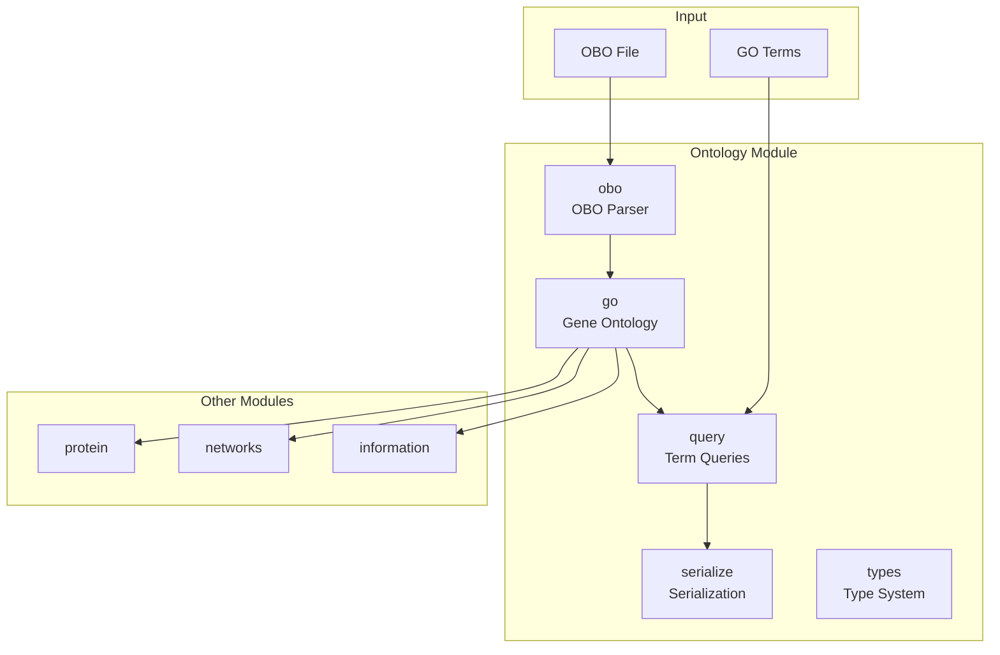
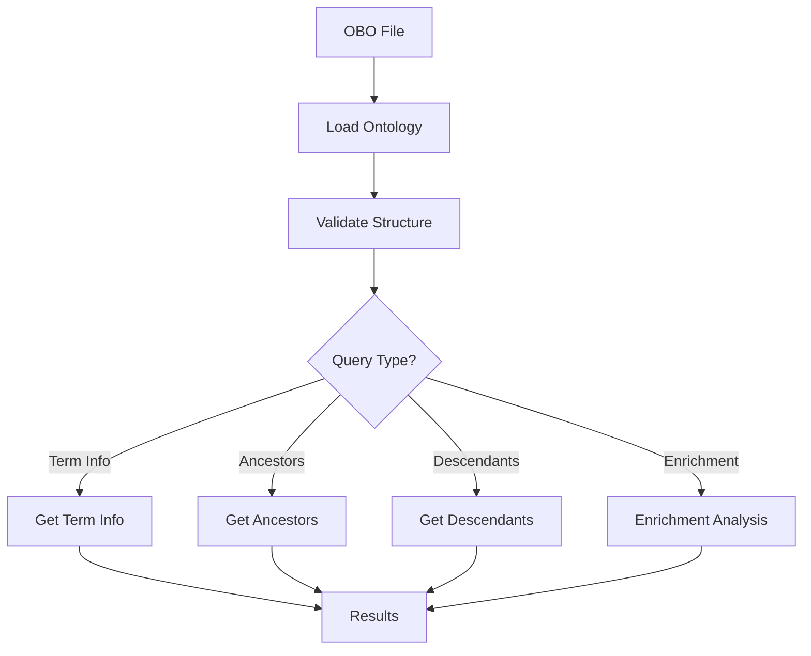

# Ontology Module

The `ontology` module provides tools for functional annotation and ontology analysis using biological ontologies like Gene Ontology (GO).

## Overview

This module handles ontology parsing, hierarchy traversal, term queries, and serialization. Provides lightweight, efficient tools for working with OBO-format ontologies without requiring external database connections. Includes error handling, validation, caching, and support for multiple relationship types.

### Module Architecture



### Ontology Analysis Workflow



## Key Components

### Gene Ontology Loading (`go.py`)
Load and work with Gene Ontology from OBO files.

**Usage:**
```python
from metainformant.ontology import load_go_obo, validate_go_ontology, write_go_summary
from pathlib import Path

# Load GO ontology from OBO file
onto = load_go_obo("data/go-basic.obo")

# Get basic statistics
print(f"Number of terms: {onto.num_terms()}")

# Validate ontology structure
is_valid, errors = validate_go_ontology(onto)
if not is_valid:
    print(f"Validation errors: {errors}")

# Write summary with statistics
summary_path = write_go_summary(onto)
print(f"Summary written to: {summary_path}")
```

### Ontology Types (`types.py`)
Core data structures for ontology representation.

**Usage:**
```python
from metainformant.ontology.types import Term, Ontology

# Create a term with relationships
term = Term(
    term_id="GO:0008150",
    name="biological_process",
    namespace="biological_process",
    definition="Any process accomplished by biological systems",
    is_a_parents=["GO:0003674"],
    relationships={"part_of": ["GO:001"]},  # Additional relationship types
    synonyms=["biological process", "BP"],
    xrefs=["Wikipedia:biological_process"],
    subsets=["goslim_generic"]
)

# Create ontology and add term
onto = Ontology()
onto.add_term(term)

# Check term existence and get term
if onto.has_term("GO:0008150"):
    term = onto.get_term("GO:0008150")
    print(f"Term namespace: {onto.get_namespace('GO:0008150')}")

# Validate ontology integrity
is_valid, errors = onto.validate()
if not is_valid:
    print(f"Validation errors: {errors}")

# Get relationships for a term
all_rels = onto.get_relationships("GO:0008150")
part_of_rels = onto.get_relationships("GO:0008150", rel_type="part_of")
```

### Ontology Queries (`query.py`)
Traverse ontology hierarchies and extract subgraphs.

**Usage:**
```python
from metainformant.ontology.query import (
    ancestors, descendants, subgraph, common_ancestors,
    path_to_root, distance, find_term_by_name,
    filter_by_namespace, get_roots, get_leaves
)

onto = load_go_obo("go.obo")

# Get all ancestor terms (broader terms)
ancestors_set = ancestors(onto, "GO:0008150")
print(f"Ancestors: {len(ancestors_set)} terms")

# Get all descendant terms (more specific terms)
descendants_set = descendants(onto, "GO:0008150")
print(f"Descendants: {len(descendants_set)} terms")

# Find common ancestors of two terms
common = common_ancestors(onto, "GO:0009987", "GO:0008150")
print(f"Common ancestors: {len(common)} terms")

# Get path from term to root
path = path_to_root(onto, "GO:0009987")
print(f"Path to root: {path}")

# Calculate distance between two terms
dist = distance(onto, "GO:0009987", "GO:0008150")
print(f"Distance: {dist}")

# Find terms by name
matches = find_term_by_name(onto, "biological process")
print(f"Found {len(matches)} matching terms")

# Filter by namespace
bp_onto = filter_by_namespace(onto, "biological_process")
print(f"Biological process terms: {bp_onto.num_terms()}")

# Get root and leaf terms
roots = get_roots(onto)
leaves = get_leaves(onto)
print(f"Root terms: {len(roots)}, Leaf terms: {len(leaves)}")

# Extract subgraph rooted at specific terms
sub_onto = subgraph(onto, ["GO:0008150"])
print(f"Subgraph size: {sub_onto.num_terms()} terms")
```

### OBO Parsing (`obo.py`)
Parse OBO format files into Ontology objects.

**Usage:**
```python
from metainformant.ontology.obo import parse_obo

# Parse OBO file
onto = parse_obo("go-basic.obo")

# Access terms
for term_id, term in onto.terms.items():
    print(f"{term_id}: {term.name}")
    if term.is_a_parents:
        print(f"  Parents: {term.is_a_parents}")
```

**Supported OBO Fields:**
- `id`: Term identifier
- `name`: Term name
- `namespace`: Ontology namespace
- `def`: Term definition
- `alt_id`: Alternative identifiers
- `is_a`: Parent relationships (is_a)
- `synonym`: Alternative names
- `xref`: Cross-references to other databases
- `subset`: GO subsets/slims
- Relationship types: `part_of`, `regulates`, `has_part`, and other custom relationships

## Integration with Other Modules

### With Networks Module
```python
from metainformant.networks import detect_communities
from metainformant.ontology import load_go_obo

# Functional analysis of network modules
communities = detect_communities(protein_network)

# Load GO for enrichment analysis
go_onto = load_go_obo("go-basic.obo")
# Use GO for functional annotation
```

### With Protein Module
```python
from metainformant.protein import parse_fasta
from metainformant.ontology import load_go_obo

# Load proteome
proteins = parse_fasta(Path("proteome.fasta"))

# Load GO for functional annotation
go_onto = load_go_obo("go-basic.obo")
# Use GO for protein functional annotation
```

### With Phenotype Module
```python
from metainformant.phenotype import load_antwiki_json
from metainformant.ontology import load_go_obo, ancestors

# Functional annotation of phenotypic traits
phenotype_data = load_antwiki_json(Path("antwiki_species.json"))

# Load GO for trait functional annotation
go_onto = load_go_obo("go-basic.obo")

# Map traits to GO terms and find broader categories
trait_term = "GO:0008150"  # biological_process
broader_terms = ancestors(go_onto, trait_term)
# Use GO hierarchy for trait categorization
```

## Serialization

Save and load ontologies to/from JSON format:

```python
from metainformant.ontology import save_ontology, load_ontology

# Save ontology
onto = load_go_obo("go.obo")
save_ontology(onto, "output/go_saved.json")

# Load ontology
loaded_onto = load_ontology("output/go_saved.json")
```

## Performance Features

- Efficient ontology traversal algorithms with BFS
- In-memory caching for expensive operations (ancestors/descendants)
- Memory-optimized data structures
- Optional caching controls

**Caching:**
```python
from metainformant.ontology import set_cache_enabled, set_cache_ttl, clear_cache

# Enable/disable caching
set_cache_enabled(True)

# Set cache TTL (default: 3600 seconds)
set_cache_ttl(7200)  # 2 hours

# Clear cache
clear_cache()

# Disable caching for individual calls
ancestors_set = ancestors(onto, "GO:0008150", use_cache=False)
```

## Error Handling

All functions include error handling:

```python
from metainformant.ontology import load_go_obo, ancestors
from metainformant.core.errors import ValidationError, IOError

try:
    onto = load_go_obo("nonexistent.obo")
except IOError as e:
    print(f"File error: {e}")

try:
    ancestors_set = ancestors(onto, "INVALID_TERM")
except ValueError as e:
    print(f"Invalid term: {e}")
```

## Testing

Comprehensive tests cover:
- Ontology parsing accuracy with various OBO formats
- Hierarchy traversal correctness
- Error handling and validation
- Serialization round-trip integrity
- Edge cases (empty ontologies, cycles, orphaned terms)

Run tests:
```bash
python -m pytest tests/test_ontology_*.py -v
```

## Advanced Features (Require External Dependencies)

Enrichment analysis and semantic similarity functions are available but require additional dependencies:

```python
from metainformant.ontology import enrich_genes, semantic_similarity

# Requires scipy: pip install scipy
# Requires gene-to-term mappings (GAF/GPAD format)

gene_to_terms = {"GENE1": {"GO:0008150"}, "GENE2": {"GO:0008150"}}
genes = ["GENE1", "GENE2"]

# Enrichment analysis (placeholder - requires scipy)
# result = enrich_genes(genes, None, onto, gene_to_terms)

# Semantic similarity (placeholder - requires scipy and annotations)
# similarity = semantic_similarity(onto, "GO:0008150", "GO:0009987")
```

**Note**: These functions are placeholders that raise `ImportError` if `scipy` is not installed. Full implementation requires:
- `scipy` package for statistical tests
- GAF/GPAD file parsers for gene annotations
- Information content calculations

## Limitations

- Enrichment analysis and semantic similarity are placeholder implementations requiring scipy
- Complex OBO qualifiers and advanced features may require specialized libraries
- Caching is in-memory only (not persistent across sessions)

## Dependencies

- Core utilities: `metainformant.core` (io, logging, paths, errors, validation)
- No external dependencies required for basic functionality

This module provides essential tools for ontology analysis and functional annotation in biological research.
