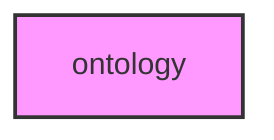

# ONTOLOGY

## Overview
Gene ontology and functional annotation module for METAINFORMANT.

## 📦 Contents
- `[__init__.py](__init__.py)`
- `[go.py](go.py)`
- `[obo.py](obo.py)`
- `[query.py](query.py)`
- `[serialize.py](serialize.py)`
- `[types.py](types.py)`
- `[visualization.py](visualization.py)`

## 📊 Structure



## Usage
Import module:
```python
from metainformant.metainformant.ontology import ...
```
