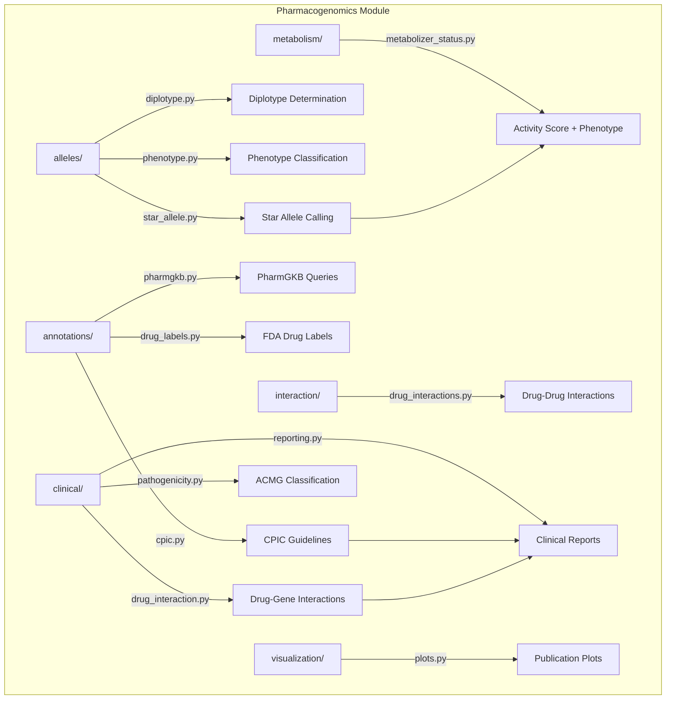

# Pharmacogenomics Module

Clinical pharmacogenomic analysis: star allele calling, metabolizer phenotyping, CPIC guideline lookups, drug interaction prediction, and report generation.

## Architecture



## Submodules

| Module | Purpose |
|--------|---------|
| [`alleles/`](alleles/) | Star allele calling, diplotype determination, phenotype classification |
| [`annotations/`](annotations/) | CPIC guideline lookups, PharmGKB queries, FDA drug label parsing |
| [`metabolism/`](metabolism/) | CPIC activity score computation, metabolizer phenotype prediction |
| [`interaction/`](interaction/) | Drug-drug interaction prediction, polypharmacy risk, CYP profiling |
| [`clinical/`](clinical/) | ACMG variant classification, drug-gene analysis, clinical reports |
| [`visualization/`](visualization/) | Metabolizer distributions, allele frequencies, drug response heatmaps |

## Key Capabilities

### Star Allele Calling

| Class/Function | Description |
|----------------|-------------|
| `StarAllele` | Dataclass representing a pharmacogene star allele with activity value |
| `call_star_alleles` | Identify star alleles from observed variants |
| `detect_novel_alleles` | Flag variants not matching known allele definitions |
| `handle_cyp2d6_cnv` | CYP2D6 copy number variation handling |

### Metabolizer Prediction

| Function | Description |
|----------|-------------|
| `predict_metabolizer_status` | Full pipeline: genotype to metabolizer phenotype |
| `compute_activity_score` | Sum allele function values into CPIC activity score |
| `classify_metabolizer` | Map activity score to phenotype (PM/IM/NM/RM/UM) |
| `dose_adjustment` | Evidence-based dose adjustment recommendations |

### Guideline Annotations

| Function | Description |
|----------|-------------|
| `lookup_drug_gene` | Query CPIC drug-gene pair data |
| `get_dosing_recommendation` | Phenotype-specific dosing guidance |
| `list_actionable_genes` | List genes with CPIC Level A/B evidence |
| `parse_cpic_allele_definitions` | Parse allele definition tables |

### Drug Interactions & Clinical

| Function | Description |
|----------|-------------|
| `predict_drug_interaction` | Predict interactions between drug pairs |
| `polypharmacy_risk` | Assess risk from multiple concurrent medications |
| `cyp_inhibition_prediction` | CYP enzyme inhibition/induction profiling |
| `generate_clinical_report` | Comprehensive pharmacogenomic report generation |
| `export_report` | Export reports in text, HTML, or JSON format |

## Quick Start

```python
from metainformant.pharmacogenomics import predict_metabolizer
from metainformant.pharmacogenomics.annotations.cpic import get_dosing_recommendation
from metainformant.pharmacogenomics.clinical.reporting import generate_clinical_report

# Predict metabolizer status from diplotype
result = predict_metabolizer(
    gene="CYP2D6",
    diplotype=("*1", "*4"),
)
# result = {"phenotype": "Intermediate Metabolizer", "activity_score": 1.0, ...}

# Get dosing recommendation
rec = get_dosing_recommendation(drug="codeine", gene="CYP2D6", phenotype="Poor Metabolizer")

# Generate clinical report
report = generate_clinical_report(
    patient_data={"id": "P001"},
    genotypes={"CYP2D6": {"diplotype": ("*1", "*4")}},
    drugs=["codeine", "tramadol"],
)
```

## Related

- [docs/pharmacogenomics/](../../../docs/pharmacogenomics/) - CPIC, ACMG, star allele documentation
- [metainformant.gwas](../gwas/) - GWAS variant data for pharmacogenomic loci
- [metainformant.dna.variation](../dna/variation/) - Variant calling upstream of star allele analysis
