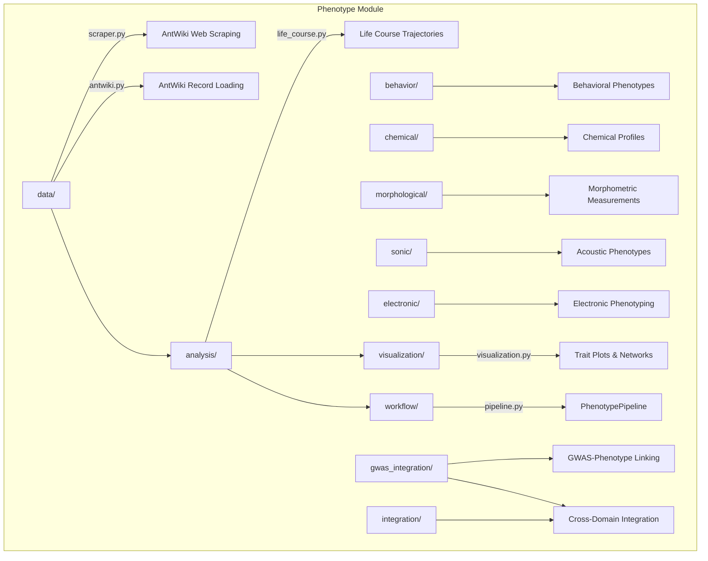

# Phenotype Module

Multi-modal phenotype analysis for social insects -- morphological traits, behavioral patterns, chemical profiles, life course trajectories, and AntWiki data integration.

## Architecture



## Key Capabilities

### Life Course Analysis

```python
from metainformant.phenotype.analysis.life_course import Event, EventSequence, extract_phenotypes_from_events

seq = EventSequence(person_id="colony_1")
seq.add_event(Event(timestamp=0.0, event_type="founding"))
seq.add_event(Event(timestamp=30.0, event_type="first_workers"))

phenotypes = extract_phenotypes_from_events(seq)
```

| Function | Description |
|----------|-------------|
| `extract_phenotypes_from_events` | Derive trait values from event sequences |
| `analyze_life_course_trajectories` | Population-level trajectory statistics |
| `identify_critical_periods` | Detect sensitive developmental windows |
| `predict_life_course_outcomes` | Forecast outcomes from early events |

### AntWiki Data

```python
from metainformant.phenotype.data.scraper import AntWikiScraperConfig
from metainformant.phenotype.data.antwiki import AntWikiRecord

config = AntWikiScraperConfig(delay_seconds=2.0, max_retries=3)
record = AntWikiRecord({"species_name": "Pogonomyrmex barbatus", "genus": "Pogonomyrmex"})
```

### Visualization

| Function | Description |
|----------|-------------|
| `plot_trait_distribution` | Histograms and density plots for traits |
| `plot_trait_correlation_matrix` | Correlation heatmaps across traits |
| `plot_life_course_trajectory` | Timeline plots for event sequences |
| `plot_morphological_measurements` | Morphometric comparison charts |
| `plot_phenotype_pca` | PCA scatter of phenotypic space |

## Submodules

| Module | Purpose |
|--------|---------|
| [`analysis/`](analysis/) | Life course trajectories, temporal phenotype extraction |
| [`behavior/`](behavior/) | Behavioral phenotype classification |
| [`chemical/`](chemical/) | Cuticular hydrocarbon and chemical profiles |
| [`data/`](data/) | AntWiki scraping (`AntWikiScraperConfig`) and record loading (`AntWikiRecord`) |
| [`electronic/`](electronic/) | Electronic phenotyping methods |
| [`gwas_integration/`](gwas_integration/) | GWAS-phenotype association linking |
| [`integration/`](integration/) | Cross-domain phenotype integration |
| [`morphological/`](morphological/) | Morphometric trait measurement and analysis |
| [`sonic/`](sonic/) | Acoustic phenotype recording and analysis |
| [`visualization/`](visualization/) | Trait distribution, correlation, trajectory plots |
| [`workflow/`](workflow/) | `PhenotypePipeline` for end-to-end analysis |

## Quick Start

```python
from metainformant.phenotype.analysis.life_course import EventSequence, Event, analyze_life_course

sequences = [
    EventSequence(person_id="colony_1", events=[
        Event(timestamp=0.0, event_type="founding"),
        Event(timestamp=45.0, event_type="mature_colony"),
    ])
]
results = analyze_life_course(sequences, outcomes=["survival"])
```

## Related

- [`metainformant.life_events`](../life_events/) -- General event sequence modeling
- [`metainformant.gwas`](../gwas/) -- GWAS association analysis
- [`metainformant.ecology`](../ecology/) -- Community and ecological context
- [`docs/phenotype/`](../../../docs/phenotype/) -- Phenotype documentation
