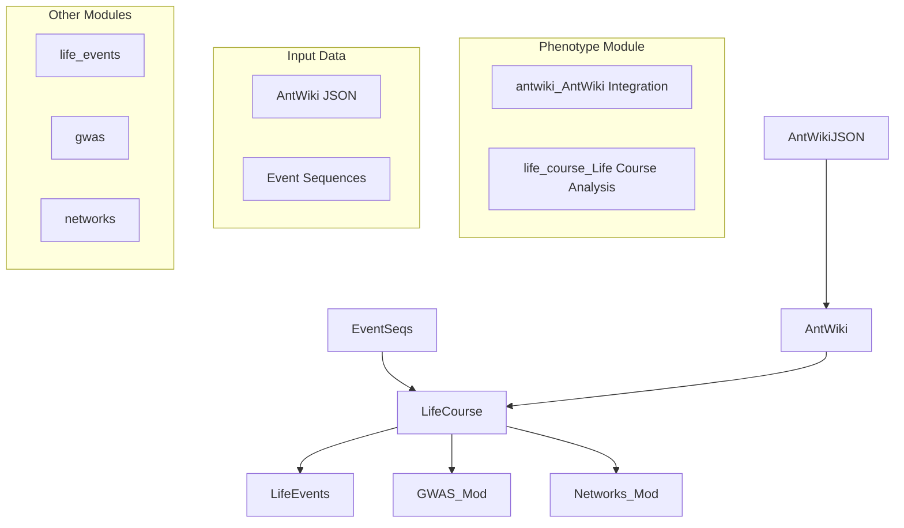

# Phenotype Module

The `phenotype` module provides tools for phenotypic trait analysis, curation, and integration with genotypic data.

## Overview

This module handles morphological and behavioral phenotype data, including loading from structured JSON files (e.g., AntWiki format). Enables phenotype-genotype association studies and morphological trait analysis.

### Module Architecture



### AntWiki Data Processing Pipeline

```mermaid
graph TD
    AantwikiDataSources[AntWiki Data Sources] --> B{Data Type}
    B -->|JSON Files| CloadJsonFiles[Load JSON Files]
    B -->|Web Scraping| DscrapeAntwiki[Scrape AntWiki]

    C --> EparseJsonStructure[Parse JSON Structure]
    D --> FhtmlParsing[HTML Parsing]

    E --> GextractFields[Extract Fields]
    F --> G

    G --> HvalidateData[Validate Data]
    H --> I{Clean Data?}

    I -->|Yes| JdataCleaning[Data Cleaning]
    I -->|No| KrawData[Raw Data]

    J --> LstandardizedFormat[Standardized Format]
    K --> L

    L --> MphenotypeCategories[Phenotype Categories]
    M --> NmorphologicalTraits[Morphological Traits]
    M --> ObehavioralTraits[Behavioral Traits]
    M --> PecologicalTraits[Ecological Traits]

    N --> QmeasurementsDb[Measurements DB]
    O --> Q
    P --> Q

    Q --> RanalysisReady[Analysis Ready]


    subgraph "Data Fields"
        SspeciesInfo[Species Info] -.-> G
        T[Measurements] -.-> G
        U[Traits] -.-> G
        V[Taxonomy] -.-> G
        W[Distribution] -.-> G
    end

    subgraph "Quality Control"
        XmissingValues[Missing Values] -.-> H
        Y[Outliers] -.-> H
        ZdataTypes[Data Types] -.-> H
        AA[Consistency] -.-> H
    end

    subgraph "Trait Types"
        BB[Morphometric] -.-> N
        CC[Coloration] -.-> N
        DD[Behavior] -.-> O
        EE[Ecology] -.-> P
    end
```



### Life Course Phenotype Analysis

```mermaid
graph TD
    AeventSequences[Event Sequences] --> BeventParsing[Event Parsing]
    B --> CextractPhenotypes[Extract Phenotypes]

    C --> DtemporalWindows[Temporal Windows]
    D --> EwindowAggregation[Window Aggregation]

    E --> FtraitCategories[Trait Categories]
    F --> GmorphologicalChanges[Morphological Changes]
    F --> HbehavioralPatterns[Behavioral Patterns]
    F --> IdevelopmentalStages[Developmental Stages]

    G --> JgrowthTrajectories[Growth Trajectories]
    H --> KactivityPatterns[Activity Patterns]
    I --> LlifeStageTransitions[Life Stage Transitions]

    J --> MstatisticalAnalysis[Statistical Analysis]
    K --> M
    L --> M

    M --> NphenotypeNetworks[Phenotype Networks]
    N --> OassociationMining[Association Mining]

    O --> PkeyPhenotypes[Key Phenotypes]
    P --> QbiologicalInsights[Biological Insights]


    subgraph "Event Types"
        R[Developmental] -.-> B
        S[Morphological] -.-> B
        T[Behavioral] -.-> B
        U[Environmental] -.-> B
    end

    subgraph "Time Windows"
        VearlyDevelopment[Early Development] -.-> D
        W[Juvenile] -.-> D
        X[Adult] -.-> D
        Y[Senescence] -.-> D
    end

    subgraph "Analysis Methods"
        ZtrajectoryModeling[Trajectory Modeling] -.-> M
        AApatternRecognition[Pattern Recognition] -.-> M
        BBnetworkAnalysis[Network Analysis] -.-> N
        CCassociationRules[Association Rules] -.-> O
    end
```



### Phenotype-Genotype Association Analysis

```mermaid
graph TD
    AphenotypeData[Phenotype Data] --> BgenotypeData[Genotype Data]
    B --> CsampleMatching[Sample Matching]

    A --> DphenotypeProcessing[Phenotype Processing]
    D --> EnormalizeTraits[Normalize Traits]
    E --> FqualityControl[Quality Control]

    C --> GassociationTesting[Association Testing]
    F --> G

    G --> H{Association Method}
    H -->|Linear Regression| IquantitativeTraits[Quantitative Traits]
    H -->|Logistic Regression| JbinaryTraits[Binary Traits]
    H -->|ANOVA| KcategoricalTraits[Categorical Traits]
    H -->|Correlation| LcontinuousTraits[Continuous Traits]

    I --> MstatisticalResults[Statistical Results]
    J --> M
    K --> M
    L --> M

    M --> NmultipleTestingCorrection[Multiple Testing Correction]
    N --> OsignificantAssociations[Significant Associations]

    O --> PmanhattanPlot[Manhattan Plot]
    O --> QqqPlot[QQ Plot]
    O --> RregionalPlot[Regional Plot]

    P --> Sgenome-wideView[Genome-wide View]
    Q --> S
    R --> S

    S --> TcandidateGenes[Candidate Genes]
    T --> UfunctionalValidation[Functional Validation]


    subgraph "Phenotype Types"
        V[Morphometric] -.-> D
        W[Behavioral] -.-> D
        X[Physiological] -.-> D
        Y[Developmental] -.-> D
    end

    subgraph "Genotype Data"
        ZvcfFiles[VCF Files] -.-> B
        AAplinkFormat[PLINK Format] -.-> B
        BBgenotypeMatrix[Genotype Matrix] -.-> B
    end

    subgraph "Correction Methods"
        CC[Bonferroni] -.-> N
        DD[FDR] -.-> N
        EE[Permutation] -.-> N
    end
```



### Web Scraping and Data Collection

```mermaid
graph TD
    AantwikiWebsite[AntWiki Website] --> BdiscoverSpecies[Discover Species]
    B --> CspeciesList[Species List]

    C --> D{Scraping Strategy}
    D -->|Single Species| EscrapeOnePage[Scrape One Page]
    D -->|Batch Scraping| FscrapeMultiple[Scrape Multiple]

    E --> GparseHtml[Parse HTML]
    F --> HqueueManagement[Queue Management]

    G --> IextractContent[Extract Content]
    H --> I

    I --> JdataSections[Data Sections]
    J --> KmorphologicalData[Morphological Data]
    J --> LbehavioralData[Behavioral Data]
    J --> MecologicalData[Ecological Data]
    J --> NtaxonomicData[Taxonomic Data]

    K --> OstructuredFormat[Structured Format]
    L --> O
    M --> O
    N --> O

    O --> PqualityValidation[Quality Validation]
    P --> Q{Save Results}
    Q -->|Individual Files| RperSpeciesFile[Per Species File]
    Q -->|Combined| SmasterDataset[Master Dataset]

    R --> T[Storage]
    S --> T

    T --> UanalysisPipeline[Analysis Pipeline]


    subgraph "Scraping Controls"
        VrateLimiting[Rate Limiting] -.-> D
        WerrorHandling[Error Handling] -.-> D
        XprogressTracking[Progress Tracking] -.-> F
        Y[Checkpoint/Resume] -.-> F
    end

    subgraph "Content Sections"
        ZmeasurementsTable[Measurements Table] -.-> K
        AAtraitDescriptions[Trait Descriptions] -.-> L
        BBdistributionMaps[Distribution Maps] -.-> M
        CCtaxonomyInfo[Taxonomy Info] -.-> N
    end

    subgraph "Output Formats"
        DD[JSON] -.-> R
        EE[CSV] -.-> S
        FF[Database] -.-> T
    end
```



### Phenotype Data Integration Framework

```mermaid
graph TD
    AmultiplePhenotypeSources[Multiple Phenotype Sources] --> BdataHarmonization[Data Harmonization]
    B --> CstandardSchema[Standard Schema]

    A --> Dsource-specificProcessing[Source-specific Processing]
    D --> EformatConversion[Format Conversion]
    E --> FunitStandardization[Unit Standardization]

    C --> GintegratedDataset[Integrated Dataset]
    F --> G

    G --> HqualityAssessment[Quality Assessment]
    H --> IcompletenessCheck[Completeness Check]
    I --> JconsistencyCheck[Consistency Check]
    J --> KoutlierDetection[Outlier Detection]

    K --> L{Clean Data?}
    L -->|Yes| MdataCleaning[Data Cleaning]
    L -->|No| NflagIssues[Flag Issues]

    M --> OfinalDataset[Final Dataset]
    N --> O

    O --> Pcross-sourceValidation[Cross-source Validation]
    P --> QintegratedPhenotypes[Integrated Phenotypes]

    Q --> RdownstreamAnalysis[Downstream Analysis]
    R --> SbiologicalInsights[Biological Insights]


    subgraph "Data Sources"
        T[AntWiki] -.-> A
        UfieldObservations[Field Observations] -.-> A
        V[Literature] -.-> A
        W[Databases] -.-> A
    end

    subgraph "Harmonization Steps"
        XtermMapping[Term Mapping] -.-> B
        YunitConversion[Unit Conversion] -.-> F
        ZscaleNormalization[Scale Normalization] -.-> F
    end

    subgraph "Quality Metrics"
        AAmissingRate[Missing Rate] -.-> H
        BBmeasurementError[Measurement Error] -.-> H
        CCbiologicalPlausibility[Biological Plausibility] -.-> H
    end
```



## Key Components

### AntWiki Integration (`antwiki.py`)
Load phenotype data from AntWiki JSON files.

**Usage:**
```python
from metainformant.phenotype.antwiki import load_antwiki_json
from metainformant.core.io import write_json
from metainformant.core.paths import expand_and_resolve
from pathlib import Path

# Load AntWiki phenotype data with error handling
try:
    data_path = expand_and_resolve("data/antwiki_species.json")
    data = load_antwiki_json(data_path)
    
    # Each entry contains species phenotype information
    for species_data in data:
        species_name = species_data.get("species") or species_data.get("taxon", "unknown")
        measurements = species_data.get("measurements", {})
        traits = species_data.get("traits", [])
        
        print(f"{species_name}: {len(traits)} traits, {len(measurements)} measurements")
        
except FileNotFoundError as e:
    print(f"File not found: {e}")
except Exception as e:
    print(f"Error loading data: {e}")
```

**Error Handling:**
The function raises `FileNotFoundError` for missing files, `IOError` from `core.errors` for file read issues, and `ValidationError` for invalid data structures.

### AntWiki Web Scraping (`scraper.py`)
Comprehensive web scraping of AntWiki species pages to extract all sections including measurements, traits, taxonomy, distribution, and descriptions.

**Cloudflare Protection:** The scraper automatically uses `cloudscraper` if available to bypass Cloudflare protection. Install with:
```bash
uv pip install cloudscraper
# Or install optional dependencies:
uv pip install metainformant[scraping]
```

If `cloudscraper` is not available, the scraper falls back to `requests` but may fail on Cloudflare-protected sites.

**Usage:**
```python
from metainformant.phenotype.scraper import AntWikiScraper, load_scraper_config
from pathlib import Path

# Load configuration (with environment variable overrides)
config = load_scraper_config()

# Initialize scraper (automatically uses cloudscraper if available)
scraper = AntWikiScraper(config)

# Scrape single species
data = scraper.scrape_species_page("Camponotus_pennsylvanicus")
print(f"Found {len(data['traits'])} traits, {len(data['measurements'])} measurements")

# Scrape all species (with limit for testing)
stats = scraper.scrape_all_species(output_dir=Path("output/phenotype/antwiki/"), limit=10)
print(f"Completed: {stats['completed']}, Failed: {stats['failed']}")
```

**Command-line Usage:**
```bash
# Scrape single species
python3 scripts/phenotype/scrape_antwiki.py --species Camponotus_pennsylvanicus

# Scrape all species with limit
python3 scripts/phenotype/scrape_antwiki.py --all --limit 10 --delay 2.0

# Resume interrupted scraping
python3 scripts/phenotype/scrape_antwiki.py --all --resume
```

**Configuration:**
Scraper configuration is loaded from `config/phenotype/antwiki_scraper.yaml` with environment variable overrides:
- `PHEN_SCRAPE_DELAY`: Override delay between requests (seconds)
- `PHEN_WORK_DIR`: Override output directory

**Features:**
- **Cloudflare bypass**: Automatically uses `cloudscraper` if available to handle Cloudflare protection
- Rate limiting with randomized delays (50-150% of base delay) to mimic human behavior
- Robots.txt compliance checking
- Retry logic with exponential backoff
- Progress tracking and checkpoint/resume support
- Comprehensive data extraction from all page sections
- Browser-like headers including Referer for legitimate-looking requests
- Organized output structure (individual species files + combined dataset)

**Output Structure:**
```
output/phenotype/antwiki/
├── species/
│   ├── Camponotus_pennsylvanicus.json
│   └── ...
├── all_species.json
├── scraping_log.jsonl
└── checkpoint.json
```

### Life Course Integration (`life_course.py`)
Extract and analyze temporal phenotypes from life event sequences.

**Usage:**
```python
from metainformant.phenotype import (
    extract_phenotypes_from_events,
    aggregate_temporal_phenotypes,
    map_events_to_traits
)
from metainformant.life_events import EventSequence, Event, load_sequences_from_json
from datetime import datetime

# Create or load event sequences
# Note: extract_phenotypes_from_events takes a SINGLE EventSequence, not a list
sequence = EventSequence(
    person_id="person_001",
    events=[
        Event("diabetes", datetime(2020, 1, 1), "health"),
        Event("bachelors", datetime(2010, 6, 1), "education"),
    ]
)

# Extract phenotypes from a single event sequence
phenotypes = extract_phenotypes_from_events(sequence)
print(f"Total events: {phenotypes['total_events']}")
print(f"Domains: {phenotypes['domains']}")

# Aggregate temporal phenotypes from MULTIPLE sequences
sequences_list = [sequence, ...]  # List of EventSequence objects
aggregated = aggregate_temporal_phenotypes(sequences_list, time_window_years=5.0)
print(f"Total people: {aggregated['aggregates']['total_people']}")

# Map events to trait categories for a SINGLE sequence
trait_mapping = map_events_to_traits(sequence)
print(f"Health issues: {trait_mapping['health_issues']['count']}")
```

**Integration with Life Events Module:**
```python
from metainformant.life_events import EventSequence, load_sequences_from_json
from metainformant.phenotype import extract_phenotypes_from_events
from metainformant.core.paths import expand_and_resolve
from pathlib import Path

# Load life event sequences (returns list of EventSequence objects)
sequences = load_sequences_from_json(Path("data/life_events.json"))

# Extract phenotypic traits from each sequence
# Note: extract_phenotypes_from_events takes a SINGLE EventSequence
all_phenotypes = []
for sequence in sequences:
    try:
        phenotypes = extract_phenotypes_from_events(sequence)
        all_phenotypes.append(phenotypes)
    except Exception as e:
        print(f"Error processing sequence {sequence.person_id}: {e}")

print(f"Processed {len(all_phenotypes)} sequences")
```

**Data Structure:**
AntWiki JSON files contain species entries with:
- `species`: Species name
- `measurements`: Morphological measurements (e.g., worker length, head width)
- `traits`: Behavioral and morphological trait classifications

**Example:**
```python
# Typical AntWiki JSON structure
[
    {
        "species": "Camponotus pennsylvanicus",
        "measurements": {
            "worker_length_mm": [6.0, 13.0],
            "head_width_mm": [1.8, 3.2]
        },
        "traits": ["arboreal", "carnivorous", "polygynous"]
    },
    ...
]
```

## Integration with Other Modules

### With DNA Module
```python
from metainformant.dna import population
from metainformant.phenotype.antwiki import load_antwiki_json
from metainformant.core.paths import expand_and_resolve
from pathlib import Path

# Genotype-phenotype association analysis

# Analyze population genetics
diversity = population.nucleotide_diversity(sequences)

# Load phenotype data with proper error handling
try:
    phenotype_path = expand_and_resolve("data/antwiki_species.json")
    phenotype_data = load_antwiki_json(phenotype_path)
    
    # Extract traits for analysis
    for entry in phenotype_data:
        species = entry.get("species") or entry.get("taxon")
        traits = entry.get("traits", [])
        # Use with genotype data for association analysis
        # See genotype-phenotype association analysis tools in other modules
except FileNotFoundError:
    print("Phenotype data file not found")
except Exception as e:
    print(f"Error loading phenotype data: {e}")
```

### With Life Events Module
```python
from metainformant.life_events import load_sequences_from_json, EventSequence
from metainformant.phenotype import extract_phenotypes_from_events, aggregate_temporal_phenotypes
from metainformant.core.paths import expand_and_resolve
from pathlib import Path

# Extract phenotypes from temporal event sequences
sequences = load_sequences_from_json(Path("data/life_events.json"))

# Extract phenotypes from each sequence (takes single EventSequence)
phenotypes_list = []
for sequence in sequences:
    phenotypes = extract_phenotypes_from_events(sequence)
    phenotypes_list.append(phenotypes)

# Aggregate temporal patterns across all sequences
aggregated = aggregate_temporal_phenotypes(sequences, time_window_years=5.0)
# Analyze temporal phenotype patterns
```

### With Ontology Module
```python
from metainformant.phenotype.antwiki import load_antwiki_json
from metainformant.ontology import load_go_obo
from metainformant.core.paths import expand_and_resolve
from pathlib import Path

# Functional annotation of phenotypic traits

# Load phenotype data
try:
    phenotype_path = expand_and_resolve("data/antwiki_species.json")
    phenotype_data = load_antwiki_json(phenotype_path)
    
    # Load GO for functional analysis
    go_path = expand_and_resolve("data/go-basic.obo")
    go_onto = load_go_obo(go_path)
    
    # Use GO for trait functional annotation
    for entry in phenotype_data:
        traits = entry.get("traits", [])
        # Map traits to GO terms for functional analysis
except Exception as e:
    print(f"Error in integration: {e}")
```

## Data Sources

- AntWiki JSON format for ant species phenotypes
- Morphological measurement data in structured JSON
- Behavioral observation datasets in JSON format
- Quantitative trait databases

## Error Handling

All functions use proper error handling with core utilities:

```python
from metainformant.phenotype.antwiki import load_antwiki_json
from metainformant.core.errors import IOError, ValidationError
from pathlib import Path

try:
    data = load_antwiki_json(Path("data.json"))
except FileNotFoundError:
    print("File not found")
except ValidationError as e:
    print(f"Invalid data format: {e}")
except IOError as e:
    print(f"I/O error: {e}")
```

## Data Validation

The `load_antwiki_json` function validates data structure by default:
- Ensures entries have `species` or `taxon` field
- Validates `measurements` is a dictionary if present
- Validates `traits` is a list if present

Disable validation by passing `validate=False`:

```python
data = load_antwiki_json(path, validate=False)
```

## Testing

Comprehensive tests cover:
- JSON loading and parsing accuracy
- Data structure validation
- Error handling for missing files and invalid data
- Integration with life_events module
- Integration with other modules

## Dependencies

- `metainformant.core` - Core utilities (io, logging, errors, paths)
- `metainformant.life_events` - Optional dependency for life course functions

## See Also

- **[AGENTS.md](AGENTS.md)**: AI agent contributions and development details for the phenotype module

## Related Modules

The Phenotype module integrates with several other METAINFORMANT modules:

- **Life Events Module**: Temporal phenotype analysis and life course event integration; longitudinal trait studies
- **GWAS Module**: Phenotype data for genome-wide association studies; quantitative and qualitative trait analysis
- **Networks Module**: Phenotype correlation networks, trait co-occurrence analysis, and morphological relationship modeling
- **Multi-omics Module**: Phenotype integration with DNA, RNA, and protein data; systems-level trait analysis
- **ML Module**: Machine learning prediction of phenotypes from genomic data; trait classification models
- **Visualization Module**: Phenotype distribution plots, trait correlation heatmaps, and morphological data visualization
- **Quality Module**: Phenotype data validation and quality control; trait measurement standardization
- **Ontology Module**: Phenotype annotation using standardized vocabularies; trait classification systems
- **Information Module**: Information-theoretic analysis of phenotype complexity and trait relationships
- **Simulation Module**: Synthetic phenotype generation for statistical power analysis and method validation

This module provides essential tools for phenotype-genotype association studies and morphological analysis.
