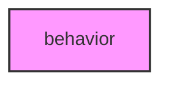

# BEHAVIOR

## Overview
Behavioral phenotype analysis module.

## 📦 Contents
- `[__init__.py](__init__.py)`
- `[ethogram.py](ethogram.py)`
- `[sequence.py](sequence.py)`

## 📊 Structure



## Usage
Import module:
```python
from metainformant.metainformant.phenotype.behavior import ...
```
