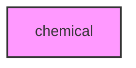

# CHEMICAL

## Overview
Chemical phenotype analysis module.

## 📦 Contents
- `[__init__.py](__init__.py)`
- `[compound.py](compound.py)`
- `[profile.py](profile.py)`

## 📊 Structure



## Usage
Import module:
```python
from metainformant.phenotype.chemical import ...
```
