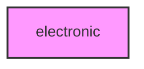

# ELECTRONIC

## Overview
Electronic phenotype analysis module.

## 📦 Contents
- `[__init__.py](__init__.py)`
- `[tracking.py](tracking.py)`

## 📊 Structure



## Usage
Import module:
```python
from metainformant.phenotype.electronic import ...
```
