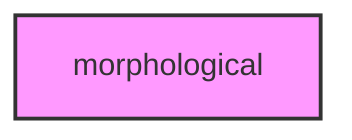

# MORPHOLOGICAL

## Overview
Morphological phenotype analysis module.

## 📦 Contents
- `[__init__.py](__init__.py)`
- `[measurement.py](measurement.py)`
- `[profile.py](profile.py)`

## 📊 Structure



## Usage
Import module:
```python
from metainformant.metainformant.phenotype.morphological import ...
```
