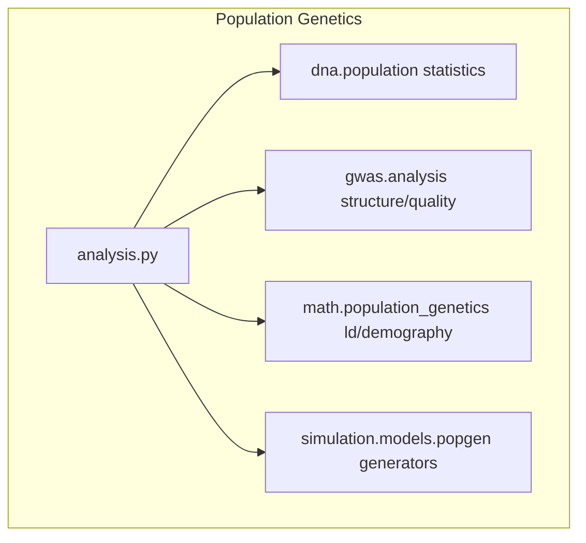

# Population Genetics Module

Population genetics analysis: sequence summary statistics, neutrality tests, two-population comparison (Fst), genotype-structure analysis (PCA, kinship, HWE), LD summaries, and demographic model comparisons.

## Overview

The `popgen` module holds the reusable methods behind the population
genetics workflow. Scripts under `scripts/popgen/` are thin orchestrators
that import from here. Simulation generators live in
`metainformant.simulation.models.popgen` and are re-exported for convenience.

All statistics are descriptive; inferential claims are gated behind the
evidence-manifest freeze per repo policy.

## Table of Contents

- [Architecture](#architecture)
- [Submodules](#submodules)
- [Quick Start](#quick-start)
- [Related](#related)

## Architecture



## Submodules

| Module | Purpose |
|--------|---------|
| [`analysis.py`](analysis.py) | Scenario suites, population comparison, PCA/kinship/HWE, LD summary, demographic comparisons, dataset pipeline |

## Quick Start

```python
from metainformant.popgen import summarize_scenario, compare_two_population_sequences

suite = summarize_scenario(["ATCG", "ATCG", "GCTA"], label="demo")
print(suite["neutrality_tests"]["tajimas_d"])
```

```bash
# Full synthetic-dataset workflow (generate -> analyze -> report -> visualize)
uv run python scripts/popgen/analysis.py --output-dir output/popgen
```

## Tests

Zero-mocks tests: `tests/popgen/` (real synthetic sequences via seeded
generators, real temp files; no test-double APIs).

## Related

- [Population Genetics Scripts](../../../scripts/popgen/) - thin orchestrators
- [DNA Population](../dna/population/) - core statistics implementations
- [Simulation Models](../simulation/models/) - synthetic data generators
