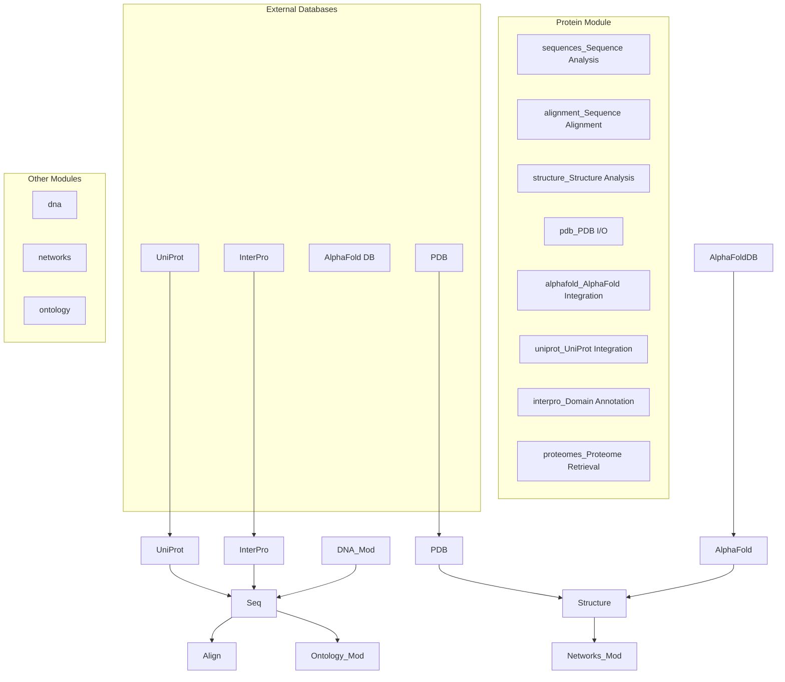
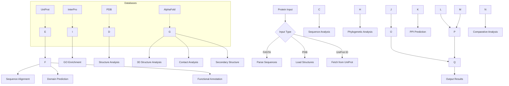
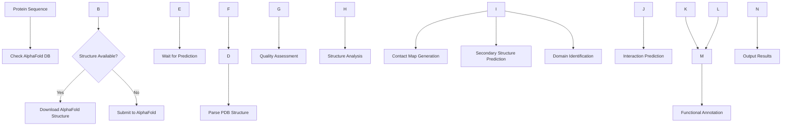

# Protein Analysis Module

The `protein` module provides tools for proteomic analysis, including sequence manipulation, structure integration, and functional annotation.

## Overview

This module handles protein sequence analysis and integrates with various protein databases and structural data sources.

### Module Architecture



### Protein Analysis Workflow



### AlphaFold Integration Pipeline



## Submodules

### Proteome Retrieval (`proteomes.py`)
Tools for retrieving and working with complete proteome datasets.

**Key Features:**
- UniProt proteome retrieval and parsing
- Proteome annotation and metadata extraction
- Cross-species proteome comparison
- Proteome quality assessment

**Usage:**
```python
from metainformant.protein import read_taxon_ids
from pathlib import Path

# Read taxon IDs from file
taxon_file = Path("taxon_ids.txt")
taxon_ids = read_taxon_ids(taxon_file)

# For full proteome analysis, use protein sequences module
from metainformant.protein import parse_fasta
proteome_dict = parse_fasta(Path("proteome.fasta"))
```

### Protein Sequences (`sequences.py`)
Protein sequence manipulation and analysis.

**Key Features:**
- Amino acid composition analysis
- Physicochemical property calculation
- Sequence motif detection
- Post-translational modification prediction

**Usage:**
```python
from metainformant.protein import (
    is_valid_protein_sequence,
    calculate_aa_composition,
    kmer_frequencies,
    parse_fasta
)
from pathlib import Path

# Validate sequence
seq = "MKVLWAALLVTFLAGCQAKVE"
is_valid = is_valid_protein_sequence(seq)

# Calculate amino acid composition
composition = calculate_aa_composition(seq)

# Calculate k-mer frequencies
kmers = kmer_frequencies(seq, k=3)

# Parse FASTA file
sequences = parse_fasta(Path("proteins.fasta"))
```

### Structure Integration (`structure.py`, `pdb.py`)
Protein structure data integration and analysis.

**Key Features:**
- PDB file parsing and manipulation
- Structure validation and quality assessment
- Structure-based function prediction
- Structure comparison and alignment

**Usage:**
```python
from metainformant.protein import fetch_pdb_structure
from pathlib import Path

# Download PDB structure
pdb_id = "1A2B"
output_dir = Path("output/pdb")
pdb_path = fetch_pdb_structure(pdb_id, output_dir, fmt="pdb")

# For structure analysis, use compute_rmsd_kabsch
from metainformant.protein import compute_rmsd_kabsch
import numpy as np

# Compare two structures (requires coordinate arrays)
# coords_ref = np.array([...])  # Reference coordinates
# coords_mobile = np.array([...])  # Mobile coordinates
# rmsd = compute_rmsd_kabsch(coords_ref, coords_mobile)
```

### Functional Annotation (`interpro.py`, `uniprot.py`)
Integration with InterPro and UniProt for functional annotation.

**Key Features:**
- InterPro domain and family annotation
- UniProt keyword and GO term mapping
- Enzyme classification and pathway mapping
- Literature reference integration

**Usage:**
```python
from metainformant.protein import map_ids_uniprot
from metainformant.protein.interpro import fetch_interpro_domains

# Map IDs to UniProt accessions
protein_ids = ["P12345", "Q67890"]
id_mapping = map_ids_uniprot(protein_ids)

# Fetch InterPro domains for a UniProt accession
uniprot_acc = "P12345"
domains = fetch_interpro_domains(uniprot_acc)
```

## Integration with Other Modules

### With DNA Module
```python
from metainformant.dna import translation
from metainformant.protein import calculate_aa_composition, is_valid_protein_sequence

# Translate DNA and analyze protein
dna_sequence = "ATGGCC..."
protein_sequence = translation.translate_dna(dna_sequence)
is_valid = is_valid_protein_sequence(protein_sequence)
composition = calculate_aa_composition(protein_sequence)
```

### With RNA Module
```python
from metainformant.rna import workflow
from metainformant.protein import parse_fasta, calculate_aa_composition
from metainformant.dna import translation

# Translation and expression correlation analysis
# Extract expression data from RNA workflow
expression_data = workflow.extract_expression("expression.tsv")

# Translate RNA sequences to protein
rna_sequences = sequences.read_fasta("rna_sequences.fasta")
protein_sequences = {}
for seq_id, rna_seq in rna_sequences.items():
    protein_seq = translation.translate_dna(rna_seq)
    protein_sequences[seq_id] = protein_seq

# Analyze protein sequences
protein_compositions = {}
for seq_id, protein_seq in protein_sequences.items():
    composition = calculate_aa_composition(protein_seq)
    protein_compositions[seq_id] = composition

# Correlate expression with protein properties
# Match expression data with protein compositions
for gene_id, expr in expression_data.items():
    if gene_id in protein_compositions:
        aa_comp = protein_compositions[gene_id]
        # Analyze correlation between expression and amino acid composition
```

### With Networks Module
```python
from metainformant.protein import parse_fasta, kmer_frequencies
from metainformant.networks import predict_interactions, create_network, load_string_interactions
import numpy as np

# PPI network construction from protein data
proteins = parse_fasta(Path("proteome.fasta"))

# Extract protein features (e.g., k-mer frequencies, composition)
protein_features = {}
protein_ids = []
for prot_id, seq in proteins.items():
    # Extract k-mer features
    kmers = kmer_frequencies(seq, k=3)
    # Convert to feature vector
    feature_vec = np.array([kmers.get(kmer, 0) for kmer in sorted_kmers])
    protein_features[prot_id] = feature_vec
    protein_ids.append(prot_id)

# Create feature matrix
features_matrix = np.array([protein_features[pid] for pid in protein_ids])

# Predict protein-protein interactions
ppi = predict_interactions(
    features_matrix,
    protein_ids,
    method="coexpression",
    threshold=0.7
)

# Create network from predicted interactions
network = create_network(protein_ids, directed=False)
for prot1, prot2, score in ppi:
    network.add_edge(prot1, prot2, weight=score)

# Or load from STRING database
ppi_network = load_string_interactions("string_interactions.tsv", score_threshold=400)
network = ppi_network.create_network(min_confidence=0.7)
```

### With Ontology Module
```python
from metainformant.protein import map_ids_uniprot, fetch_interpro_domains
from metainformant.ontology import load_go_obo, ancestors, descendants

# GO annotation integration
protein_ids = ["P12345", "Q67890"]
uniprot_mapping = map_ids_uniprot(protein_ids)

# Load Gene Ontology
go_onto = load_go_obo("go-basic.obo")

# Fetch InterPro domains and map to GO terms
for uniprot_acc in uniprot_mapping.values():
    domains = fetch_interpro_domains(uniprot_acc)
    # Map domains to GO terms (domain-specific logic)
    go_terms = map_domains_to_go(domains)
    
    # Find broader GO categories
    for go_term in go_terms:
        broader = ancestors(go_onto, go_term)
        specific = descendants(go_onto, go_term)
        # Use GO hierarchy for functional annotation
```

### With Multiomics Module
```python
from metainformant.protein import parse_fasta
from metainformant.multiomics import MultiOmicsData, joint_pca, canonical_correlation
import pandas as pd

# Proteomics integration
proteins = parse_fasta(Path("proteome.fasta"))

# Create proteomics feature matrix (e.g., abundance, composition)
proteomics_data = pd.DataFrame({
    prot_id: {
        "abundance": calculate_abundance(seq),
        "length": len(seq),
        "molecular_weight": calculate_mw(seq)
    }
    for prot_id, seq in proteins.items()
}).T

# Integrate with other omics
rna_expression = pd.read_csv("expression.tsv", index_col=0)
genomics_variants = pd.read_csv("variants.csv", index_col=0)

# Create multi-omics dataset
omics_data = MultiOmicsData(
    genomics=genomics_variants,
    transcriptomics=rna_expression,
    proteomics=proteomics_data
)

# Joint analysis
embeddings, loadings, variance = joint_pca(omics_data, n_components=50)

# Canonical correlation between RNA and protein
X_c, Y_c, X_w, Y_w, correlations = canonical_correlation(
    omics_data,
    layer_pair=("transcriptomics", "proteomics"),
    n_components=10
)
```

### With ML Module
```python
from metainformant.protein import parse_fasta, kmer_frequencies, calculate_aa_composition
from metainformant.ml import BiologicalClassifier, select_features_univariate
import numpy as np

# Protein function prediction
proteins = parse_fasta(Path("proteome.fasta"))

# Extract protein features
def extract_protein_features(proteins_dict):
    features = []
    labels = []  # Functional labels (e.g., enzyme, structural, etc.)
    
    for prot_id, seq in proteins_dict.items():
        # K-mer features
        kmers = kmer_frequencies(seq, k=3)
        kmer_vec = np.array([kmers.get(kmer, 0) for kmer in sorted_kmers])
        
        # Composition features
        composition = calculate_aa_composition(seq)
        comp_vec = np.array(list(composition.values()))
        
        # Combine features
        feature_vec = np.concatenate([kmer_vec, comp_vec])
        features.append(feature_vec)
        
        # Functional labels (from annotation)
        label = get_functional_label(prot_id)  # Placeholder
        labels.append(label)
    
    return np.array(features), np.array(labels)

X, y = extract_protein_features(proteins)

# Feature selection
X_selected, selected_indices = select_features_univariate(X, y, k=100, method="f_score")

# Train protein function classifier
classifier = BiologicalClassifier(algorithm="random_forest", random_state=42)
classifier.fit(X_selected, y)
predictions = classifier.predict(X_selected)

# Feature importance for protein function
importance = classifier.feature_importance_
```

### With Visualization Module
```python
from metainformant.protein import simple_helix_coil_propensity, calculate_aa_composition
from metainformant.visualization import lineplot, heatmap, scatter_plot

# Visualize protein properties
seq = "MKVLWAALLVTFLAGCQAKVE"
propensity = simple_helix_coil_propensity(seq)
ax = lineplot(None, propensity)
ax.set_title("Helix-Coil Propensity Profile")

# Amino acid composition visualization
composition = calculate_aa_composition(seq)
aa_names = list(composition.keys())
aa_values = list(composition.values())
ax = scatter_plot(range(len(aa_names)), aa_values,
                  xlabel="Amino Acid", ylabel="Frequency",
                  title="Amino Acid Composition")

# Multiple protein composition heatmap
proteins = parse_fasta(Path("proteome.fasta"))
composition_matrix = np.array([
    list(calculate_aa_composition(seq).values())
    for seq in proteins.values()
])
ax = heatmap(composition_matrix, title="Protein Composition Matrix",
             xlabel="Amino Acids", ylabel="Proteins")
```

## Performance Features

- Memory-efficient processing of large proteomes
- Parallel sequence analysis
- Caching of expensive computations
- Streaming processing for large datasets

## Testing

Comprehensive tests cover:
- Sequence format validation
- Annotation accuracy verification
- Structure parsing correctness
- Integration with external databases

## Dependencies

- Biopython for sequence objects
- Optional: UniProt API access, PDB parsing libraries

## See Also

- **[AGENTS.md](AGENTS.md)**: AI agent contributions and development details for the protein module

## Related Modules

The Protein module integrates with several other METAINFORMANT modules:

- **DNA Module**: Protein sequences originate from DNA transcription and translation; genetic code and codon optimization analysis
- **RNA Module**: Translation of RNA produces protein sequences; ribosome profiling and translation efficiency
- **Networks Module**: Protein-protein interaction networks, domain-domain interactions, and structural interaction analysis
- **Ontology Module**: Gene Ontology (GO) term assignment, functional annotation, and semantic similarity analysis
- **Multi-omics Module**: Protein data integration with DNA, RNA, and epigenetic data; proteome-wide analysis
- **Quality Module**: Protein structure validation, sequence quality assessment, and annotation verification
- **Visualization Module**: Protein structure visualization, domain architecture plots, and interaction network graphs
- **ML Module**: Machine learning analysis of protein sequences, structures, and functions
- **Information Module**: Information-theoretic analysis of protein sequences and structures
- **Simulation Module**: Synthetic protein sequence generation and structural modeling

This module provides essential tools for protein sequence analysis and functional annotation.
