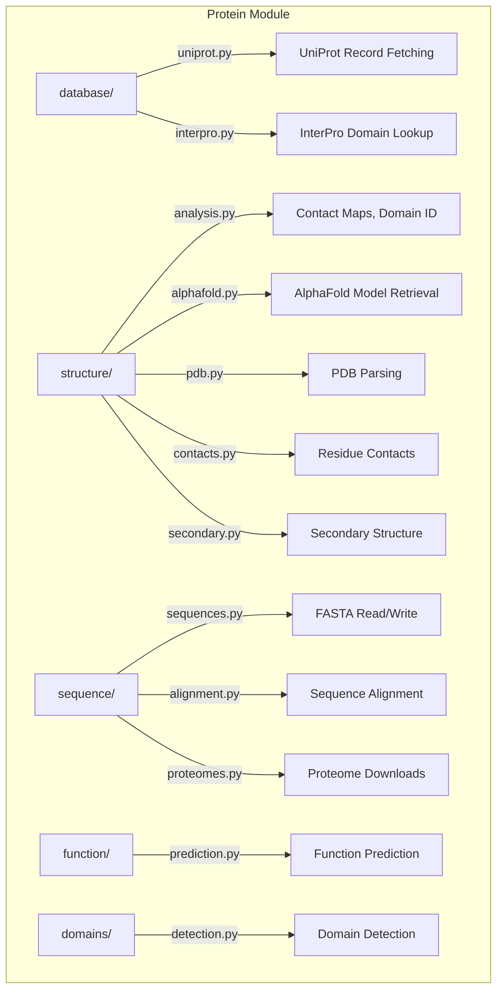

# Protein Module

Protein sequence analysis, 3D structure prediction, database integration, and functional annotation for METAINFORMANT.

## Architecture



## Submodules

| Module | Purpose |
|--------|---------|
| [`database/`](database/) | UniProt (`fetch_uniprot_record`) and InterPro integration |
| [`structure/`](structure/) | 3D analysis (`calculate_contact_map`, `identify_domains`), PDB parsing, AlphaFold |
| [`sequence/`](sequence/) | Protein FASTA I/O (`read_fasta`), alignment, proteome downloads |
| [`function/`](function/) | Function prediction from sequence and structure features |
| [`domains/`](domains/) | Domain detection and classification (Pfam-style) |
| [`visualization/`](visualization/) | Structure and sequence visualization |
| [`workflow/`](workflow/) | End-to-end protein analysis orchestration |

## Key Capabilities

### Database Integration

```python
from metainformant.protein.database.uniprot import fetch_uniprot_record

record = fetch_uniprot_record("P12345")
print(record["protein_name"])       # Recommended protein name
print(record["organism"])           # Scientific name
print(record["sequence"][:50])      # First 50 residues
print(record["domains"])            # Annotated domains
```

### Structure Analysis

| Function | Description |
|----------|-------------|
| `calculate_contact_map` | Residue contact map from 3D coordinates |
| `identify_domains` | Structural domain identification |
| `build_alphafold_url` | AlphaFold DB URL from UniProt accession |
| `fetch_alphafold_model` | Download AlphaFold predicted structure |

```python
from metainformant.protein.structure.analysis import calculate_contact_map, identify_domains
from metainformant.protein.structure.alphafold import fetch_alphafold_model

contacts = calculate_contact_map(coords, threshold=8.0)   # numpy array
domains = identify_domains(structure_dict)                  # list of domain dicts
model_path = fetch_alphafold_model("P12345", out_dir=Path("output/structures"))
```

### Sequence Processing

```python
from metainformant.protein.sequence.sequences import read_fasta
from metainformant.protein.sequence.alignment import align_sequences

proteins = read_fasta("data/proteome.fasta")
alignment = align_sequences(list(proteins.values()))
```

## Quick Start

```python
from metainformant.protein.database.uniprot import fetch_uniprot_record
from metainformant.protein.structure.alphafold import fetch_alphafold_model
from pathlib import Path

# Fetch annotation and predicted structure for a protein
record = fetch_uniprot_record("Q9Y6K9")
model = fetch_alphafold_model("Q9Y6K9", out_dir=Path("output/protein"))
print(f"{record['protein_name']} - {record['length']} residues")
```

## Related

- [metainformant.networks](../networks/) - Protein-protein interaction networks
- [metainformant.ontology](../ontology/) - GO term annotation for proteins
- [metainformant.dna](../dna/) - DNA-level sequence analysis
- [docs/protein/](../../../docs/protein/) - Protein module documentation
