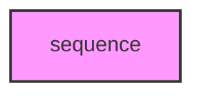

# SEQUENCE

## Overview
Functionality for sequence.

## 📦 Contents
- `[__init__.py](__init__.py)`
- `[alignment.py](alignment.py)`
- `[proteomes.py](proteomes.py)`
- `[sequences.py](sequences.py)`

## 📊 Structure



## Usage
Import module:
```python
from metainformant.metainformant.protein.sequence import ...
```
