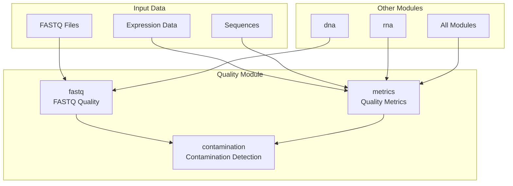
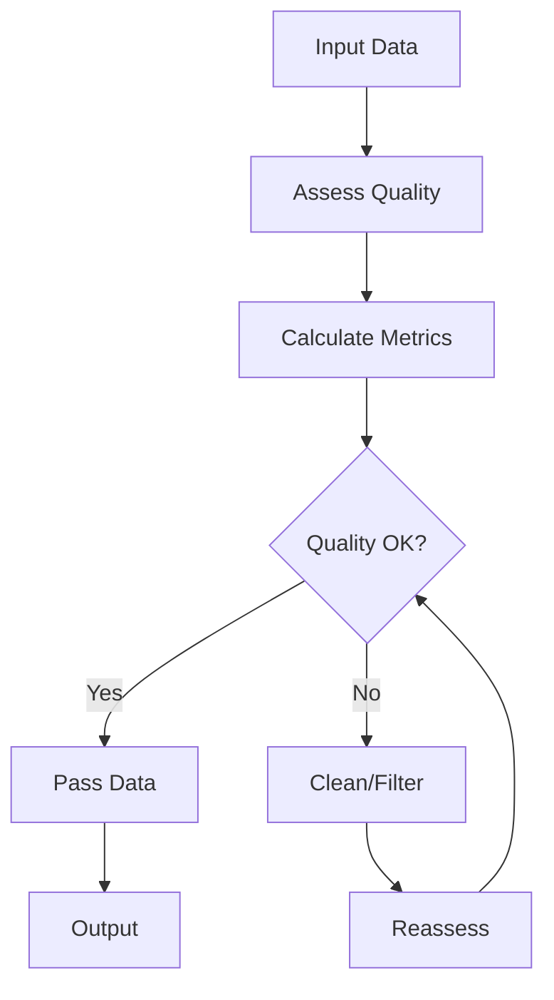

# Quality Control Module

The `quality` module provides tools for assessing and ensuring data quality across various biological data types.

## Overview

This module handles quality assessment, filtering, and validation for biological datasets including sequences, expression data, and genomic information.

### Module Architecture



### Quality Control Workflow



## Submodules

### Sequence Quality (`fastq.py`)
FASTQ format quality analysis and filtering.

**Key Features:**
- Per-base quality score analysis
- Read trimming and filtering
- Quality report generation
- Format validation and conversion

**Usage:**
```python
from metainformant.quality import analyze_fastq_quality, per_base_quality
from metainformant.dna.fastq import iter_fastq, FastqRecord

# Quality analysis
# First, read FASTQ records
reads = list(FastqRecord(read_id, seq, qual) for read_id, seq, qual in iter_fastq("reads.fastq"))

# Analyze quality
quality_stats = analyze_fastq_quality(reads)
per_base = per_base_quality(reads)
```

### Contamination Detection (`contamination.py`)
Sequence contamination detection and removal.

**Key Features:**
- Adapter sequence detection and trimming
- Cross-species contamination screening
- Primer dimer identification
- Vector and plasmid contamination detection

**Usage:**
```python
from metainformant.quality import (
    detect_adapter_contamination,
    detect_cross_species_contamination,
    generate_contamination_report
)
from metainformant.dna.fastq import iter_fastq

# Detect adapters
reads = list(iter_fastq("reads.fastq"))
adapter_results = detect_adapter_contamination(reads)

# Screen for cross-species contamination
contamination_results = detect_cross_species_contamination(
    reads,
    reference_species="human"
)

# Generate contamination report
report = generate_contamination_report(
    adapter_results,
    cross_species_results=contamination_results
)
```

### Quality Metrics (`metrics.py`)
Comprehensive quality scoring and assessment.

**Key Features:**
- Quality score calculations
- Completeness and accuracy metrics
- Batch effect detection
- Statistical quality summaries

**Usage:**
```python
from metainformant.quality import (
    calculate_quality_metrics,
    generate_quality_report,
    calculate_gc_metrics,
    calculate_length_metrics
)

# Calculate quality metrics (from quality scores: list of lists)
quality_scores = [[33, 35, 32, 34], [34, 36, 33, 35]]
metrics = calculate_quality_metrics(quality_scores)

# Calculate GC metrics
gc_values = [0.45, 0.50, 0.48, 0.52]
gc_metrics = calculate_gc_metrics(gc_values)

# Calculate length metrics
lengths = [100, 150, 120, 140]
length_metrics = calculate_length_metrics(lengths)

# Generate comprehensive quality report
report = generate_quality_report({
    "quality": metrics,
    "gc": gc_metrics,
    "length": length_metrics
})
```

### Data Validation (`validation.py`)
General data validation and quality assessment.

**Key Features:**
- Format validation
- Completeness checking
- Consistency verification
- Metadata validation

**Usage:**
```python
from metainformant.quality import generate_quality_report
from metainformant.quality import calculate_quality_metrics

# For sequence validation, use DNA module
from metainformant.dna import sequences
seqs = sequences.read_fasta("sequences.fasta")

# Generate quality reports using quality module functions
# See metrics examples above
```

## Integration with Other Modules

### With DNA Module
```python
from metainformant.dna import sequences
from metainformant.quality import analyze_fastq_quality

# Quality control for DNA sequences
seqs = sequences.read_fasta("raw_sequences.fasta")

# Use quality module functions for FASTQ quality assessment
from metainformant.dna.fastq import iter_fastq
reads = list(iter_fastq("reads.fastq"))
quality_stats = analyze_fastq_quality(reads)
```

### With RNA Module Workflows
```python
from metainformant.quality import analyze_fastq_quality, detect_contamination
from metainformant.dna.fastq import iter_fastq

# Quality control for RNA-seq FASTQ files
# Quality assessment before downstream RNA analysis
rna_reads = list(iter_fastq("rna_reads.fastq"))
quality_stats = analyze_fastq_quality(rna_reads)

# Contamination detection for RNA-seq
contamination = detect_adapter_contamination(rna_reads)

# Filter reads based on quality before RNA workflow
# Pass quality-filtered reads to RNA quantification pipeline
```

### With GWAS Workflows
```python
from metainformant.quality import analyze_fastq_quality
from metainformant.gwas.quality import apply_qc_filters, parse_vcf_full

# Quality control for variant calling input
# FASTQ quality assessment before variant calling
genomic_reads = list(iter_fastq("genomic_reads.fastq"))
quality_stats = analyze_fastq_quality(genomic_reads)

# After variant calling, apply GWAS-specific QC filters
vcf_data = parse_vcf_full("variants.vcf")
qc_variants = apply_qc_filters(vcf_data, maf_threshold=0.05, missing_threshold=0.1)

# Integrated quality control pipeline for GWAS
```

## Performance Features

- Efficient processing of large sequence files
- Memory-conscious quality assessment
- Parallel quality checking where applicable

## Testing

Quality assessment tools are thoroughly tested with:
- Known good and bad datasets
- Performance benchmarking
- Edge case handling

## Dependencies

- Biopython for sequence quality analysis
- Optional: FastQC integration for detailed reports

This module ensures data integrity and quality across all biological data processing pipelines.
