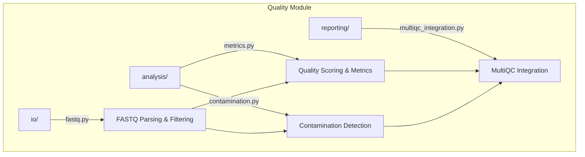

# Quality Module

Sequencing quality control -- FASTQ analysis, contamination detection, composite quality scoring, and MultiQC report integration.

## Architecture



## Key Capabilities

### FASTQ Quality Analysis

```python
from metainformant.quality.io.fastq import analyze_fastq_quality, read_fastq_records

results = analyze_fastq_quality("data/sample.fastq.gz", n_reads=10000)
records = list(read_fastq_records("data/sample.fastq.gz", max_records=100))
```

| Function | Description |
|----------|-------------|
| `read_fastq_records` | Stream `FastqRecord` objects from FASTQ files |
| `analyze_fastq_quality` | Full QC: per-base quality, GC, adapters, duplication |
| `basic_statistics` | Read count, mean quality, length stats |
| `per_base_quality` | Position-wise quality score distributions |
| `gc_content_distribution` | Per-read GC content histogram |
| `adapter_content` | Detect Illumina adapter contamination |
| `filter_reads` | Quality and length filtering |

### Contamination Detection

```python
from metainformant.quality.analysis.contamination import ContaminationDetector

detector = ContaminationDetector(reference_genomes={"target": ref_seq})
result = detector.detect_microbial_contamination(sequences, threshold=0.01)
```

| Function | Description |
|----------|-------------|
| `detect_microbial_contamination` | K-mer Jaccard similarity to known contaminants |
| `detect_cross_species_contamination` | Reference-based cross-species screening |
| `detect_adapter_contamination` | Residual adapter sequence detection |
| `detect_vector_contamination` | Cloning vector sequence screening |
| `generate_contamination_report` | Summary report across all contamination types |

### Quality Scoring

```python
from metainformant.quality.analysis.metrics import calculate_quality_score

score = calculate_quality_score(qc_data, data_type="fastq")
# Returns: {"overall_score": 85.2, "grade": "B", "components": {...}}
```

| Function | Description |
|----------|-------------|
| `calculate_quality_score` | Composite score for FASTQ, VCF, or BAM data |
| `calculate_coverage_metrics` | Depth-of-coverage statistics |
| `calculate_gc_metrics` | GC content distribution analysis |
| `detect_outliers` | IQR/Z-score outlier detection |
| `batch_quality_analysis` | Multi-sample batch QC comparison |

## Submodules

| Module | Purpose |
|--------|---------|
| [`io/`](io/) | FASTQ parsing (`FastqRecord`, `read_fastq_records`), filtering |
| [`analysis/`](analysis/) | Quality metrics (`calculate_quality_score`) and contamination (`ContaminationDetector`) |
| [`reporting/`](reporting/) | MultiQC integration and report generation |

## Quick Start

```python
from metainformant.quality.io.fastq import analyze_fastq_quality
from metainformant.quality.analysis.metrics import calculate_quality_score

# Analyze a FASTQ file
qc = analyze_fastq_quality("data/reads.fastq.gz")

# Calculate composite quality score
score = calculate_quality_score(qc, data_type="fastq")
print(f"Grade: {score['grade']}, Score: {score['overall_score']:.1f}")
```

## Related

- [`metainformant.dna.io`](../dna/io/) -- DNA-level FASTQ processing
- [`metainformant.rna`](../rna/) -- RNA-seq QC within workflows
- [`docs/quality/`](../../../docs/quality/) -- Quality documentation
