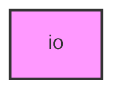

# IO

## Overview
Functionality for io.

## 📦 Contents
- `[__init__.py](__init__.py)`
- `[fastq.py](fastq.py)`

## 📊 Structure



## Usage
Import module:
```python
from metainformant.metainformant.quality.io import ...
```
