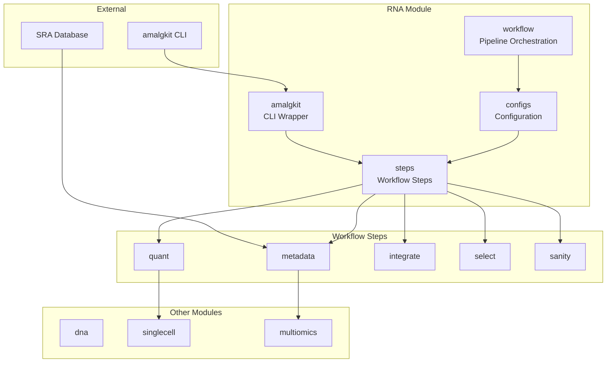
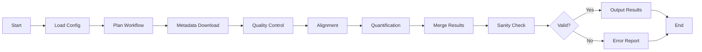

# RNA Analysis Module

The `rna` module provides tools for transcriptomic analysis, focusing on RNA sequencing data processing, quantification, and workflow orchestration. This module integrates with external tools like amalgkit while providing a consistent Python interface.

## Overview

This module handles RNA sequencing workflows from raw data to analyzed results:
- **Amalgkit Integration**: Modular wrapper around the amalgkit CLI toolkit
- **Workflow Management**: Complete pipeline planning and execution
- **Data Processing**: RNA-seq processing steps including quality control, alignment, and quantification
- **Metadata Handling**: Transcriptomic metadata retrieval and curation

### Module Architecture



### RNA-seq Workflow Pipeline



## Key Components

### Amalgkit Integration (`amalgkit.py`)
Thin wrapper around the external amalgkit CLI toolkit for transcriptomic meta-analysis.

**Key Features:**
- CLI availability checking and validation
- Command construction and execution
- Parameter validation and error handling
- Modular step execution (metadata, integration, configuration, etc.)

**Usage:**
```python
from metainformant.rna import check_cli_available, metadata, quant

# Check if amalgkit is available
available, help_text = check_cli_available()
if not available:
    print(f"Amalgkit not available: {help_text}")

# Run metadata retrieval
result = metadata({"threads": 4, "species": "Homo sapiens"})
print(f"Exit code: {result.returncode}")

# Run quantification
quant_result = quant({"input": "aligned.bam", "output": "counts.txt"})
```

### Workflow Management (`workflow.py`)
Complete workflow planning and execution for complex RNA-seq pipelines.

**Key Features:**
- Workflow configuration and validation
- Step planning and dependency resolution
- Execution orchestration with error handling
- Progress tracking and logging

**Usage:**
```python
from metainformant.rna import AmalgkitWorkflowConfig, plan_workflow, execute_workflow

# Configure workflow
config = AmalgkitWorkflowConfig(
    work_dir="/path/to/work",
    threads=8,
    species_list=["Homo sapiens", "Mus musculus"]
)

# Plan workflow steps
steps = plan_workflow(config)

# Execute workflow
results = execute_workflow(config)
for step, result in results.items():
    print(f"{step}: {result.returncode}")
```

## Supported Workflow Steps

The module supports all major amalgkit workflow steps:

### Metadata (`metadata`)
Retrieve and organize transcriptomic metadata from public databases.

**Parameters:**
- `threads`: Number of parallel threads
- `species`: Target species for metadata retrieval
- `output_dir`: Directory for metadata files

### Integration (`integrate`)
Integrate multiple data sources and annotations.

**Parameters:**
- `input_dirs`: Directories containing input data
- `annotation`: Reference annotation file
- `threads`: Processing threads

### Configuration (`config`)
Generate configuration files for downstream analysis.

**Parameters:**
- `species`: Target organism
- `assay`: Assay type (RNA-seq, etc.)
- `stranded`: Library strandedness

### Selection (`select`)
Select and filter relevant features for analysis.

**Parameters:**
- `input`: Input feature file
- `criteria`: Selection criteria
- `output`: Output file

### Data Retrieval (`getfastq`)
Download FASTQ files from public repositories.

**Parameters:**
- `accessions`: SRA/ENA accession numbers
- `output_dir`: Download directory
- `threads`: Download threads

### Quantification (`quant`)
Quantify gene/transcript expression levels.

**Parameters:**
- `input`: Aligned reads (BAM/SAM)
- `annotation`: Transcript annotation
- `method`: Quantification method (featureCounts, etc.)

### Merging (`merge`)
Merge results from parallel processing.

**Parameters:**
- `input_files`: Files to merge
- `output`: Merged output file
- `method`: Merge strategy

### Statistical Testing (`cstmm`, `csca`)
Statistical testing for differential expression.

**Parameters:**
- `counts`: Count matrix
- `design`: Experimental design matrix
- `method`: Statistical test method

### Curation (`curate`)
Data curation and quality assessment.

**Parameters:**
- `input`: Raw data directory
- `criteria`: Curation criteria
- `output`: Curated results

### Sanity Checking (`sanity`)
Validate data integrity and completeness.

**Parameters:**
- `input_dirs`: Directories to validate
- `checks`: Validation checks to perform

## Command Line Interface

The module provides a comprehensive CLI for RNA analysis:

```bash
# Check amalgkit availability
python -m metainformant rna check

# Run complete workflow
python -m metainformant rna run --work-dir /path/to/work --threads 8 --species "Homo sapiens"

# Run individual steps
python -m metainformant rna metadata --threads 4 --species "Homo sapiens"
python -m metainformant rna quant --input aligned.bam --output counts.txt

# Plan workflow without execution
python -m metainformant rna plan --work-dir /path/to/work --species "Homo sapiens"
```

## Integration with Other Modules

### With DNA Module
```python
from metainformant.dna import sequences
from metainformant.rna import workflow

# Use DNA sequences for RNA annotation
gene_sequences = sequences.read_fasta("genes.fasta")
config = AmalgkitWorkflowConfig(annotation_fasta=gene_sequences)
results = workflow.execute_workflow(config)
```

### With Protein Module
```python
from metainformant.rna import workflow
from metainformant.protein import parse_fasta, calculate_aa_composition
from metainformant.dna import translation

# Translation and expression correlation analysis
# Extract expression data from RNA workflow
expression_data = workflow.extract_expression("expression.tsv")

# Translate RNA sequences to protein
rna_sequences = sequences.read_fasta("rna_sequences.fasta")
protein_sequences = {}
for seq_id, rna_seq in rna_sequences.items():
    protein_seq = translation.translate_dna(rna_seq)
    protein_sequences[seq_id] = protein_seq

# Analyze protein sequences
protein_compositions = {}
for seq_id, protein_seq in protein_sequences.items():
    composition = calculate_aa_composition(protein_seq)
    protein_compositions[seq_id] = composition

# Correlate expression with protein properties
# Match expression data with protein compositions
```

### With Multiomics Module
```python
from metainformant.rna import workflow
from metainformant.multiomics import MultiOmicsData, joint_pca, canonical_correlation
import pandas as pd

# RNA + protein integration
rna_expression = workflow.extract_expression("expression.tsv")
proteomics_data = pd.read_csv("proteomics.csv", index_col=0)

# Create multi-omics dataset
omics_data = MultiOmicsData(
    transcriptomics=rna_expression,
    proteomics=proteomics_data
)

# Joint analysis of RNA and protein
embeddings, loadings, variance = joint_pca(omics_data, n_components=50)

# Canonical correlation between RNA and protein
X_c, Y_c, X_w, Y_w, correlations = canonical_correlation(
    omics_data,
    layer_pair=("transcriptomics", "proteomics"),
    n_components=10
)
print(f"Canonical correlations: {correlations[:5]}")
```

### With Quality Module
```python
from metainformant.rna import workflow
from metainformant.quality import analyze_fastq_quality, detect_adapter_contamination
from metainformant.dna.fastq import iter_fastq

# Comprehensive QC workflow for RNA-seq
# Quality assessment before RNA workflow
rna_reads = list(iter_fastq("rna_reads.fastq"))
quality_stats = analyze_fastq_quality(rna_reads)

# Contamination detection
adapter_results = detect_adapter_contamination(rna_reads)

# Filter reads based on quality before RNA workflow
# Pass quality-filtered reads to RNA quantification pipeline
# Then run RNA workflow
config = AmalgkitWorkflowConfig(work_dir="output/rna")
results = workflow.execute_workflow(config)

# Quality check on final expression matrix
expression_matrix = results["expression_matrix"]
# Apply quality filters to expression data
```

### With ML Module
```python
from metainformant.rna import workflow
from metainformant.ml import BiologicalRegressor, select_features_univariate, cross_validate_biological

# Expression-based phenotype prediction
expression_data = workflow.extract_expression("expression.tsv")
phenotypes = np.array([...])  # Continuous trait values

# Feature selection for expression-based prediction
X_selected, selected_indices = select_features_univariate(
    expression_data.values,
    phenotypes,
    k=100,
    method="f_score"
)

# Train regression model
regressor = BiologicalRegressor(algorithm="ridge", random_state=42)
regressor.fit(X_selected, phenotypes)

# Cross-validate model
cv_results = cross_validate_biological(regressor, X_selected, phenotypes, cv=5)
print(f"Mean CV R²: {np.mean(cv_results['test_score']):.3f}")

# Expression-based classification
from metainformant.ml import BiologicalClassifier
classifier = BiologicalClassifier(algorithm="random_forest", random_state=42)
class_labels = np.array([0, 1, 0, 1, 0])  # Binary classification labels
classifier.fit(X_selected, class_labels)
```

### With Information Theory Module
```python
from metainformant.rna import workflow
from metainformant.information import shannon_entropy, mutual_information
import numpy as np

# Expression entropy analysis
expression_data = workflow.extract_expression("expression.tsv")

# Calculate entropy of expression distribution for each gene
gene_entropies = {}
for gene in expression_data.columns:
    gene_expression = expression_data[gene].values
    # Normalize to probabilities
    expression_probs = gene_expression / gene_expression.sum()
    entropy = shannon_entropy(expression_probs)
    gene_entropies[gene] = entropy

# Find genes with high expression entropy (highly variable)
high_entropy_genes = [g for g, e in gene_entropies.items() if e > np.median(list(gene_entropies.values()))]

# Calculate mutual information between genes
gene1_expr = expression_data[high_entropy_genes[0]].values
gene2_expr = expression_data[high_entropy_genes[1]].values

# Binarize expression for MI calculation
gene1_binary = (gene1_expr > np.median(gene1_expr)).astype(int)
gene2_binary = (gene2_expr > np.median(gene2_expr)).astype(int)

# Calculate MI
p_x = np.bincount(gene1_binary) / len(gene1_binary)
p_y = np.bincount(gene2_binary) / len(gene2_binary)
p_xy = np.histogram2d(gene1_binary, gene2_binary, bins=2)[0]
p_xy = p_xy / p_xy.sum()

mi = mutual_information(p_xy, p_x, p_y)
print(f"MI({high_entropy_genes[0]}, {high_entropy_genes[1]}): {mi:.3f}")
```

### With Visualization Module
```python
from metainformant.rna import workflow
from metainformant.visualization import heatmap, lineplot, expression_heatmap

# Visualize expression data
results = workflow.execute_workflow(config)
expression_matrix = results["expression_matrix"]

# Expression heatmap
ax = expression_heatmap(expression_matrix, 
                         title="RNA Expression Heatmap",
                         xlabel="Samples", ylabel="Genes")

# Time-series expression plot
time_points = [0, 6, 12, 24, 48]  # Hours
gene_expression = expression_matrix.loc["GENE1", :].values
ax = lineplot(time_points, gene_expression,
              xlabel="Time (hours)", ylabel="Expression",
              title="GENE1 Expression Over Time")

# Correlation heatmap
expression_correlation = expression_matrix.corr()
ax = heatmap(expression_correlation, title="Sample Correlation Matrix")
```

## Configuration Management

The module supports comprehensive configuration management:

```python
from metainformant.core import config as core_config
from metainformant.rna import AmalgkitWorkflowConfig

# Load configuration from file
cfg = core_config.load_config("rna_config.yaml")

# Create workflow configuration
workflow_cfg = AmalgkitWorkflowConfig(
    work_dir=cfg.work_dir,
    threads=cfg.compute.threads,
    species_list=cfg.species,
    **cfg.amalgkit_params
)
```

## Error Handling and Validation

- **Defensive Imports**: Optional dependencies are imported defensively
- **CLI Validation**: Amalgkit availability is checked before execution
- **Parameter Validation**: All parameters are validated before execution
- **Error Propagation**: Clear error messages with context

## Performance Features

- **Parallel Execution**: Multi-threaded processing for large datasets
- **Streaming Processing**: Memory-efficient handling of large files
- **Progress Tracking**: Real-time progress reporting for long-running operations
- **Resource Management**: Proper cleanup and resource management

## Testing

The module includes comprehensive tests:
- CLI availability and functionality tests
- Workflow execution validation
- Parameter validation tests
- Integration tests with real data
- Performance benchmarks

## Dependencies

- **Required**: Python 3.11+ for full workflow functionality
- **Optional**: amalgkit CLI (external dependency)
- **Core**: metainformant.core for configuration and I/O

## Usage Examples

### Basic CLI Usage
```python
from metainformant.rna import check_cli_available, run_amalgkit

# Check availability
if check_cli_available()[0]:
    # Run metadata step
    result = run_amalgkit("metadata", {"threads": 4})
    print(f"Metadata completed with code: {result.returncode}")
```

### Complete Workflow
```python
from metainformant.rna import AmalgkitWorkflowConfig, execute_workflow

# Setup and run complete workflow
config = AmalgkitWorkflowConfig(
    work_dir="/tmp/rna_analysis",
    threads=8,
    species_list=["Homo sapiens"],
    steps=["metadata", "getfastq", "quant", "cstmm"]
)

results = execute_workflow(config)
print("Workflow completed successfully!")
```

This module provides a complete solution for transcriptomic analysis, from individual processing steps to complete workflow orchestration.
