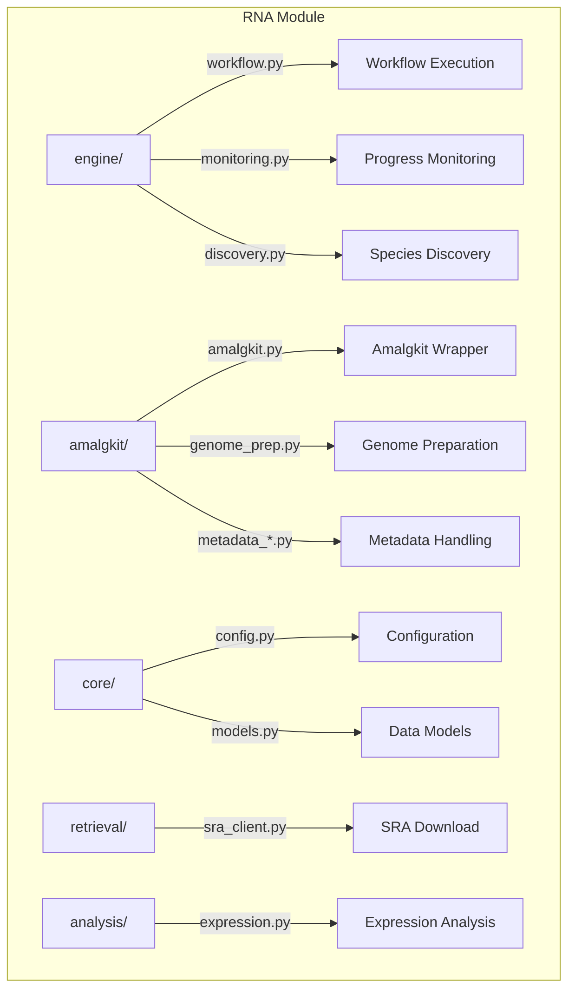

# RNA Module

Core RNA-seq analysis and workflow orchestration for METAINFORMANT.

## 📊 Architecture



## 📦 Submodules

| Module | Purpose |
|--------|---------|
| [`engine/`](engine/) | Workflow execution, monitoring, orchestration |
| [`amalgkit/`](amalgkit/) | Amalgkit tool wrapper and API |
| [`core/`](core/) | Configuration, models, utilities |
| [`retrieval/`](retrieval/) | SRA/ENA data retrieval |
| [`analysis/`](analysis/) | Expression matrix analysis |

## 🔑 Key Classes

### Workflow Engine

- `AmalgkitWorkflowConfig` - Workflow configuration from YAML
- `WorkflowExecutor` - Step-by-step execution with retries
- `ProgressTracker` - Real-time progress state management

### Amalgkit Wrapper

- `AmalgkitRunner` - CLI command builder and executor
- `GenomePreparator` - Reference genome download and indexing
- `MetadataFilter` - Sample selection and filtering

## 🚀 Usage

```python
from metainformant.rna.engine.workflow import AmalgkitWorkflowConfig, execute_workflow

# Load configuration
config = AmalgkitWorkflowConfig.load("config/amalgkit/amalgkit_pbarbatus_all.yaml")

# Execute workflow
result = execute_workflow(config, steps=["getfastq", "quant", "merge"])
```

## 📊 Workflow Steps

| Step | Description |
|------|-------------|
| `metadata` | Fetch sample metadata from NCBI |
| `select` | Filter to valid RNA-seq samples |
| `getfastq` | Download SRA → extract FASTQ |
| `quant` | Quantify with kallisto |
| `merge` | Combine abundance files |
| `curate` | Quality control and filtering |

## 🔗 Related

- [scripts/rna/](../../../scripts/rna/) - Workflow scripts
- [config/amalgkit/](../../../config/amalgkit/) - Configuration files
- [config/amalgkit/amalgkit_faq.md](../../../config/amalgkit/amalgkit_faq.md) - FAQ
