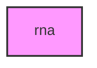

# RNA

## Overview
RNA transcriptomic analysis and workflow orchestration module for METAINFORMANT.

## 📦 Contents
- **[amalgkit/](amalgkit/)**
- **[analysis/](analysis/)**
- **[core/](core/)**
- **[engine/](engine/)**
- **[retrieval/](retrieval/)**
- `[__init__.py](__init__.py)`
- `[progress_tracker.py](progress_tracker.py)`
- `[steps.py](steps.py)`

## 📊 Structure



## Usage
Import module:
```python
from metainformant.metainformant.rna import ...
```
