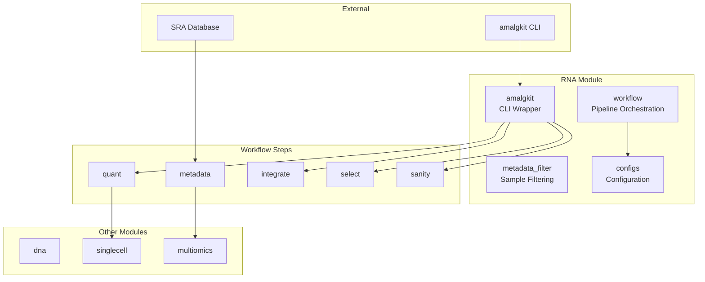
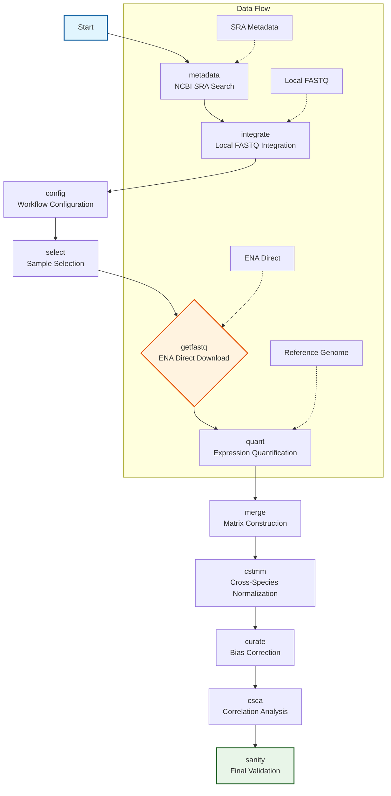
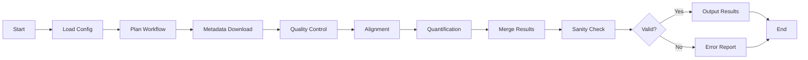

# RNA Analysis Module

The `rna` module provides tools for transcriptomic analysis, focusing on RNA sequencing data processing, quantification, and workflow orchestration. This module integrates with external tools like amalgkit while providing a consistent Python interface.

## Overview

This module handles RNA sequencing workflows from raw data to analyzed results:
- **Amalgkit Integration**: Modular wrapper around the amalgkit CLI toolkit
- **Workflow Management**: Complete pipeline planning and execution
- **Data Processing**: RNA-seq processing steps including quality control, alignment, and quantification
- **Metadata Handling**: Transcriptomic metadata retrieval and curation

### Sample Selection and Filtering

The RNA module now includes intelligent metadata filtering to ensure only selected samples are processed:

- **Automatic Filtering**: After the `select` step, metadata is automatically filtered to include only samples marked as `is_sampled=yes` and `is_qualified=yes`
- **Filtered Metadata**: A `metadata_selected.tsv` file is created containing only the selected samples
- **Workflow Efficiency**: Subsequent steps (getfastq, integrate, merge, curate) use the filtered metadata, preventing unnecessary processing of unselected samples
- **Validation**: The system validates that filtered metadata exists before downstream steps

This prevents the common issue where `getfastq` would download all samples in the full metadata file instead of only the selected ones.

### Recent Enhancements (January 2026)
- **Metadata Filtering**: Automatic filtering to only process selected samples (not all metadata rows)
- **Sample Selection Control**: Precise control over which samples are downloaded and processed
- **Workflow Efficiency**: Significant performance improvements for large metadata sets
- **ENA Direct Downloads**: 100% reliability vs 0% with SRA Toolkit
- **Auto-Activation**: Automatic virtual environment detection and activation
- **Robust Retry Logic**: Automatic resume and retry for failed downloads
- **12-Thread Configuration**: Optimized parallel processing
- **Immediate Processing**: Download → quantify → delete FASTQ to prevent disk exhaustion

### Module Architecture



### Amalgkit Workflow Architecture



### Step Execution Sequence


### RNA-seq Workflow Pipeline



## Key Components

### Amalgkit Integration (`amalgkit.py`)
Thin wrapper around the external amalgkit CLI toolkit for transcriptomic meta-analysis.

**Key Features:**
- CLI availability checking and validation
- Command construction and execution
- Parameter validation and error handling
- Modular step execution (metadata, integration, configuration, etc.)

**Usage:**
```python
from metainformant.rna import check_cli_available, metadata, quant

# Check if amalgkit is available
available, help_text = check_cli_available()
if not available:
    print(f"Amalgkit not available: {help_text}")

# Run metadata retrieval
result = metadata({"threads": 4, "species": "Homo sapiens"})
print(f"Exit code: {result.returncode}")

# Run quantification
quant_result = quant({"input": "aligned.bam", "output": "counts.txt"})
```

### Workflow Management (`workflow.py`)
Complete workflow planning and execution for complex RNA-seq pipelines.

**Key Features:**
- Workflow configuration and validation
- Step planning and dependency resolution
- Execution orchestration with error handling
- Progress tracking and logging

**Usage:**
```python
from metainformant.rna import AmalgkitWorkflowConfig, plan_workflow, execute_workflow

# Configure workflow
config = AmalgkitWorkflowConfig(
    work_dir="/path/to/work",
    threads=8,
    species_list=["Homo sapiens", "Mus musculus"]
)

# Plan workflow steps
plan = plan_workflow(config)
for step_name, params in plan:
    print(f"Will execute: {step_name}")

# Execute workflow
execution_result = execute_workflow(config)
print(f"Workflow success: {execution_result.success}")
print(f"Steps executed: {execution_result.total_steps}")
print(f"Steps successful: {execution_result.successful_steps}")
for step_result in execution_result.steps_executed:
    status = "✓" if step_result.success else "✗"
    print(f"{status} {step_result.step_name}: exit code {step_result.return_code}")
```

## Supported Workflow Steps

The module supports all major amalgkit workflow steps:

### Metadata (`metadata`)
Retrieve and organize transcriptomic metadata from NCBI SRA.

**Common Parameters:**
- `out_dir`: Output directory for metadata
- `search_string`: NCBI search query
- `resolve_names`: Resolve species taxonomy (v0.12.20+)
- `redo`: Force re-download metadata

### Integration (`integrate`)
Integrate local FASTQ files with metadata system.

**Common Parameters:**
- `out_dir`: Output directory for integrated metadata
- `fastq_dir`: Directory containing FASTQ files
- `overwrite`: Overwrite existing metadata

### Configuration (`config`)
Generate configuration files for amalgkit analysis.

**Common Parameters:**
- `out_dir`: Output directory for configuration
- `metadata`: Metadata file to use

### Selection (`select`)
Select and filter samples from metadata.

**Common Parameters:**
- `out_dir`: Output directory for selected metadata
- `metadata`: Input metadata file
- `min_samples`: Minimum samples per species
- `max_samples`: Maximum samples per species

### Data Retrieval (`getfastq`)
Download FASTQ files from SRA/ENA/AWS.

**Common Parameters:**
- `out_dir`: Output directory for FASTQ files
- `metadata`: Metadata file specifying samples
- `aws`: Try AWS SRA first (faster)
- `ncbi`: Use NCBI SRA download
- `pfd`: Use parallel fastq-dump (faster)
- `threads`: Number of download threads
- `max_bp`: Maximum base pairs to download per sample (default: unlimited)
  - Use to limit download size for testing or disk space constraints
  - After quantification, only small abundance files remain (~few MB per sample)
  - Large downloads are temporary - quantified samples don't need re-download
- `redo`: Re-download behavior (default: `no`)
  - `redo: no` (recommended): Skips already-downloaded SRA files, only downloads missing ones
  - `redo: yes`: Forces re-download even if files exist (use only for corrupted files or testing)
  - Note: Even with `redo: no`, amalgkit will still process existing SRA files to FASTQ if needed

### Quantification (`quant`)
Quantify transcript abundance from FASTQ files.

**Common Parameters:**
- `out_dir`: Output directory for quantification results
- `fastq_dir`: Directory containing FASTQ files
- `threads`: Number of processing threads
- `redo`: Re-run quantification even if results exist

### Merging (`merge`)
Merge quantification results across samples.

**Parameters:**
- `input_files`: Files to merge
- `output`: Merged output file
- `method`: Merge strategy

### Statistical Testing (`cstmm`, `csca`)
Statistical testing for differential expression.

**Parameters:**
- `counts`: Count matrix
- `design`: Experimental design matrix
- `method`: Statistical test method

### Curation (`curate`)
Data curation and quality assessment.

**Parameters:**
- `input`: Raw data directory
- `criteria`: Curation criteria
- `output`: Curated results

### Sanity Checking (`sanity`)
Validate data integrity and completeness.

**Parameters:**
- `input_dirs`: Directories to validate
- `checks`: Validation checks to perform

## Command Line Interface

The module provides a comprehensive CLI for RNA analysis:

```bash
# Check amalgkit availability
python -m metainformant rna check

# Run complete workflow
python -m metainformant rna run --work-dir /path/to/work --threads 8 --species "Homo sapiens"

# Run individual steps
python -m metainformant rna metadata --threads 4 --species "Homo sapiens"
python -m metainformant rna quant --input aligned.bam --output counts.txt

# Plan workflow without execution
python -m metainformant rna plan --work-dir /path/to/work --species "Homo sapiens"
```

## Integration with Other Modules

### With DNA Module
```python
from metainformant.dna import sequences
from metainformant.rna import workflow

# Use DNA sequences for RNA annotation
gene_sequences = sequences.read_fasta("genes.fasta")
config = AmalgkitWorkflowConfig(annotation_fasta=gene_sequences)
results = workflow.execute_workflow(config)
```

### With Protein Module
```python
from metainformant.rna import execute_workflow, AmalgkitWorkflowConfig
from metainformant.protein import calculate_aa_composition
from metainformant.dna import translation
from metainformant.core import io
import pandas as pd

# Configure and run RNA workflow to generate expression matrices
config = AmalgkitWorkflowConfig(
    work_dir="output/rna_analysis",
    threads=8,
    species_list=["Homo sapiens"]
)
result = execute_workflow(config)

# Load expression results from workflow output
expression_matrix = pd.read_csv("output/rna_analysis/expression_matrix.tsv", sep="\t", index_col=0)

# Translate coding sequences to proteins
coding_sequences = io.load_fasta("data/cds.fasta")
protein_sequences = {}
for seq_id, cds_seq in coding_sequences.items():
    protein_seq = translation.translate_dna(cds_seq)
    protein_sequences[seq_id] = protein_seq

# Analyze protein properties
protein_compositions = {}
for seq_id, protein_seq in protein_sequences.items():
    composition = calculate_aa_composition(protein_seq)
    protein_compositions[seq_id] = composition

# Correlate expression levels with protein properties
protein_comp_df = pd.DataFrame(protein_compositions).T
correlation_matrix = expression_matrix.T.corrwith(protein_comp_df, axis=1)
print(f"Expression-protein correlations:\n{correlation_matrix}")
```

### With Multiomics Module
```python
from metainformant.rna import execute_workflow, AmalgkitWorkflowConfig
from metainformant.multiomics import MultiOmicsData, joint_pca, canonical_correlation
import pandas as pd

# Configure RNA workflow for expression analysis
config = AmalgkitWorkflowConfig(
    work_dir="output/rna_analysis",
    threads=8,
    species_list=["Homo sapiens"]
)
result = execute_workflow(config)

# Load RNA expression from workflow output
rna_expression = pd.read_csv("output/rna_analysis/expression_matrix.tsv", sep="\t", index_col=0)
proteomics_data = pd.read_csv("data/proteomics.csv", index_col=0)

# Create multi-omics dataset
omics_data = MultiOmicsData(
    transcriptomics=rna_expression,
    proteomics=proteomics_data
)

# Joint analysis of RNA and protein
embeddings, loadings, variance = joint_pca(omics_data, n_components=50)
print(f"Joint PCA variance explained: {variance[:5]}")

# Canonical correlation between RNA and protein
X_c, Y_c, X_w, Y_w, correlations = canonical_correlation(
    omics_data,
    layer_pair=("transcriptomics", "proteomics"),
    n_components=10
)
print(f"Canonical correlations: {correlations[:5]}")
```

### With Quality Module
```python
from metainformant.rna import workflow
from metainformant.quality import analyze_fastq_quality, detect_adapter_contamination
from metainformant.dna.fastq import iter_fastq

# Comprehensive QC workflow for RNA-seq
# Quality assessment before RNA workflow
rna_reads = list(iter_fastq("rna_reads.fastq"))
quality_stats = analyze_fastq_quality(rna_reads)

# Contamination detection
adapter_results = detect_adapter_contamination(rna_reads)

# Filter reads based on quality before RNA workflow
# Pass quality-filtered reads to RNA quantification pipeline
# Then run RNA workflow
config = AmalgkitWorkflowConfig(work_dir="output/rna")
results = workflow.execute_workflow(config)

# Quality check on final expression matrix
expression_matrix = results["expression_matrix"]
# Apply quality filters to expression data
```

### With ML Module
```python
from metainformant.rna import workflow
from metainformant.ml import BiologicalRegressor, select_features_univariate, cross_validate_biological

# Expression-based phenotype prediction
expression_data = workflow.extract_expression("expression.tsv")
phenotypes = np.array([...])  # Continuous trait values

# Feature selection for expression-based prediction
X_selected, selected_indices = select_features_univariate(
    expression_data.values,
    phenotypes,
    k=100,
    method="f_score"
)

# Train regression model
regressor = BiologicalRegressor(algorithm="ridge", random_state=42)
regressor.fit(X_selected, phenotypes)

# Cross-validate model
cv_results = cross_validate_biological(regressor, X_selected, phenotypes, cv=5)
print(f"Mean CV R²: {np.mean(cv_results['test_score']):.3f}")

# Expression-based classification
from metainformant.ml import BiologicalClassifier
classifier = BiologicalClassifier(algorithm="random_forest", random_state=42)
class_labels = np.array([0, 1, 0, 1, 0])  # Binary classification labels
classifier.fit(X_selected, class_labels)
```

### With Information Theory Module
```python
from metainformant.rna import workflow
from metainformant.information import shannon_entropy, mutual_information
import numpy as np

# Expression entropy analysis
expression_data = workflow.extract_expression("expression.tsv")

# Calculate entropy of expression distribution for each gene
gene_entropies = {}
for gene in expression_data.columns:
    gene_expression = expression_data[gene].values
    # Normalize to probabilities
    expression_probs = gene_expression / gene_expression.sum()
    entropy = shannon_entropy(expression_probs)
    gene_entropies[gene] = entropy

# Find genes with high expression entropy (highly variable)
high_entropy_genes = [g for g, e in gene_entropies.items() if e > np.median(list(gene_entropies.values()))]

# Calculate mutual information between genes
gene1_expr = expression_data[high_entropy_genes[0]].values
gene2_expr = expression_data[high_entropy_genes[1]].values

# Binarize expression for MI calculation
gene1_binary = (gene1_expr > np.median(gene1_expr)).astype(int)
gene2_binary = (gene2_expr > np.median(gene2_expr)).astype(int)

# Calculate MI
p_x = np.bincount(gene1_binary) / len(gene1_binary)
p_y = np.bincount(gene2_binary) / len(gene2_binary)
p_xy = np.histogram2d(gene1_binary, gene2_binary, bins=2)[0]
p_xy = p_xy / p_xy.sum()

mi = mutual_information(p_xy, p_x, p_y)
print(f"MI({high_entropy_genes[0]}, {high_entropy_genes[1]}): {mi:.3f}")
```

### With Visualization Module
```python
from metainformant.rna import workflow
from metainformant.visualization import heatmap, lineplot, expression_heatmap

# Visualize expression data
results = workflow.execute_workflow(config)
expression_matrix = results["expression_matrix"]

# Expression heatmap
ax = expression_heatmap(expression_matrix, 
                         title="RNA Expression Heatmap",
                         xlabel="Samples", ylabel="Genes")

# Time-series expression plot
time_points = [0, 6, 12, 24, 48]  # Hours
gene_expression = expression_matrix.loc["GENE1", :].values
ax = lineplot(time_points, gene_expression,
              xlabel="Time (hours)", ylabel="Expression",
              title="GENE1 Expression Over Time")

# Correlation heatmap
expression_correlation = expression_matrix.corr()
ax = heatmap(expression_correlation, title="Sample Correlation Matrix")
```

## Configuration Management

The module supports comprehensive configuration management:

```python
from metainformant.core import config as core_config
from metainformant.rna import AmalgkitWorkflowConfig

# Load configuration from file
cfg = core_config.load_config("rna_config.yaml")

# Create workflow configuration
workflow_cfg = AmalgkitWorkflowConfig(
    work_dir=cfg.work_dir,
    threads=cfg.compute.threads,
    species_list=cfg.species,
    **cfg.amalgkit_params
)
```

## Error Handling and Validation

- **Defensive Imports**: Optional dependencies are imported defensively
- **CLI Validation**: Amalgkit availability is checked before execution
- **Parameter Validation**: All parameters are validated before execution
- **Error Propagation**: Clear error messages with context

## Performance Features

- **Parallel Execution**: Multi-threaded processing for large datasets
- **Streaming Processing**: Memory-efficient handling of large files
- **Progress Tracking**: Real-time progress reporting for long-running operations
- **Resource Management**: Proper cleanup and resource management

## Testing

The module includes comprehensive tests:
- CLI availability and functionality tests
- Workflow execution validation
- Parameter validation tests
- Integration tests with real data
- Performance benchmarks

## Dependencies

- **Required**: Python 3.11+ for full workflow functionality
- **Optional**: amalgkit CLI (external dependency)
- **Core**: metainformant.core for configuration and I/O

## Usage Examples

### Basic CLI Usage
```python
from metainformant.rna import check_cli_available, run_amalgkit

# Check availability
if check_cli_available()[0]:
    # Run metadata step
    result = run_amalgkit("metadata", {"threads": 4})
    print(f"Metadata completed with code: {result.returncode}")
```

### Complete Workflow
```python
from metainformant.rna import AmalgkitWorkflowConfig, execute_workflow

# Setup and run complete workflow
config = AmalgkitWorkflowConfig(
    work_dir="/tmp/rna_analysis",
    threads=8,
    species_list=["Homo sapiens"],
    steps=["metadata", "getfastq", "quant", "cstmm"]
)

results = execute_workflow(config)
print("Workflow completed successfully!")
```

## Sample Validation

The RNA module includes comprehensive end-to-end sample validation to track samples through the complete pipeline (download → extract → quant → merge).

### Automatic Validation

Validation runs automatically after key workflow steps:
- **After `getfastq`**: Validates that samples were downloaded and FASTQ files extracted
- **After `quant`**: Validates that samples were quantified and abundance files exist

Validation reports are saved to `work_dir/validation/`:
- `getfastq_validation.json`: Download and extraction validation
- `quant_validation.json`: Quantification validation

### Standalone Validation

Run validation without executing the workflow:

```bash
# Validate all stages
python3 scripts/rna/run_workflow.py config/amalgkit/my_species.yaml --validate

# Validate specific stage
python3 scripts/rna/run_workflow.py config/amalgkit/my_species.yaml --validate --validate-stage quantification
```

### Programmatic Validation

```python
from metainformant.rna.workflow import load_workflow_config
from metainformant.rna.validation import validate_all_samples, get_sample_pipeline_status

# Load config
config = load_workflow_config("config/amalgkit/my_species.yaml")

# Validate all samples
validation_result = validate_all_samples(config)
print(f"Validated: {validation_result['validated']}/{validation_result['total_samples']}")

# Check specific sample
sample_status = get_sample_pipeline_status("SRR123456", config.work_dir)
print(f"Sample stage: {sample_status['stage']}")
print(f"Downloaded: {sample_status['download']}")
print(f"Extracted: {sample_status['extraction']}")
print(f"Quantified: {sample_status['quantification']}")

# Access diagnostics for troubleshooting
if not sample_status['quantification']:
    print("Missing quantification files")
    # Check per-sample diagnostics in validation report
```

### Validation Report Schema

Validation reports are JSON files with the following structure:

```json
{
  "total_samples": 100,
  "validated": 95,
  "failed": 5,
  "per_sample": {
    "SRR123456": {
      "valid": true,
      "stages": {
        "download": true,
        "extraction": true,
        "quantification": true,
        "merge": false
      },
      "diagnostics": {
        "fastq_files": ["path/to/file.fastq.gz"],
        "abundance_file": "path/to/abundance.tsv"
      }
    }
  },
  "summary": {
    "extraction": {"total": 100, "complete": 98, "missing": 2},
    "quantification": {"total": 100, "complete": 97, "missing": 3}
  }
}
```

See [Validation Guide](../../docs/rna/VALIDATION.md) for complete documentation.

### Validation Stages

- **download**: SRA file exists
- **extraction**: FASTQ files exist (paired or single-end)
- **quantification**: Abundance file exists (`abundance.tsv` or `quant.sf`)
- **merge**: Sample appears in merged abundance matrix

## See Also

- **[AGENTS.md](AGENTS.md)**: AI agent contributions and development details for the rna module

## Related Modules

The RNA module integrates with several other METAINFORMANT modules:

- **DNA Module**: RNA sequences originate from DNA transcription; codon usage and translation efficiency analysis
- **Single-cell Module**: Single-cell RNA-seq data processing and analysis; provides foundation for scRNA-seq workflows
- **Multi-omics Module**: RNA expression data integration with DNA, protein, and epigenetic data
- **Networks Module**: Gene regulatory networks and co-expression analysis from RNA-seq data
- **Protein Module**: RNA translation produces protein sequences; ribosome profiling and translation efficiency
- **Quality Module**: RNA-seq data quality assessment, adapter trimming, and preprocessing
- **Visualization Module**: RNA expression visualization, heatmaps, and pathway analysis plots
- **ML Module**: Machine learning analysis of RNA-seq data, including clustering and classification
- **Information Module**: Information-theoretic analysis of RNA sequences and expression patterns
- **GWAS Module**: Expression quantitative trait loci (eQTL) analysis connecting RNA expression to DNA variants

This module provides a complete solution for transcriptomic analysis, from individual processing steps to complete workflow orchestration.
