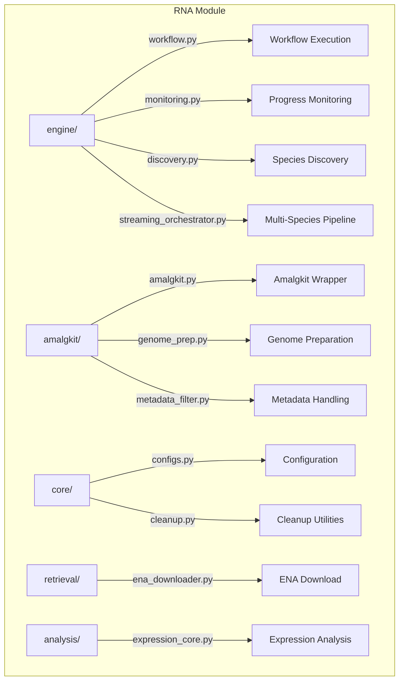

# RNA Module

Core RNA-seq analysis and workflow orchestration for METAINFORMANT.

## 📊 Architecture


```mermaid
graph TD
    subgraph "RNA Module"
        E[engine/] --> |workflow.py| W[Workflow Execution]
        E --> |monitoring.py| M[Progress Monitoring]
        E --> |discovery.py| D[Species Discovery]
        E --> |streaming_orchestrator.py| SO[Multi-Species Pipeline]
        
        A[amalgkit/] --> |amalgkit.py| AK[Amalgkit Wrapper]
        A --> |genome_prep.py| G[Genome Preparation]
        A --> |metadata_filter.py| MD[Metadata Handling]
        
        C[core/] --> |configs.py| CF[Configuration]
        C --> |cleanup.py| CL[Cleanup Utilities]
        
        R[retrieval/] --> |ena_downloader.py| ENA[ENA Download]
        
        AN[analysis/] --> |expression_core.py| EX[Expression Analysis]
    end
```

## 📦 Submodules

| Module                               | Purpose                                       |
|--------------------------------------|-----------------------------------------------|
| [`engine/`](engine/)                 | Workflow execution, monitoring, orchestration |
| [`amalgkit/`](amalgkit/)             | Amalgkit tool wrapper and API                 |
| [`core/`](core/)                     | Configuration, cleanup, dependencies          |
| [`retrieval/`](retrieval/)           | ENA FASTQ data retrieval                      |
| [`analysis/`](analysis/)             | Expression matrix analysis, QC, validation    |
| [`deconvolution/`](deconvolution/)   | Cell-type deconvolution from bulk RNA-seq     |
| [`splicing/`](splicing/)             | Alternative splicing analysis                 |

## 🔑 Key Classes

### Workflow Engine

- `AmalgkitWorkflowConfig` — Workflow configuration loaded from YAML
- `StreamingPipelineOrchestrator` — Multi-species ENA-first orchestrator
- `StreamingPipeline` — Per-sample download→quant→cleanup pipeline
- `ProgressTracker` — Real-time progress state management

### Amalgkit Wrapper

- `AmalgkitParams` — Typed parameter container for amalgkit CLI calls
- `build_amalgkit_command()` — CLI command builder
- `run_amalgkit()` — Execute any amalgkit step
- `GenomePreparator` — Reference genome download and Kallisto indexing
- `TissueNormalizer` — Tissue label normalization via mappings

## 🚀 Usage

```python
from metainformant.rna.engine.workflow import AmalgkitWorkflowConfig, execute_workflow

# Load configuration
config = AmalgkitWorkflowConfig.load("config/amalgkit/amalgkit_pbarbatus.yaml")

# Execute workflow
result = execute_workflow(config, steps=["getfastq", "quant", "merge"])
```

## 📊 Workflow Steps

| Step       | Description                         |
|------------|-------------------------------------|
| `metadata` | Fetch sample metadata from NCBI     |
| `select`   | Filter to valid RNA-seq samples     |
| `getfastq` | Download SRA → extract FASTQ        |
| `quant`    | Quantify with kallisto              |
| `merge`    | Combine abundance files             |
| `curate`   | Quality control and filtering       |

## 🌐 Download Strategy: ENA-First with NCBI Fallback

All species use a two-tier download strategy managed by the `StreamingPipelineOrchestrator`:

1. **ENA primary** — Direct FTP/HTTP downloads of `.fastq.gz` from European Nucleotide Archive. Bypasses slow `prefetch` + `fasterq-dump` extraction.
2. **NCBI fallback** — If ENA download fails, falls back to `fasterq-dump` from NCBI SRA.

- **Entry point**: `scripts/rna/run_workflow.py` → `StreamingPipelineOrchestrator`
- **Concurrency**: Up to 16 parallel workers with SQLite-backed progress tracking
- **Scheduling**: Size-ordered (smallest samples first) for maximum throughput
- **Monitoring**: Real-time TUI via `scripts/rna/monitor_tui.py`

## 🧬 Index Complexity Management

For genomes with high repetitive content (e.g., *Harpegnathos saltator*), standard `kallisto index` may stall.

**Symptoms**:

- `kallisto quant` processes hang indefinitely with 100% CPU.
- `Max EC size` > 3000 in index stats.

**Solution** — `IndexComplexityManager` in `amalgkit/index_prep.py`:

1. Automatically filters `XR_` and `NR_` (non-coding RNA) transcripts.
2. Removes transcripts < 200bp and duplicates.
3. Rebuilds index with reduced complexity.

*This strategy solved the Harpegnathos stall (Max EC: ~3015) by reducing index size and complexity. It is now applied automatically for any species.*

## 🧬 GWAS Integration

RNA expression data can be integrated with GWAS variants for eQTL analysis:

```python
from metainformant.multiomics.analysis import integration
from metainformant.gwas.finemapping.colocalization import eqtl_coloc

# Prepare expression data for integration
rna_data = integration.from_rna_expression(
    expression_df,
    normalize=True
)

# Run colocalization with GWAS summary statistics
result = eqtl_coloc(
    gwas_z=gwas_zscores,
    eqtl_z=expression_zscores,
    gene_id="LOC123456"
)
```

See [metainformant.multiomics](../multiomics/) for comprehensive integration methods.

## 🔗 Related

- [scripts/rna/](../../../scripts/rna/) - Workflow scripts
- [config/amalgkit/](../../../config/amalgkit/) - Configuration files
- [config/amalgkit/amalgkit_faq.md](../../../config/amalgkit/amalgkit_faq.md) - FAQ
- [metainformant.multiomics](../multiomics/) - GWAS-expression integration
