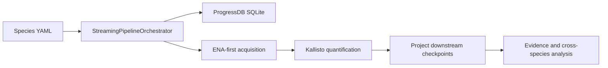

# RNA module

This package provides the current Amalgkit 0.16.38 execution and analysis
interfaces used by the Hymenoptera project. Large inputs and outputs live
under the explicitly selected `AMALGKIT_DATA_ROOT`, never in the repository.

## Current execution architecture


```mermaid
flowchart LR
    C[Species YAML] --> P[StreamingPipelineOrchestrator]
    P --> D[ProgressDB SQLite]
    P --> A[ENA-first acquisition]
    A --> Q[Kallisto quantification]
    Q --> F[Project downstream checkpoints]
    F --> E[Evidence and cross-species analysis]
```

The producer owns the first five stages and records resumable sample state:

`metadata → select → getfastq → integrate → quant`

The project checkpoint runner owns the deterministic downstream stages:

`merge → wsfilter → finalize → sanity`

The two phases are separated by a lock and an evidence contract. Downstream
work may start only after the producer has stopped and the current cohort
database, metadata, quantification sidecars, and raw-input receipts pass
validation.

## Stable Python interfaces

| Interface | Responsibility |
|---|---|
| `metainformant.rna.engine.streaming_orchestrator.StreamingPipelineOrchestrator` | Bounded multi-species acquisition and quantification |
| `metainformant.rna.engine.progress_db.ProgressDB` | SQLite-backed sample state and resume queries |
| `metainformant.rna.engine.workflow` | Typed configuration, planning, and step execution |
| `metainformant.rna.engine.provenance` | Hash-bound metadata, quantification, and downstream receipts |
| `metainformant.rna.amalgkit` | Version-pinned Amalgkit command registry and wrappers |
| `metainformant.rna.analysis` | Expression, QC, cross-species, and validation analyses |

## Command-line entrypoints

Inspect the configured cohort without modifying data:

```bash
export AMALGKIT_DATA_ROOT=/Volumes/blue/data/amalgkit
uv run python scripts/rna/run_all_species.py \
  --config-dir projects/hymenoptera_amalgkit/config/amalgkit \
  --data-root "$AMALGKIT_DATA_ROOT" --dry-run
```

Run one species through the shared producer:

```bash
uv run python scripts/rna/process_species.py \
  --species apis_mellifera \
  --config-dir projects/hymenoptera_amalgkit/config/amalgkit \
  --data-root "$AMALGKIT_DATA_ROOT"
```

Run the complete lock-owned project campaign:

```bash
bash projects/hymenoptera_amalgkit/scripts/run_full_campaign.sh
```

See the [Hymenoptera execution guide](../../../projects/hymenoptera_amalgkit/doc/00_setup/04_running_the_pipeline.md)
for storage, resume, evidence, and cross-species gates.

## Download and evidence boundary

ENA is the primary public-read path. The configured SRA fallback is used only
when the ENA path cannot complete. A metadata row, downloaded FASTQ, or
readable abundance table is not completion evidence by itself. A sample is
eligible for raw-input reclamation only after its current quantification
provenance sidecar validates the exact abundance file and the project receipt
records the same decision.

## Related documentation

- [RNA workflow documentation](../../../docs/rna/README.md)
- [Configuration FAQ](../../../projects/hymenoptera_amalgkit/config/amalgkit/amalgkit_faq.md)
- [Storage contract](../../../projects/hymenoptera_amalgkit/doc/01_infrastructure/02_storage_contract.md)
- [Reproducibility checklist](../../../projects/hymenoptera_amalgkit/doc/manuscript/reproducibility_checklist.md)
