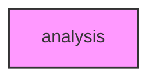

# ANALYSIS

## Overview
Functionality for analysis.

## 📦 Contents
- `[__init__.py](__init__.py)`
- `[protein_integration.py](protein_integration.py)`
- `[validation.py](validation.py)`

## 📊 Structure



## Usage
Import module:
```python
from metainformant.metainformant.rna.analysis import ...
```
