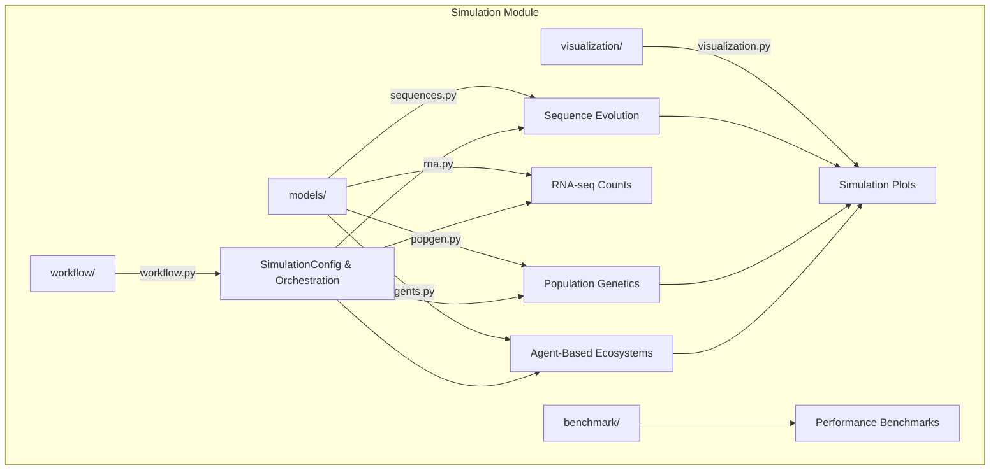

# Simulation Module

Synthetic biological data generation for benchmarking and validation -- sequence evolution, population genetics, RNA-seq counts, and agent-based ecosystem models.

## Architecture



## Key Capabilities

### Sequence Simulation

```python
from metainformant.simulation.models.sequences import generate_random_dna, evolve_sequence

ancestor = generate_random_dna(1000, gc_content=0.45)
evolved = evolve_sequence(ancestor, n_generations=100, mutation_rate=0.001)
```

| Function | Description |
|----------|-------------|
| `generate_random_dna` | Random DNA with configurable GC content |
| `mutate_sequence` | Introduce N point mutations |
| `evolve_sequence` | Multi-generation sequence evolution |
| `generate_sequence_family` | Related sequences with controlled divergence |
| `analyze_sequence_divergence` | Pairwise similarity across a set |

### Population Genetics

```python
from metainformant.simulation.models.popgen import generate_population_sequences, simulate_bottleneck_population

seqs = generate_population_sequences(n_sequences=50, length=1000, theta=0.01)
bottleneck = simulate_bottleneck_population(n_sequences=100, length=500, bottleneck_size=10)
```

| Function | Description |
|----------|-------------|
| `generate_genotype_matrix` | SNP genotype matrix with allele frequencies |
| `simulate_bottleneck_population` | Population size reduction events |
| `simulate_population_expansion` | Exponential growth scenarios |
| `generate_site_frequency_spectrum` | SFS under demographic models |
| `simulate_admixture` | Two-population admixture with mixing proportions |
| `simulate_selection` | Directional/balancing selection |

### RNA-seq Count Simulation

```python
from metainformant.simulation.models.rna import simulate_counts_negative_binomial

counts = simulate_counts_negative_binomial(
    n_samples=50, n_features=1000, means=means, dispersions=dispersions
)
```

### Agent-Based Ecosystem Models

The `Agent` class supports energy-based interactions, reproduction with mutation, and typed agents (producer, consumer, decomposer).

## Submodules

| Module | Purpose |
|--------|---------|
| [`models/`](models/) | Core generators: `sequences`, `popgen`, `rna`, `agents` |
| [`workflow/`](workflow/) | `SimulationConfig`, `run_simulation_workflow`, calibration |
| [`visualization/`](visualization/) | `plot_sequence_evolution`, `plot_population_dynamics_simulation`, animations |
| [`benchmark/`](benchmark/) | Performance benchmarking utilities |

## Quick Start

```python
from metainformant.simulation.workflow.workflow import SimulationConfig, run_simulation_workflow

config = SimulationConfig(
    simulation_type="population_genetics",
    population_size=200,
    n_steps=50,
    mutation_rate=0.001,
    output_dir="output/simulation"
)
result = run_simulation_workflow(config)
```

## Related

- [`metainformant.dna`](../dna/) -- Real sequence analysis to validate simulations
- [`metainformant.math.population_genetics`](../math/population_genetics/) -- Analytical population genetics theory
- [`docs/simulation/`](../../../docs/simulation/) -- Simulation documentation
