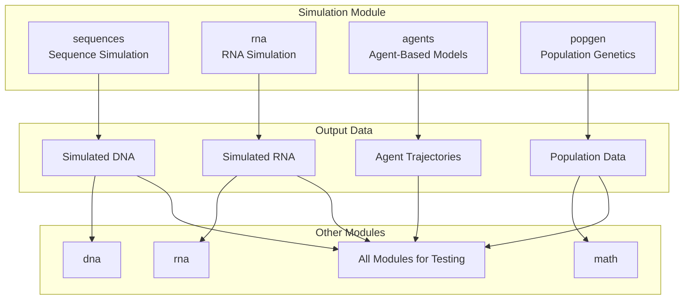
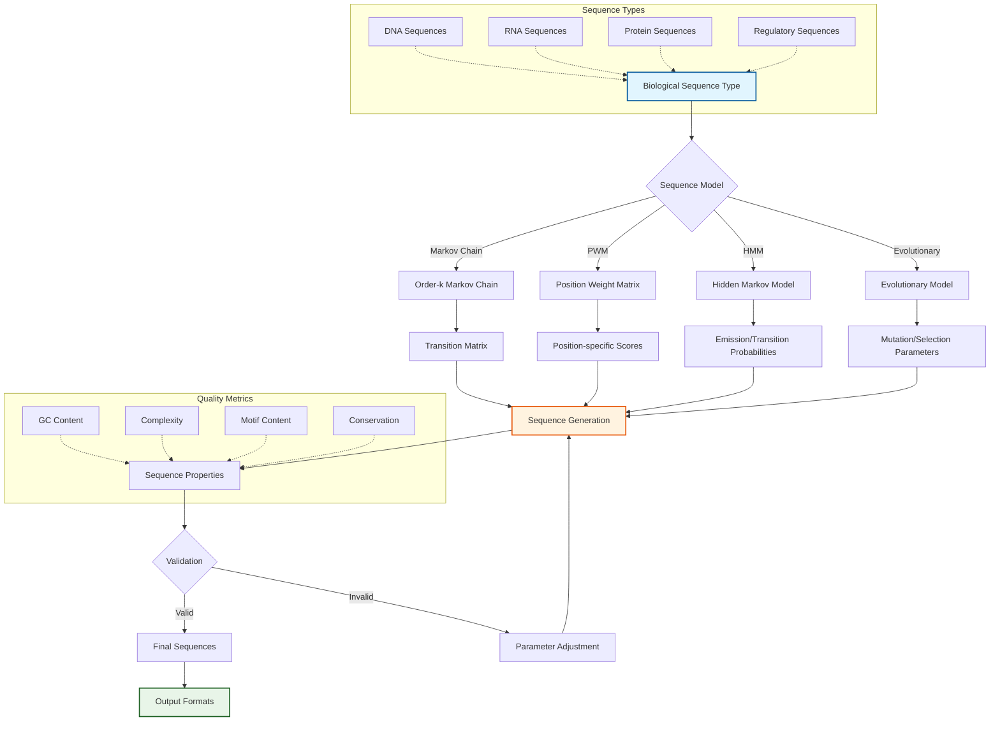
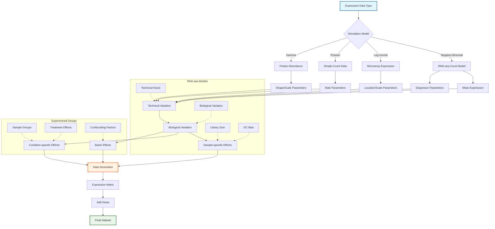
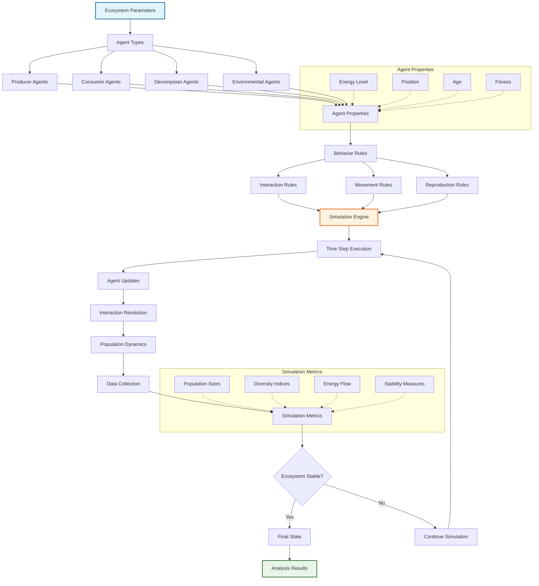
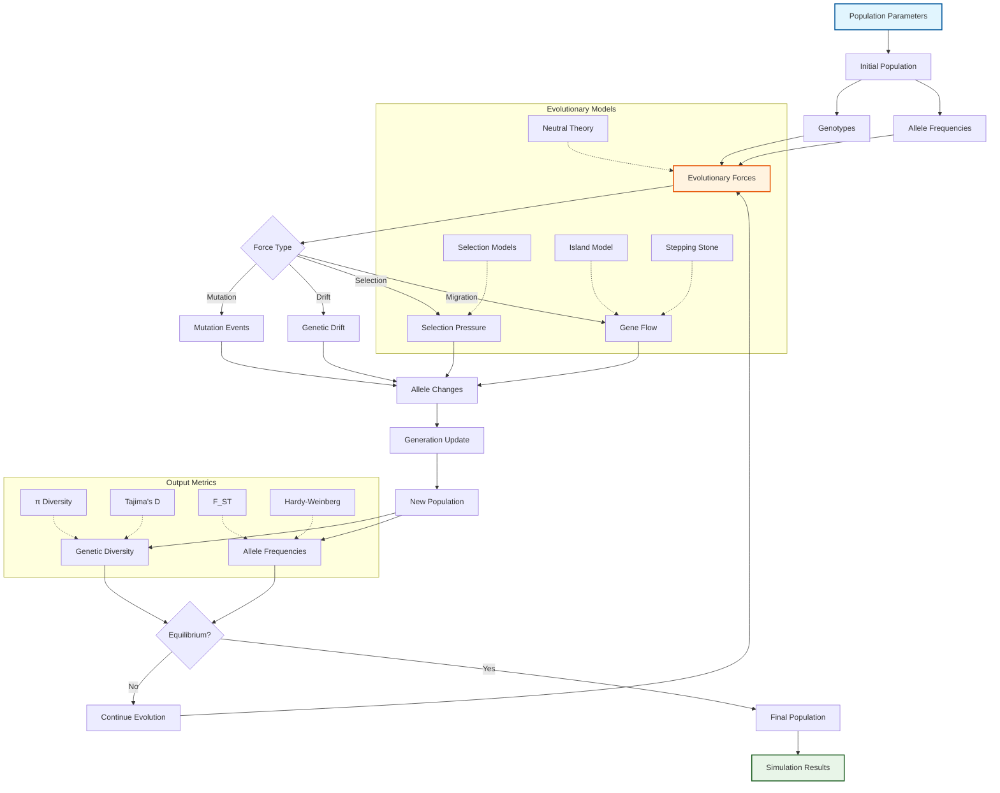
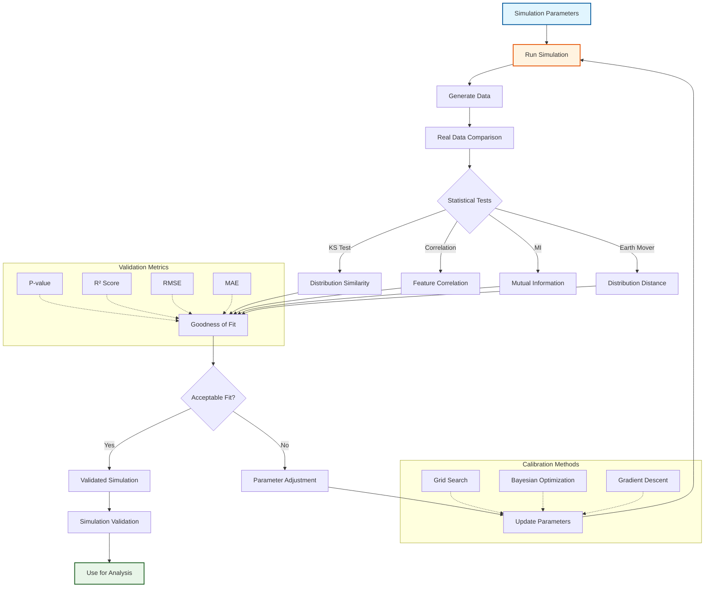

# Simulation Module

The `simulation` module provides synthetic data generation and agent-based modeling tools for testing hypotheses and generating training data across biological domains.

## Overview

This module enables researchers to:
- **Generate Synthetic Data**: Create realistic biological sequences and expression data
- **Agent-Based Modeling**: Simulate complex biological systems with interacting agents
- **Hypothesis Testing**: Test theoretical models with controlled synthetic data
- **Training Data Generation**: Create datasets for machine learning applications

### Module Architecture



### Sequence Simulation Framework



### Expression Data Simulation



### Agent-Based Ecosystem Modeling



### Population Genetics Simulation



### Validation and Calibration Framework



## Submodules

### Sequence Simulation (`sequences.py`)
Synthetic DNA, RNA, and protein sequence generation.

**Key Features:**
- Random sequence generation with biological constraints
- Mutation simulation with configurable rates
- Sequence evolution under selection
- Realistic length distributions and composition

**Usage:**
```python
from metainformant.simulation import generate_random_dna, generate_random_protein, mutate_sequence

# Generate random sequences
dna_seq = generate_random_dna(1000)
protein_seq = generate_random_protein(200)

# Simulate mutations (n_mut is number of mutations to introduce)
mutated = mutate_sequence(dna_seq, n_mut=5)
```

### Expression Simulation (`rna.py`)
Synthetic gene expression data generation.

**Key Features:**
- Negative binomial distribution modeling
- Library size and dispersion control
- Batch effect simulation
- Differential expression simulation

**Usage:**
```python
from metainformant.simulation import simulate_counts_negative_binomial

# Simulate expression counts
counts = simulate_counts_negative_binomial(
    num_genes=1000,
    num_samples=20,
    mean_expression=100.0,
    dispersion=0.1
)
```

### Agent-Based Models (`agents.py`)
Grid-world and multi-agent simulation framework.

**Key Features:**
- Configurable grid environments
- Agent behavior modeling
- Interaction dynamics
- Spatial and temporal analysis

**Usage:**
```python
from metainformant.simulation import GridWorld, Agent
import random

# Create simulation environment
rng = random.Random(42)
world = GridWorld(width=50, height=50, num_agents=100, rng=rng)

# Run simulation
for _ in range(100):
    world.step()

# Analyze results - get agent positions
positions = world.positions()
```

## Advanced Simulation Features

### Evolutionary Dynamics
```python
from metainformant.simulation import generate_random_dna, mutate_sequence
from metainformant.math import price_equation
import random

# Evolve sequences under selection
rng = random.Random(42)
population = [generate_random_dna(100, rng=rng) for _ in range(100)]
for generation in range(50):
    # Calculate fitness
    fitness = [len(seq) for seq in population]  # Simple fitness function
    trait_parent = [float(len(seq)) for seq in population]
    
    # Generate next generation with mutations
    trait_offspring = []
    new_population = []
    for seq in population:
        mutated = mutate_sequence(seq, n_mut=2, rng=rng)
        new_population.append(mutated)
        trait_offspring.append(float(len(mutated)))
    
    # Analyze evolution using Price equation
    cov_term, trans_term, total_change = price_equation(fitness, trait_parent, trait_offspring)
    population = new_population
```

### Complex System Modeling
```python
from metainformant.simulation import Agent, GridWorld
import random

# Multi-scale simulation
class GeneExpressionAgent(Agent):
    def __init__(self, x, y):
        super().__init__(x, y)
        self.expression_level = 0.0

    def step(self, world, rng):
        super().step(world, rng)
        # Gene expression dynamics
        self.expression_level += rng.random() * 0.1

# Run integrated simulation
rng = random.Random(42)
world = GridWorld(width=10, height=10, num_agents=100, rng=rng)
# Replace agents with custom ones
world.agents = [GeneExpressionAgent(rng.randrange(10), rng.randrange(10)) for _ in range(100)]

for _ in range(50):
    world.step()
```

## Integration with Other Modules

### With Machine Learning Module
```python
from metainformant.simulation import generate_random_dna
from metainformant.ml import BiologicalClassifier
import random

# Generate synthetic training data
rng = random.Random(42)
sequences = [generate_random_dna(100, rng=rng) for _ in range(1000)]
# Extract features (e.g., k-mer frequencies) and create labels
labels = [0 if len(seq) < 50 else 1 for seq in sequences]

# Train classifier (requires feature extraction from sequences)
# See ml module for proper feature extraction and training
```

### With Visualization Module
```python
from metainformant.simulation import GridWorld
from metainformant.visualization import animate_time_series, scatter_plot
import random

# Visualize agent dynamics
rng = random.Random(42)
world = GridWorld(width=20, height=20, num_agents=50, rng=rng)

# Record positions over time
position_history = []
for _ in range(100):
    world.step()
    positions = world.positions()
    position_history.append(positions)

# Visualize final positions
if position_history:
    final_positions = position_history[-1]
    x_coords = [pos[0] for pos in final_positions]
    y_coords = [pos[1] for pos in final_positions]
    ax = scatter_plot(x_coords, y_coords, title="Agent Positions")
```

### With DNA Module for Validation
```python
from metainformant.simulation import generate_random_dna, mutate_sequence
from metainformant.dna import sequences, alignment
import random

# Generate synthetic sequences for validation
rng = random.Random(42)
seq1 = generate_random_dna(1000, rng=rng)
seq2 = mutate_sequence(seq1, n_mut=10, rng=rng)

# Validate simulation by comparing with real alignment tools
# Align simulated sequences
aln = alignment.global_pairwise([seq1, seq2])

# Verify mutation rate matches expected
# Use DNA module analysis to validate simulation parameters
```

## Performance Considerations

- **Memory Efficiency**: Streaming generation for large datasets
- **Parallel Generation**: Multi-threaded sequence and data generation
- **Configurable Complexity**: Scale from simple to complex simulations
- **Reproducibility**: Deterministic random seeds for reproducible results

## Parameter Control

All simulations support parameter control:

```python
from metainformant.simulation import generate_random_dna, mutate_sequence
import random

# Configurable sequence generation
rng = random.Random(42)
sequences = []
for _ in range(1000):
    # Generate with specified GC content
    seq = generate_random_dna(1000, gc_content=0.5, rng=rng)
    # Optionally apply mutations
    seq = mutate_sequence(seq, n_mut=5, rng=rng)
    sequences.append(seq)
```

## Testing and Validation

- **Distribution Validation**: Statistical tests for generated data distributions
- **Biological Realism**: Validation against real biological data
- **Performance Testing**: Benchmarking for large-scale simulations
- **Edge Case Handling**: Robust behavior with extreme parameters

## Dependencies

- **Core**: NumPy for numerical computations
- **Optional**: NetworkX for complex network simulations
- **Visualization**: Matplotlib for simulation visualization

## Usage Examples

### Synthetic Sequence Dataset
```python
from metainformant.simulation import generate_random_dna, mutate_sequence
from metainformant.dna.sequences import write_fasta
import random

# Generate sequence dataset
rng = random.Random(42)
sequences_list = []
for _ in range(10000):
    # Generate random length between 500 and 2000
    length = rng.randint(500, 2000)
    seq = generate_random_dna(length, gc_content=0.5, rng=rng)
    # Apply mutations
    n_mutations = int(length * 0.001)
    seq = mutate_sequence(seq, n_mut=n_mutations, rng=rng)
    sequences_list.append(seq)

# Save for downstream analysis
write_fasta({"seq_{i}": seq for i, seq in enumerate(sequences_list)}, "output/synthetic_dna.fasta")
```

### Agent-Based Ecosystem Simulation
```python
from metainformant.simulation import GridWorld, Agent
import random

# Ecosystem simulation with GridWorld
rng = random.Random(42)
# Create environment
ecosystem = GridWorld(width=100, height=100, num_agents=220, rng=rng)

# Run long-term simulation
for year in range(10):
    for day in range(365):
        ecosystem.step()
    # Analyze positions at end of each year
    positions = ecosystem.positions()
    # Perform custom analysis on positions
```

## Workflow Integration

### End-to-End Simulation Pipelines

The module now includes workflow functions for simulation pipelines:

```python
from metainformant.simulation.workflow import (
    run_sequence_simulation_workflow,
    run_agent_simulation_workflow,
    run_popgen_simulation_workflow,
)

# Sequence simulation workflow
results = run_sequence_simulation_workflow(
    "output/sequences",
    n_sequences=1000,
    sequence_length=1000,
    gc_content=0.5,
    seed=42
)

# Agent-based simulation workflow
results = run_agent_simulation_workflow(
    "output/agents",
    width=100,
    height=100,
    num_agents=500,
    num_steps=1000,
    seed=42
)

# Population genetics workflow
results = run_popgen_simulation_workflow(
    "output/popgen",
    n_sequences=50,
    sequence_length=1000,
    nucleotide_diversity=0.01,
    seed=42
)
```

## Validation and Reproducibility

All simulation functions now include parameter validation:

- **Type validation**: Ensures parameters are of correct types
- **Range validation**: Validates parameter ranges (e.g., Fst in [0,1])
- **Error handling**: Clear error messages for invalid parameters
- **Reproducibility**: Seed management for deterministic outputs

## Core Integration

The simulation module now uses core utilities consistently:

- **Logging**: All functions log their operations
- **Validation**: Parameter validation using core.validation
- **Error handling**: Custom exceptions from core.errors
- **Path handling**: Uses core.paths for output directory management

## Module-Specific Simulation Scripts

The simulation module includes dedicated scripts for each domain module, providing synthetic data generation capabilities across all biological domains. These scripts are located in `scripts/simulation/` and can be run standalone or integrated into workflows.

### Available Simulation Scripts

Each module has a corresponding simulation script that generates domain-specific synthetic data:

- **`simulate_core.py`**: Core utilities simulation (config files, workflow test data, I/O patterns)
- **`simulate_dna.py`**: DNA sequence simulation (sequences, mutations, population genetics, alignment, phylogeny)
- **`simulate_rna.py`**: RNA expression simulation (count matrices, differential expression, batch effects)
- **`simulate_protein.py`**: Protein simulation (sequences, structure coordinates, domain annotations, PPI networks)
- **`simulate_epigenome.py`**: Epigenome simulation (methylation patterns, chromatin accessibility, ChIP-seq peaks)
- **`simulate_ontology.py`**: Ontology simulation (GO term annotations, enrichment test data)
- **`simulate_phenotype.py`**: Phenotype simulation (morphological traits, behavioral traits, trait correlations)
- **`simulate_ecology.py`**: Ecology simulation (species abundance, community composition, environmental metadata)
- **`simulate_math.py`**: Mathematical biology simulation (coalescent models, selection experiments, population genetics)
- **`simulate_visualization.py`**: Visualization data simulation (time-series, multi-dimensional, statistical test data)
- **`simulate_singlecell.py`**: Single-cell simulation (scRNA-seq counts, cell types, trajectories)
- **`simulate_quality.py`**: Quality control simulation (FASTQ quality scores, contamination patterns, quality metrics)
- **`simulate_networks.py`**: Network simulation (PPI networks, regulatory networks, pathway networks)
- **`simulate_ml.py`**: Machine learning simulation (feature matrices, classification/regression test data)
- **`simulate_multiomics.py`**: Multi-omics simulation (cross-platform data, integrated datasets)
- **`simulate_gwas.py`**: GWAS simulation (variants/VCF, genotype matrices, phenotypes, population structure)
- **`simulate_life_events.py`**: Life events simulation (event sequences, life course patterns)
- **`simulate_information.py`**: Information theory simulation (sequence information content, mutual information test data)

### Usage Pattern

All simulation scripts follow a consistent pattern:

```bash
# Basic usage
python3 scripts/simulation/simulate_<module>.py --type <simulation_type> [options]

# Example: Generate DNA sequences
python3 scripts/simulation/simulate_dna.py --type sequences --n 100 --length 1000

# Example: Generate RNA expression with differential expression
python3 scripts/simulation/simulate_rna.py --type differential --num-genes 500 --num-samples 10

# Example: Generate GWAS variants
python3 scripts/simulation/simulate_gwas.py --type variants --n-variants 1000 --n-samples 100
```

### Script Features

Each script provides:
- **Multiple simulation types**: Different simulation modes for various use cases
- **Comprehensive parameters**: Configurable parameters for realistic data generation
- **Parameter validation**: Full validation using `core.validation` with type checking and range validation
- **Reproducibility**: Seed-based random number generation for reproducible results
- **Output organization**: Structured output to `output/simulation/<module>/` by default
- **Metadata**: Summary files and metadata for tracking simulation parameters
- **Integration**: Uses core utilities (io, paths, logging, validation) consistently
- **Error handling**: Comprehensive error handling with clear, contextual messages
- **Documentation**: Complete docstrings with parameter descriptions and examples
- **Type safety**: Full type hints for all functions

### Integration with Analysis Modules

The simulated data from these scripts can be directly used with corresponding analysis modules:

```python
# Simulate DNA sequences
# python3 scripts/simulation/simulate_dna.py --type sequences --n 100

# Then analyze with DNA module
from metainformant.dna import sequences, alignment
seqs = sequences.read_fasta("output/simulation/dna/sequences.fasta")
aln = alignment.global_pairwise(list(seqs.values())[:2])
```

See `scripts/simulation/README.md` for detailed documentation and usage examples for each script.

This module provides tools for synthetic data generation and hypothesis testing, enabling researchers to explore biological systems in controlled computational environments.
