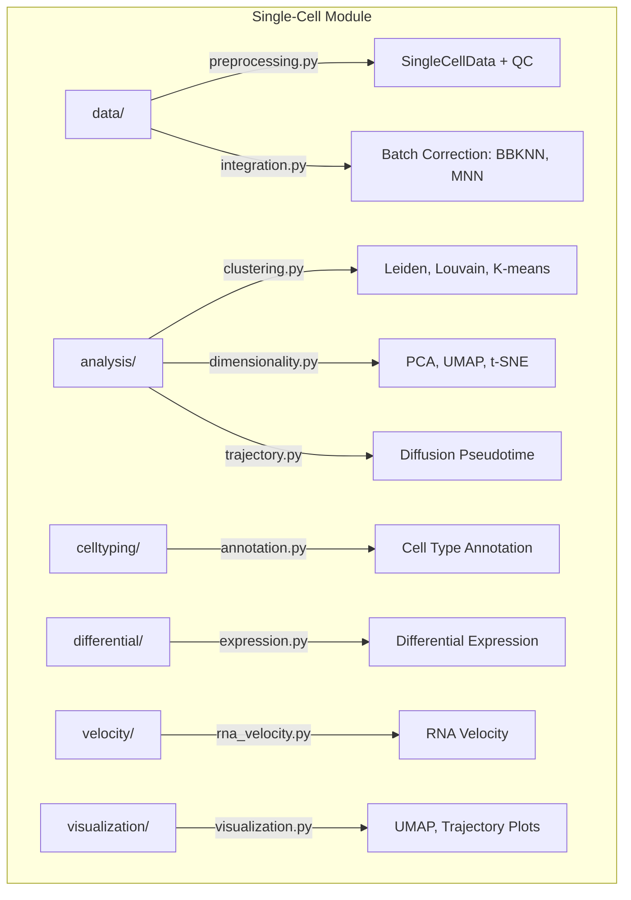

# Single-Cell Module

Single-cell RNA-seq analysis: preprocessing, dimensionality reduction, clustering, trajectory inference, and visualization for METAINFORMANT.

## Architecture



## Submodules

| Module | Purpose |
|--------|---------|
| [`data/`](data/) | `SingleCellData` class, QC filtering, batch integration (`bbknn_integration`) |
| [`analysis/`](analysis/) | `leiden_clustering`, `compute_pca`, `compute_umap`, `compute_diffusion_pseudotime` |
| [`celltyping/`](celltyping/) | Automated cell type annotation from marker genes |
| [`differential/`](differential/) | Differential expression testing between clusters |
| [`velocity/`](velocity/) | RNA velocity estimation for dynamic trajectories |
| [`visualization/`](visualization/) | `plot_umap`, trajectory plots, QC visualizations |

## Key Capabilities

### Preprocessing and QC

```python
from metainformant.singlecell.data.preprocessing import SingleCellData
import numpy as np

# Create or load single-cell dataset
X = np.random.rand(500, 2000)  # 500 cells x 2000 genes
data = SingleCellData(X=X)
print(f"{data.n_obs} cells, {data.n_vars} genes")
```

### Dimensionality Reduction

| Function | Description |
|----------|-------------|
| `pca_reduction` / `compute_pca` | Principal component analysis |
| `compute_umap` / `run_umap` | UMAP embedding |
| `compute_tsne` / `run_tsne` | t-SNE embedding |
| `compute_diffusion_map` | Diffusion map coordinates |
| `select_hvgs` | Highly variable gene selection |

```python
from metainformant.singlecell.analysis.dimensionality import compute_pca, compute_umap

data = compute_pca(data, n_components=50)
data = compute_umap(data, n_neighbors=15)
```

### Clustering and Trajectory

```python
from metainformant.singlecell.analysis.clustering import leiden_clustering
from metainformant.singlecell.analysis.trajectory import compute_diffusion_pseudotime

data = leiden_clustering(data, resolution=1.0, n_neighbors=15)
data = compute_diffusion_pseudotime(data, root_cell=0, n_components=10)
```

## Quick Start

```python
from metainformant.singlecell.data.preprocessing import SingleCellData
from metainformant.singlecell.analysis.dimensionality import compute_pca, compute_umap
from metainformant.singlecell.analysis.clustering import leiden_clustering
from metainformant.singlecell.visualization.visualization import plot_umap
import numpy as np

# End-to-end single-cell workflow
data = SingleCellData(X=np.random.rand(1000, 3000))
data = compute_pca(data, n_components=50)
data = compute_umap(data, n_neighbors=15)
data = leiden_clustering(data, resolution=0.8)
fig = plot_umap(data, color="leiden")
```

## Related

- [metainformant.rna](../rna/) - Bulk RNA-seq expression analysis
- [metainformant.epigenome](../epigenome/) - Epigenomic assays for single-cell
- [metainformant.visualization](../visualization/) - General plotting utilities
- [docs/singlecell/](../../../docs/singlecell/) - Single-cell module documentation
