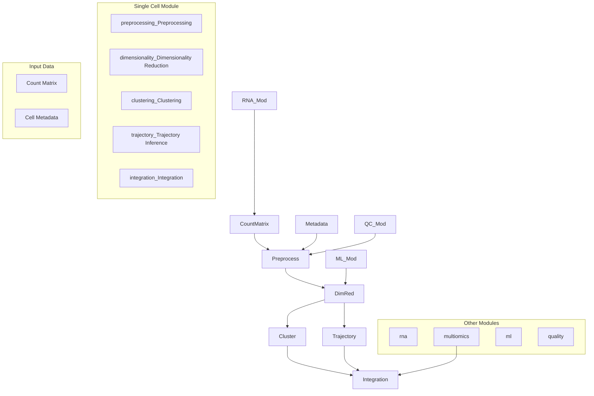
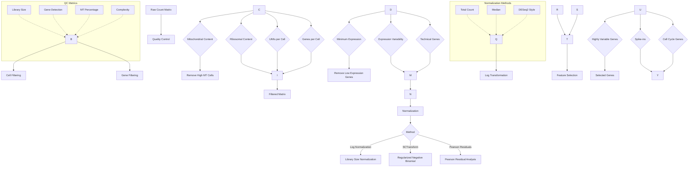
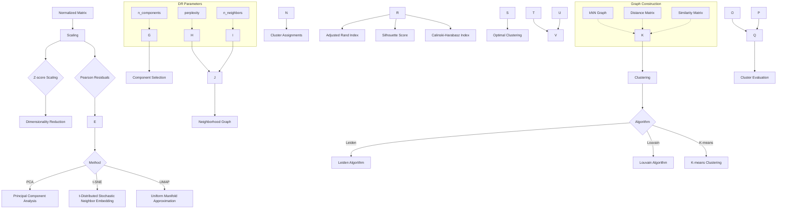
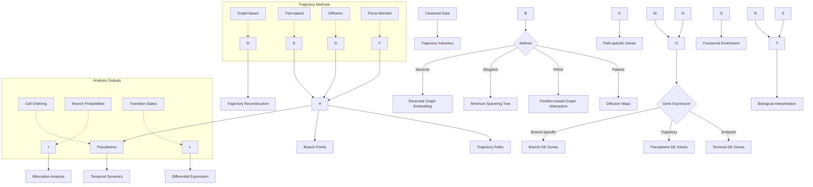
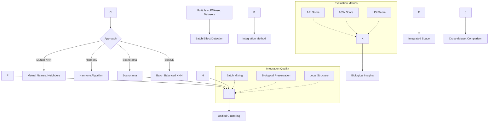
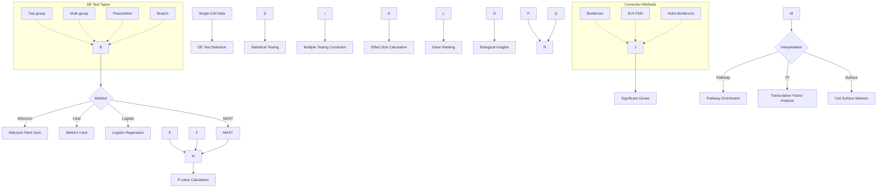

# Single Cell Analysis Module

The `singlecell` module provides tools for single-cell transcriptomic analysis, including preprocessing, dimensionality reduction, clustering, and trajectory inference.

## Overview

This module handles the single-cell RNA sequencing analysis pipeline from raw count matrices to biological interpretation.

### Module Architecture



### Single-Cell Preprocessing Pipeline



### Dimensionality Reduction and Clustering



### Trajectory Inference and Analysis



### Single-Cell Integration Methods



### Differential Expression Analysis



## Key Components

### Preprocessing (`preprocessing.py`)
Quality control, normalization, and filtering of single-cell data.

**Key Features:**
- Quality metric calculation and filtering
- Normalization methods (CPM, TPM, etc.)
- Batch effect detection and correction
- Mitochondrial gene percentage filtering

**Usage:**
```python
from metainformant.singlecell import (
    load_count_matrix,
    calculate_qc_metrics,
    filter_cells,
    normalize_counts
)

# Load and preprocess data
data = load_count_matrix("counts.mtx", format="mtx")
data = calculate_qc_metrics(data)
data = filter_cells(data, min_genes=200, max_pct_mt=10.0)
data = normalize_counts(data)
```

### Dimensionality Reduction (`dimensionality.py`)
PCA, t-SNE, UMAP, and other dimensionality reduction techniques.

**Key Features:**
- Principal component analysis (PCA)
- t-Distributed Stochastic Neighbor Embedding (t-SNE)
- Uniform Manifold Approximation and Projection (UMAP)
- Non-negative matrix factorization (NMF)

**Usage:**
```python
from metainformant.singlecell import (
    select_hvgs,
    compute_pca,
    compute_umap,
    compute_neighbors
)

# Select highly variable genes
data = select_hvgs(data, n_top_genes=2000)

# Reduce dimensions
data = compute_pca(data, n_components=50)
data = compute_neighbors(data, n_neighbors=15)
data = compute_umap(data, min_dist=0.1)
```

### Clustering (`clustering.py`)
Cell type identification and cluster analysis.

**Key Features:**
- K-means and hierarchical clustering
- Graph-based clustering (Louvain, Leiden)
- Cluster marker identification
- Cluster stability assessment

**Usage:**
```python
from metainformant.singlecell import (
    leiden_clustering,
    louvain_clustering,
    find_marker_genes
)

# Cluster cells
data = leiden_clustering(data, resolution=1.0)
# Or use Louvain
data = louvain_clustering(data, resolution=1.0)

# Find marker genes
markers = find_marker_genes(data, cluster_key="cluster")
```

### Trajectory Analysis (`trajectory.py`)
Pseudotime and developmental trajectory inference.

**Key Features:**
- Pseudotime ordering algorithms
- Trajectory branching detection
- Developmental stage identification
- Trajectory comparison across conditions

**Usage:**
```python
from metainformant.singlecell import (
    compute_pseudotime,
    trajectory_analysis,
    lineage_analysis
)

# Compute pseudotime
data = compute_pseudotime(data, root_cells=0, method="diffusion")

# Trajectory analysis
traj_result = trajectory_analysis(data)

# Lineage analysis
lineages = lineage_analysis(data)
```

### Integration (`integration.py`)
Multi-sample batch correction and integration.

**Key Features:**
- Canonical correlation analysis (CCA)
- Mutual nearest neighbors (MNN) correction
- Harmony batch correction
- Data integration quality assessment

**Usage:**
```python
from metainformant.singlecell import (
    integrate_datasets,
    harmony_integration,
    batch_correction
)

# Integrate multiple samples
integrated = integrate_datasets([sample1_data, sample2_data, sample3_data])

# Harmony batch correction
corrected = harmony_integration(integrated, batch_key="batch")

# Alternative: Combat batch correction
corrected = batch_correction(integrated, batch_key="batch", method="combat")
```

### Visualization (`visualization.py`)
Specialized single-cell data visualization.

**Key Features:**
- UMAP and t-SNE scatter plots
- Feature expression overlays
- Trajectory visualizations
- Cluster annotation plots

**Usage:**
```python
from metainformant.singlecell import (
    plot_qc_metrics,
    plot_dimensionality_reduction,
    plot_gene_expression,
    plot_clusters
)

# Create visualizations
fig = plot_qc_metrics(data)
fig = plot_dimensionality_reduction(data, method="umap", color_by="cluster")
fig = plot_gene_expression(data, gene="GENE1")
fig = plot_clusters(data, cluster_key="cluster")
```

## Integration with Other Modules

### With RNA Module
```python
from metainformant.rna import workflow
from metainformant.singlecell import normalize_counts, load_count_matrix

# Process single-cell data
single_cell_data = load_count_matrix("counts.mtx")
single_cell_data = normalize_counts(single_cell_data)

# Compare with bulk RNA data from RNA workflow
bulk_expression = workflow.extract_expression("bulk_expression.tsv")
# Compare expression patterns between single-cell and bulk data
```

### With Machine Learning Module
```python
from metainformant.singlecell import leiden_clustering, compute_pca
from metainformant.ml import BiologicalClassifier, reduce_dimensions_umap

# Use clustering results for supervised learning
data = leiden_clustering(data, resolution=1.0)
data = compute_pca(data, n_components=20)

# Extract cluster labels for classification
clusters = data.obs["cluster"].values
X_features = data.obsm["X_pca"]

# Train classifier with cluster labels
classifier = BiologicalClassifier(algorithm="random_forest", random_state=42)
classifier.fit(X_features, clusters)

# Use ML module's UMAP for visualization
X_umap = reduce_dimensions_umap(X_features, n_neighbors=15, n_components=2)
```

### With Visualization Module
```python
from metainformant.singlecell import compute_umap, compute_pseudotime
from metainformant.visualization import scatter_plot, lineplot

# UMAP visualization of single-cell data
data = compute_umap(data, min_dist=0.1, n_components=2)
umap_coords = data.obsm["X_umap"]

# Visualize UMAP embedding colored by cluster
ax = scatter_plot(umap_coords[:, 0], umap_coords[:, 1],
                  xlabel="UMAP 1", ylabel="UMAP 2",
                  title="Single-Cell UMAP Embedding",
                  c=data.obs["cluster"].values)

# Trajectory visualization
data = compute_pseudotime(data, root_cells=0, method="diffusion")
pseudotime = data.obs["pseudotime"].values

# Plot pseudotime along trajectory
ax = lineplot(range(len(pseudotime)), pseudotime,
              xlabel="Cell Index", ylabel="Pseudotime",
              title="Developmental Trajectory")

# Expression feature visualization
feature_expression = data[:, "GENE1"].X.toarray().flatten()
ax = scatter_plot(umap_coords[:, 0], umap_coords[:, 1],
                  c=feature_expression, cmap="viridis",
                  xlabel="UMAP 1", ylabel="UMAP 2",
                  title="GENE1 Expression")
```

### With Quality Module
```python
from metainformant.singlecell import calculate_qc_metrics, filter_cells
from metainformant.quality import calculate_quality_metrics, generate_quality_report

# Calculate single-cell QC metrics
data = calculate_qc_metrics(data)

# Filter cells based on QC metrics
data = filter_cells(data, min_genes=200, max_pct_mt=10.0)

# Use quality module for comprehensive QC reporting
qc_scores = [
    data.obs["n_genes"].values,
    data.obs["n_counts"].values,
    data.obs["pct_counts_mt"].values
]
qc_metrics = calculate_quality_metrics(qc_scores)

# Generate quality report
report = generate_quality_report({
    "genes": {"mean": qc_metrics["mean"], "std": qc_metrics["std"]},
    "counts": {"mean": qc_metrics["mean"], "std": qc_metrics["std"]},
    "mitochondrial": {"mean": qc_metrics["mean"], "std": qc_metrics["std"]}
})
```

### With Information Theory Module
```python
from metainformant.singlecell import leiden_clustering, compute_pca
from metainformant.information import shannon_entropy, mutual_information
import numpy as np

# Entropy analysis of cell states
data = leiden_clustering(data, resolution=1.0)

# Calculate entropy of cluster distribution
cluster_counts = np.bincount(data.obs["cluster"].values)
cluster_proportions = cluster_counts / cluster_counts.sum()
cluster_entropy = shannon_entropy(cluster_proportions)
print(f"Cluster diversity (entropy): {cluster_entropy:.3f}")

# Calculate mutual information between gene expression and cell type
# Select marker genes
marker_genes = ["GENE1", "GENE2", "GENE3"]
marker_expression = data[:, marker_genes].X.toarray()

# Binarize expression for MI calculation
marker_expression_binary = (marker_expression > marker_expression.mean(axis=0)).astype(int)
cell_types = data.obs["cluster"].values

# Calculate MI for each marker gene
for i, gene in enumerate(marker_genes):
    gene_expression = marker_expression_binary[:, i]
    # Convert to probability distributions
    p_x = np.bincount(gene_expression.astype(int)) / len(gene_expression)
    p_y = np.bincount(cell_types.astype(int)) / len(cell_types)
    # Calculate joint distribution
    p_xy = np.histogram2d(gene_expression, cell_types, bins=[2, len(np.unique(cell_types))])[0]
    p_xy = p_xy / p_xy.sum()
    
    mi = mutual_information(p_xy, p_x, p_y)
    print(f"MI({gene}, cell_type): {mi:.3f}")
```

### With Multiomics Module
```python
from metainformant.singlecell import load_count_matrix, compute_pca, integrate_datasets
from metainformant.multiomics import MultiOmicsData, canonical_correlation

# Integrate single-cell data with bulk omics
sc_counts = load_count_matrix("singlecell_counts.h5ad")
sc_data = compute_pca(sc_counts, n_components=50)

# Prepare bulk expression data
bulk_expression = pd.read_csv("bulk_expression.csv", index_col=0)

# Create multi-omics dataset
omics_data = MultiOmicsData(
    singlecell=sc_data.to_df(),
    transcriptomics=bulk_expression
)

# Canonical correlation between single-cell and bulk
X_c, Y_c, X_w, Y_w, correlations = canonical_correlation(
    omics_data,
    layer_pair=("singlecell", "transcriptomics"),
    n_components=10
)

# Joint analysis across omics layers
from metainformant.multiomics import joint_pca
embeddings, loadings, variance = joint_pca(omics_data, n_components=50)

# Integrate multiple single-cell samples
sc_samples = [load_count_matrix(f"sample{i}.h5ad") for i in range(3)]
integrated_sc = integrate_datasets(sc_samples)
```

### With Networks Module
```python
from metainformant.singlecell import compute_neighbors, leiden_clustering
from metainformant.networks import infer_grn, GeneRegulatoryNetwork

# Regulatory network inference from scRNA-seq
data = compute_neighbors(data, n_neighbors=15)
data = leiden_clustering(data, resolution=1.0)

# Extract expression matrix (cells x genes)
expression_matrix = data.X.toarray() if hasattr(data.X, "toarray") else data.X
gene_names = data.var_names.tolist()

# Infer gene regulatory network from expression data
grn = infer_grn(
    expression_matrix.T,  # Transpose to genes x cells
    gene_names=gene_names,
    method="mutual_information",
    threshold=0.3
)

# Create regulatory network object
regulatory_network = GeneRegulatoryNetwork(grn)

# Analyze regulatory motifs
motifs = regulatory_network.regulatory_motifs()
print(f"Found {len(motifs['feedforward_loops'])} feed-forward loops")

# Identify master regulators
master_regulators = regulatory_network.master_regulators(top_k=10)
print(f"Top master regulators: {master_regulators}")
```

## Performance Features

- Memory-efficient processing of large single-cell datasets
- Parallel computation for time-intensive operations
- Streaming processing for very large datasets
- GPU acceleration support where applicable

## Testing

Comprehensive tests cover:
- Algorithm implementation correctness
- Integration with real single-cell datasets
- Performance benchmarking
- Edge case handling

## Dependencies

- Scanpy for core single-cell algorithms
- Optional: scVelo for trajectory analysis, scikit-learn for additional ML methods

## See Also

- **[AGENTS.md](AGENTS.md)**: AI agent contributions and development details for the singlecell module

## Related Modules

The Single-cell module integrates with several other METAINFORMANT modules:

- **RNA Module**: Single-cell RNA-seq data processing and analysis; foundation for scRNA-seq workflows
- **Multi-omics Module**: Multi-omics single-cell data integration; spatial transcriptomics
- **ML Module**: Machine learning analysis of single-cell data; clustering algorithms and feature selection
- **Visualization Module**: Single-cell data visualization, dimensionality reduction plots, and trajectory inference diagrams
- **Quality Module**: Single-cell data quality control and preprocessing; doublet detection and filtering
- **Information Module**: Information-theoretic analysis of single-cell heterogeneity and cell state complexity
- **Networks Module**: Cell-cell communication networks and regulatory network inference
- **Simulation Module**: Synthetic single-cell data generation for method validation
- **GWAS Module**: Single-cell eQTL analysis and cell-type specific association studies
- **Ontology Module**: Cell type annotation and functional enrichment analysis

This module provides a toolkit for single-cell transcriptomic analysis.
