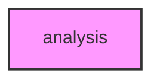

# ANALYSIS

## Overview
Functionality for analysis.

## 📦 Contents
- `[__init__.py](__init__.py)`
- `[clustering.py](clustering.py)`
- `[dimensionality.py](dimensionality.py)`
- `[trajectory.py](trajectory.py)`

## 📊 Structure



## Usage
Import module:
```python
from metainformant.metainformant.singlecell.analysis import ...
```
