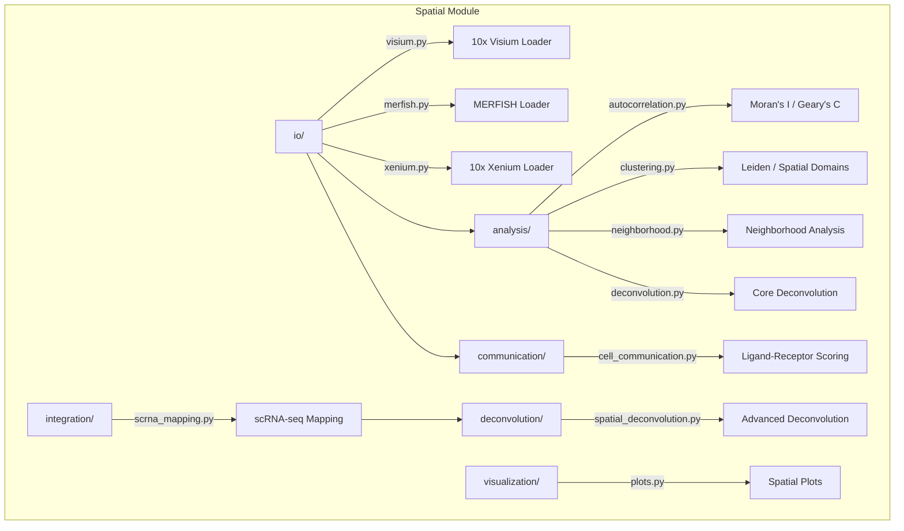

# Spatial Transcriptomics Module

Spatial transcriptomics analysis: platform I/O (Visium, MERFISH, Xenium), spatial statistics, cell-cell communication, deconvolution, and scRNA-seq integration.

## Architecture



## Submodules

| Module | Purpose |
|--------|---------|
| [`io/`](io/) | Platform loaders for Visium, MERFISH, and Xenium data formats |
| [`analysis/`](analysis/) | Spatial autocorrelation, clustering, neighborhood analysis, deconvolution |
| [`communication/`](communication/) | Ligand-receptor interaction scoring and communication networks |
| [`deconvolution/`](deconvolution/) | Advanced cell type deconvolution with reference profiles and niche ID |
| [`integration/`](integration/) | scRNA-seq to spatial mapping, label transfer, gene imputation |
| [`visualization/`](visualization/) | Spatial scatter plots, tissue overlays, expression maps |

## Key Capabilities

### Platform I/O

| Class/Function | Description |
|----------------|-------------|
| `load_visium` | Load 10x Visium spatial dataset (MEX or HDF5) |
| `SpatialDataset` | Unified spatial data container with coordinates and counts |
| `TissuePosition` | Single Visium spot position with tissue membership |
| `read_tissue_positions` | Parse tissue position CSV files |

### Spatial Statistics

| Class/Function | Description |
|----------------|-------------|
| `morans_i` | Global Moran's I spatial autocorrelation |
| `gearys_c` | Geary's C spatial autocorrelation |
| `local_morans_i` | Local Moran's I (LISA) for hotspot detection |
| `getis_ord_g` | Getis-Ord G* statistic for local clustering |
| `spatial_variogram` | Spatial variogram estimation |
| `spatial_weights_matrix` | Build spatial weight matrices (KNN or distance) |

### Spatial Clustering

| Function | Description |
|----------|-------------|
| `spatial_cluster` | Unified interface for spatial clustering methods |
| `leiden_clustering` | Leiden community detection on spatial graph |
| `louvain_clustering` | Louvain community detection on spatial graph |
| `spatial_domains` | Identify spatially coherent tissue domains |
| `build_spatial_graph` | Construct KNN or radius-based spatial graph |

### Cell-Cell Communication

| Function | Description |
|----------|-------------|
| `compute_ligand_receptor_interactions` | Score LR interactions between cell types |
| `spatial_interaction_score` | Distance-weighted interaction scoring |
| `build_communication_network` | Build cell-type communication graph |
| `communication_pattern_analysis` | NMF-based communication pattern discovery |

### Deconvolution & Integration

| Function | Description |
|----------|-------------|
| `deconvolve_spots` | Estimate cell type proportions per spot (NNLS) |
| `build_reference_profiles` | Build reference profiles from scRNA-seq |
| `niche_identification` | Identify tissue niches by composition clustering |
| `map_scrna_to_spatial` | Map scRNA-seq cells to spatial coordinates |
| `impute_spatial_genes` | Impute unmeasured genes from scRNA-seq data |

## Quick Start

```python
from metainformant.spatial.io.visium import load_visium
from metainformant.spatial.analysis.autocorrelation import morans_i, spatial_weights_matrix
from metainformant.spatial.communication.cell_communication import compute_ligand_receptor_interactions

# Load Visium data
dataset = load_visium("/path/to/spaceranger/output")

# Compute spatial autocorrelation
coords = [(s.x_pixel, s.y_pixel) for s in dataset.positions]
W = spatial_weights_matrix(coords, method="knn", k=6)
result = morans_i(gene_expression_vector, W)
print(f"Moran's I = {result.I:.3f}, p = {result.p_value:.4f}")

# Ligand-receptor analysis
lr_results = compute_ligand_receptor_interactions(
    expression=expression_matrix,
    cell_types=cell_type_labels,
)
```

## Related

- [docs/spatial/](../../../docs/spatial/) - Platform guides, autocorrelation, clustering docs
- [metainformant.singlecell](../singlecell/) - scRNA-seq analysis for integration workflows
- [metainformant.visualization](../visualization/) - General-purpose plotting utilities
