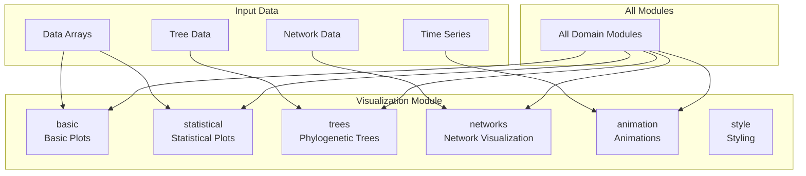
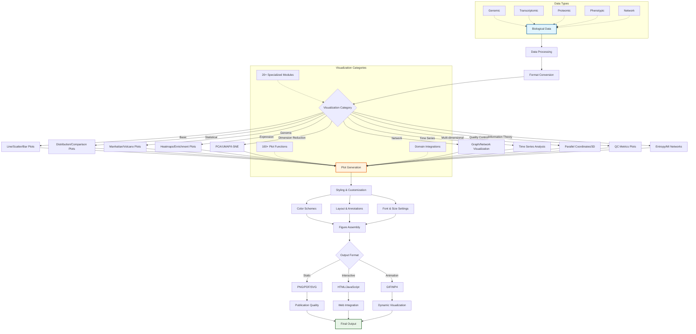
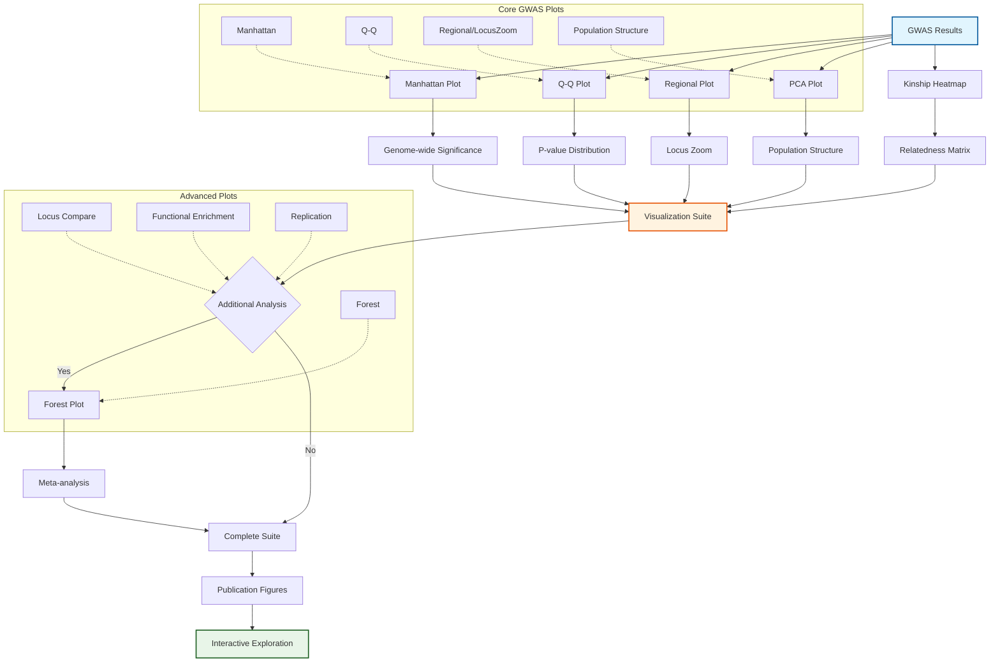
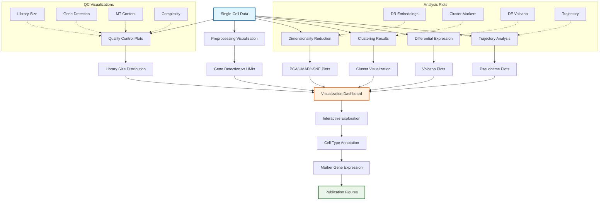
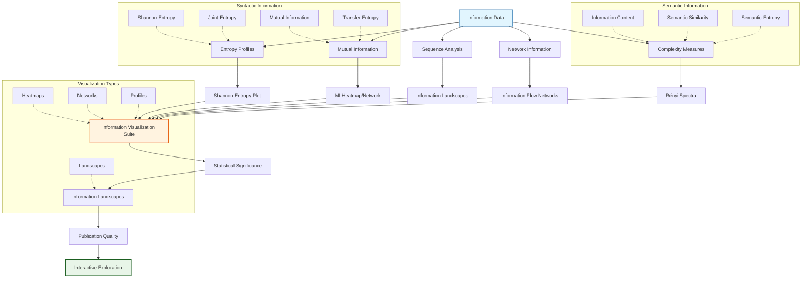
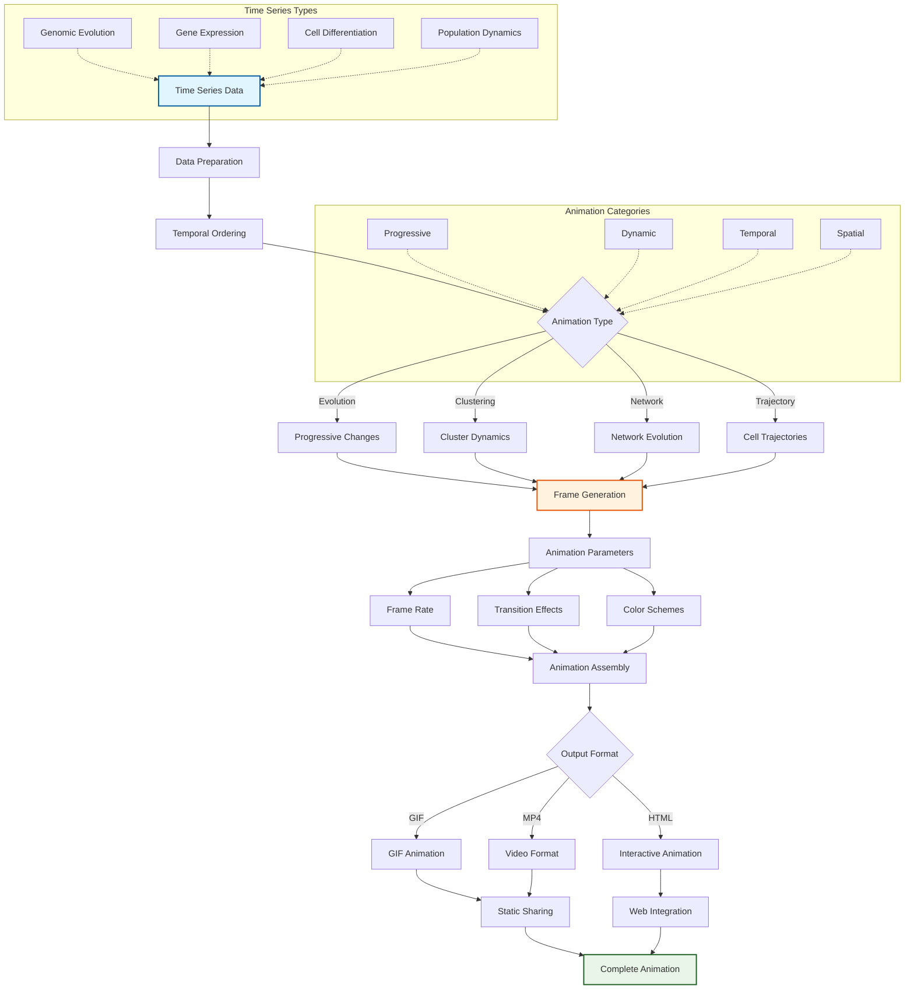
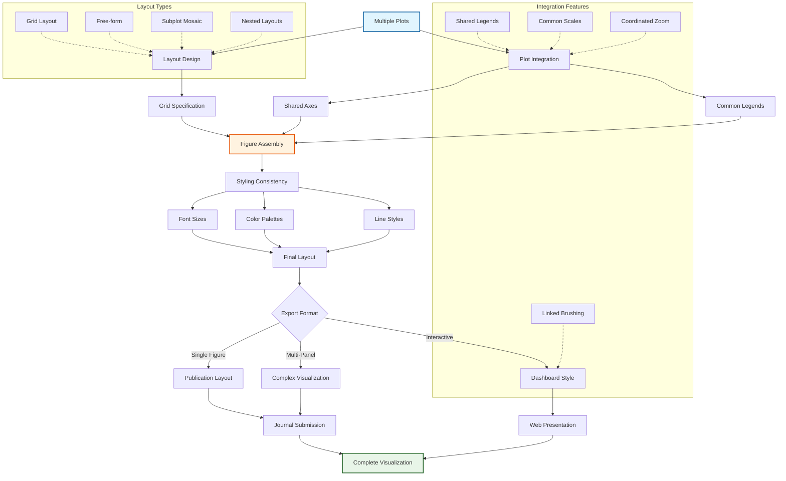

# Visualization Module

The `visualization` module provides unified plotting and animation utilities for creating publication-quality figures and interactive visualizations across all METAINFORMANT domains.

## Overview

This module offers a cohesive API for creating various types of plots, from statistical charts to phylogenetic trees and animations. It integrates multiple plotting backends while providing a consistent interface.

### Module Architecture



### Visualization Pipeline Framework



### GWAS Visualization Suite



### Single-Cell Visualization Framework



### Information Theory Visualization



### Animation and Time Series Framework



### Multi-Panel Figure Layout System



## Module Organization

The visualization package is organized into category-specific modules for clear organization and maintainability:

### Core Plotting Modules

#### Basic Plots (`basic.py`)
Fundamental plotting functions for simple visualizations.

**Functions:**
- `lineplot`: Simple line plots
- `scatter_plot`: Scatter plots
- `bar_plot`: Bar charts
- `pie_chart`: Pie charts
- `area_plot`: Area plots (filled line plots)
- `step_plot`: Step plots
- `heatmap`: Basic heatmaps

**Usage:**
```python
from metainformant.visualization import lineplot, scatter_plot, bar_plot, heatmap

ax = lineplot(None, [1, 4, 2, 8, 5], label="Data")
ax = scatter_plot([1, 2, 3], [4, 5, 6], xlabel="X", ylabel="Y")
ax = bar_plot(["A", "B", "C"], [10, 20, 15])
```

#### Statistical Plots (`statistical.py`)
Statistical visualization functions for data analysis.

**Functions:**
- `histogram`: Histograms
- `box_plot`: Box plots
- `violin_plot`: Violin plots
- `qq_plot`: Q-Q plots for p-value analysis
- `correlation_heatmap`: Correlation matrices
- `density_plot`: Kernel density estimation
- `ridge_plot`: Overlapping density plots
- `roc_curve`: ROC curves
- `precision_recall_curve`: Precision-recall curves
- `residual_plot`: Regression residuals
- `leverage_plot`: Regression leverage

**Usage:**
```python
from metainformant.visualization import histogram, box_plot, qq_plot
import numpy as np

data = np.random.normal(0, 1, 1000)
ax = histogram(data, bins=30)
ax = box_plot([np.random.normal(0, 1, 100) for _ in range(3)], labels=["A", "B", "C"])
```

#### Genomics Plots (`genomics.py`)
Genomic visualization functions for GWAS and sequence analysis.

**Functions:**
- `manhattan_plot`: Manhattan plots for GWAS
- `volcano_plot`: Volcano plots for differential expression
- `regional_plot`: Regional plots for specific genomic regions
- `circular_manhattan_plot`: Circular genome-wide views
- `chromosome_ideogram`: Chromosome maps with markers
- `coverage_plot`: Sequencing coverage visualization
- `variant_plot`: Variant visualization

**Usage:**
```python
from metainformant.visualization import manhattan_plot, volcano_plot
import pandas as pd
import numpy as np

data = pd.DataFrame({
    'position': range(1000, 10000, 100),
    'pvalue': np.random.uniform(1e-9, 1, 90),
    'chromosome': ['chr1'] * 45 + ['chr2'] * 45
})
data['neg_log10_p'] = -np.log10(data['pvalue'])
ax = manhattan_plot(data, 'position', 'neg_log10_p', 'chromosome')
```

#### Expression Plots (`expression.py`)
Expression analysis visualization functions.

**Functions:**
- `expression_heatmap`: Expression heatmaps with clustering
- `enrichment_plot`: Pathway/gene set enrichment
- `gene_expression_plot`: Single gene expression visualization
- `differential_expression_plot`: Top differentially expressed genes
- `log_fold_change_plot`: Log fold change distributions

#### Dimensionality Reduction (`dimred.py`)
Visualization functions for dimensionality reduction techniques.

**Functions:**
- `pca_plot`: PCA scatter plots
- `umap_plot`: UMAP visualizations
- `tsne_plot`: t-SNE visualizations
- `pca_scree_plot`: Variance explained plots
- `pca_loadings_plot`: PCA loadings visualization
- `biplot`: PCA biplots (samples and loadings)

**Usage:**
```python
from metainformant.visualization import pca_plot, umap_plot
import pandas as pd
import numpy as np

data = pd.DataFrame({
    'PC1': np.random.normal(0, 1, 100),
    'PC2': np.random.normal(0, 1, 100),
    'group': ['A'] * 50 + ['B'] * 50
})
ax = pca_plot(data, hue='group')
```

#### Network Plots (`networks.py`)
Network visualization functions.

**Functions:**
- `network_plot`: Basic network graphs
- `circular_network_plot`: Circular layouts
- `hierarchical_network_plot`: Hierarchical layouts
- `force_directed_plot`: Force-directed layouts
- `community_network_plot`: Community-based coloring

#### Time Series (`timeseries.py`)
Time series visualization functions.

**Functions:**
- `time_series_plot`: Basic time series plots
- `autocorrelation_plot`: Autocorrelation analysis
- `seasonal_decomposition_plot`: Trend, seasonal, residual decomposition
- `forecast_plot`: Forecasts with confidence intervals
- `trend_plot`: Trend analysis with fitted lines

#### Multi-dimensional (`multidim.py`)
Multi-dimensional visualization functions.

**Functions:**
- `pairplot_dataframe`: Pair plots for DataFrames
- `parallel_coordinates_plot`: Parallel coordinates
- `radar_chart`: Radar charts (spider charts)
- `splom_plot`: Scatter plot matrices
- `scatter_3d`: 3D scatter plots

#### Quality Control (`quality.py`)
Quality control visualization functions.

**Functions:**
- `qc_metrics_plot`: Multiple QC metrics
- `quality_score_plot`: Quality score distributions
- `per_base_quality_plot`: Position-specific quality
- `adapter_content_plot`: Adapter content visualization
- `sequence_length_distribution`: Sequence length distributions

#### Information Theory (`information.py`)
Information theory visualization functions.

**Functions:**
- `entropy_plot`: Entropy across positions
- `mutual_information_plot`: MI matrix heatmaps
- `information_profile_plot`: Comprehensive information profiles
- `renyi_spectrum_plot`: Rényi entropy spectra
- `information_network_plot`: MI-based networks

### Specialized Modules

#### Phylogenetic Trees (`trees.py`)
Phylogenetic tree visualization with multiple layouts.

**Functions:**
- `plot_phylo_tree`: Standard tree plots
- `circular_tree_plot`: Circular layouts
- `unrooted_tree_plot`: Unrooted trees
- `tree_comparison_plot`: Side-by-side tree comparison
- `tree_annotation_plot`: Trees with annotations

**Usage:**
```python
from metainformant.visualization import plot_phylo_tree, circular_tree_plot
from Bio import Phylo

tree = Phylo.read("tree.nwk", "newick")
ax = plot_phylo_tree(tree)
ax = circular_tree_plot(tree)
```

#### Animations (`animations.py`)
Dynamic visualization animations.

**Functions:**
- `animate_time_series`: Time series animations
- `animate_evolution`: Evolutionary process animations
- `animate_clustering`: Clustering iteration animations
- `animate_network`: Network evolution animations
- `animate_trajectory`: Trajectory inference animations

**Usage:**
```python
from metainformant.visualization import animate_time_series

data = [1, 2, 3, 2, 4, 5, 3, 6]
fig, anim = animate_time_series(data, interval_ms=500)
```

### Utility Modules

#### Styling (`style.py`)
Publication-quality style presets and color palettes.

**Functions:**
- `apply_publication_style`: Apply publication-quality settings
- `get_color_palette`: Get color palettes (primary, accessible, colorblind, viridis_like)
- `get_figure_size`: Get predefined figure sizes
- `set_font_family`: Set font family
- `set_font_size`: Set font size
- `reset_style`: Reset to defaults

#### Layout (`layout.py`)
Multi-panel figure creation and layout management.

**Functions:**
- `create_subplot_grid`: Create subplot grids
- `create_multi_panel`: Create multi-panel layouts
- `add_shared_axis_labels`: Add shared labels
- `hide_unused_subplots`: Hide unused subplots
- `adjust_spacing`: Adjust subplot spacing

#### Export (`export.py`)
High-resolution figure export utilities.

**Functions:**
- `save_figure`: Save figure with high-resolution settings
- `save_figure_multiformat`: Save in multiple formats
- `batch_export_figures`: Batch export multiple figures
- `get_supported_formats`: Get list of supported formats

#### Interactive (`interactive.py`)
Plotly integration for interactive plots (optional dependency).

**Functions:**
- `create_interactive_scatter`: Interactive scatter plots
- `create_interactive_heatmap`: Interactive heatmaps
- `convert_matplotlib_to_plotly`: Convert matplotlib to Plotly
- `is_plotly_available`: Check Plotly availability

### Domain Integration Modules

#### GWAS Integration (`gwas_integration.py`)
Unified access to GWAS visualization functions.

Re-exports functions from `gwas.visualization_*` modules including:
- Manhattan plots, circular Manhattan plots
- Q-Q plots, lambda GC plots
- Regional plots, gene annotation plots
- PCA plots, kinship heatmaps
- Variant property plots
- Effect size plots

#### Single-Cell Integration (`singlecell_integration.py`)
Unified access to single-cell visualization functions.

Re-exports functions from `singlecell.visualization` including:
- QC metrics plots
- Embedding plots (UMAP, t-SNE, PCA)
- Gene expression plots

#### Information Theory Integration (`information_integration.py`)
Unified access to information theory visualization functions.

Re-exports functions from `information.visualization` including:
- Entropy plots
- Mutual information matrices
- Information profiles
- Rényi spectra

#### Life Events Integration (`life_events_integration.py`)
Unified access to life events visualization functions.

Re-exports functions from `life_events.visualization` including:
- Event timeline plots
- Event embeddings visualization
- Attention heatmaps
- Prediction importance plots

## Backward Compatibility

The module maintains backward compatibility through:

1. **`plots.py` wrapper**: Re-exports functions from new modules for existing code
2. **Unchanged function names**: All existing function names remain the same
3. **Import paths**: Both old and new import paths work

**Old imports (still work):**
```python
from metainformant.visualization.plots import lineplot, scatter_plot
```

**New imports (recommended):**
```python
from metainformant.visualization import lineplot, scatter_plot
# or
from metainformant.visualization.basic import lineplot, scatter_plot
```

## Integration Features

### Backend Support
- **Matplotlib**: Primary backend for static plots
- **Seaborn**: Enhanced statistical visualizations (optional)
- **Plotly**: Interactive web-based visualizations (optional)
- **NetworkX**: Network graph visualization (optional)

### Consistent API
All plotting functions follow a consistent pattern:
```python
ax = plot_function(data, **kwargs)
ax.set_xlabel("X Label")
ax.set_ylabel("Y Label")
ax.set_title("Plot Title")
```

## Performance Considerations

- **Memory Management**: Figures are properly closed after saving
- **Vector Graphics**: SVG/PDF export for scalable graphics
- **Batch Processing**: Efficient handling of multiple plots
- **Large Dataset Optimization**: Downsampling for large datasets

## Integration with Other Modules

### With DNA Module
```python
from metainformant.dna import phylogeny
from metainformant.visualization import plot_phylo_tree

tree = phylogeny.neighbor_joining_tree(dna_sequences)
ax = plot_phylo_tree(tree)
```

### With GWAS Module
```python
from metainformant.gwas import association_test_linear
from metainformant.visualization import manhattan_plot, qq_plot

results = association_test_linear(genotype_matrix, phenotypes)
ax = manhattan_plot(results, 'position', 'neg_log10_p', 'chromosome')
```

### With Single-Cell Module
```python
from metainformant.singlecell import compute_umap
from metainformant.visualization import umap_plot

data = compute_umap(data, min_dist=0.1)
ax = umap_plot(data, x_col='UMAP1', y_col='UMAP2', hue='cluster')
```

## Testing

Comprehensive tests ensure:
- Plot rendering correctness
- Data accuracy in visualizations
- Animation functionality
- Export format validation
- Performance benchmarks

## Dependencies

- **Required**: matplotlib, numpy
- **Optional**: 
  - seaborn (enhanced styling)
  - plotly (interactive plots)
  - networkx (network visualization)
  - scipy (statistical functions)
  - scikit-learn (machine learning plots)

This module provides a visualization toolkit for biological data analysis and figure generation.
