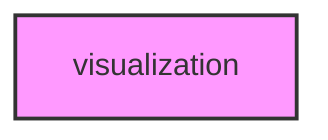

# VISUALIZATION

## Overview
Visualization and plotting utilities module for METAINFORMANT.

## 📦 Contents
- **[analysis/](analysis/)**
- **[genomics/](genomics/)**
- **[plots/](plots/)**
- `[__init__.py](__init__.py)`

## 📊 Structure



## Usage
Import module:
```python
from metainformant.metainformant.visualization import ...
```
