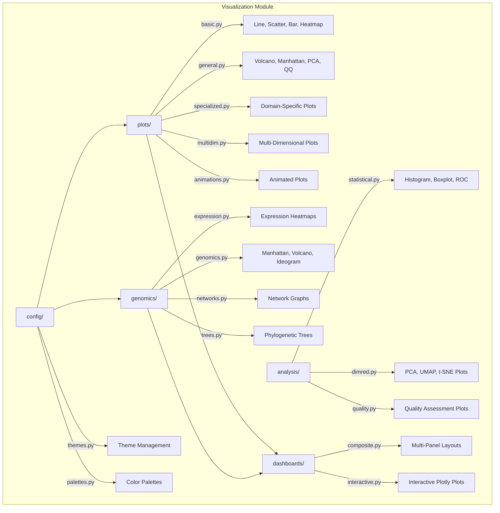

# Visualization Module

80+ plot types for biological data -- basic charts, statistical plots, genomic visualizations, expression heatmaps, interactive dashboards, and configurable themes.

## Architecture



## Key Capabilities

### Basic & Statistical Plots

```python
from metainformant.visualization.plots.basic import lineplot, scatter_plot, heatmap
from metainformant.visualization.analysis.statistical import histogram
import numpy as np

ax = lineplot(np.arange(100), np.random.randn(100), output_path="output/viz/line.png")
ax = histogram(np.random.randn(500), bins=30, output_path="output/viz/hist.png")
```

| Function | Module | Description |
|----------|--------|-------------|
| `lineplot`, `scatter_plot`, `heatmap`, `bar_plot` | `plots.basic` | Core chart types |
| `volcano_plot`, `manhattan_plot`, `pca_plot`, `qq_plot` | `plots.general` | Genomic/statistical composites |
| `histogram`, `correlation_heatmap` | `analysis.statistical` | Statistical distribution plots |
| `plot_pca` | `analysis.dimred` | PCA scatter with variance explained |

### Genomic Visualizations

```python
from metainformant.visualization.genomics.expression import plot_expression_heatmap
from metainformant.visualization.genomics.genomics import manhattan_plot, volcano_plot

ax = plot_expression_heatmap(expression_df, output_path="output/viz/heatmap.png")
ax = manhattan_plot(positions, pvalues, chromosomes, output_path="output/viz/manhattan.png")
```

### Themes, Palettes & Dashboards

```python
from metainformant.visualization.config.themes import apply_theme
from metainformant.visualization.config.palettes import categorical, expression_gradient
from metainformant.visualization.dashboards.composite import multi_panel

apply_theme("publication")
colors = categorical(5, palette="wong")  # Colorblind-safe
fig = multi_panel(plot_functions=[plot_a, plot_b], layout=(1, 2))
```

## Submodules

| Module | Purpose |
|--------|---------|
| [`plots/`](plots/) | Core chart types: `lineplot`, `scatter_plot`, `heatmap`, `bar_plot`, `volcano_plot`, `manhattan_plot` |
| [`genomics/`](genomics/) | Expression heatmaps, Manhattan plots, phylogenetic trees, network graphs |
| [`analysis/`](analysis/) | Statistical plots (`histogram`, `plot_pca`), quality assessment, time series |
| [`dashboards/`](dashboards/) | Multi-panel composites (`multi_panel`, `genomic_overview`) and interactive Plotly plots |
| [`config/`](config/) | Themes (`apply_theme`, `theme`) and color palettes (`categorical`, `expression_gradient`) |
| [`interactive_dashboards/`](interactive_dashboards/) | Extended interactive dashboard utilities |

## Quick Start

```python
from metainformant.visualization.plots.general import volcano_plot
import numpy as np
import pandas as pd

log2fc = np.random.randn(1000)
pvalues = np.random.uniform(0, 1, 1000)
ax = volcano_plot(log2fc, pvalues, output_path="output/viz/volcano.png")
```

## Related

- [`metainformant.gwas.visualization`](../gwas/visualization/) -- GWAS-specific plot suites
- [`metainformant.simulation.visualization`](../simulation/visualization/) -- Simulation result plots
- [`docs/visualization/`](../../../docs/visualization/) -- Visualization documentation
