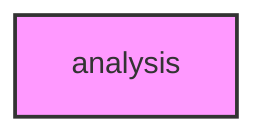

# ANALYSIS

## Overview
Functionality for analysis.

## 📦 Contents
- `[__init__.py](__init__.py)`
- `[dimred.py](dimred.py)`
- `[information.py](information.py)`
- `[quality.py](quality.py)`
- `[statistical.py](statistical.py)`
- `[timeseries.py](timeseries.py)`

## 📊 Structure



## Usage
Import module:
```python
from metainformant.metainformant.visualization.analysis import ...
```
