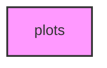

# PLOTS

## Overview
Functionality for plots.

## 📦 Contents
- `[__init__.py](__init__.py)`
- `[animations.py](animations.py)`
- `[basic.py](basic.py)`
- `[general.py](general.py)`
- `[multidim.py](multidim.py)`
- `[specialized.py](specialized.py)`

## 📊 Structure



## Usage
Import module:
```python
from metainformant.metainformant.visualization.plots import ...
```
