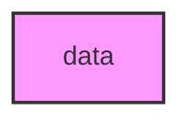

# DATA

## Overview
Functionality for data.

## 📦 Contents
- **[dna/](dna/)**
- **[epigenome/](epigenome/)**
- **[ontology/](ontology/)**
- **[phenotype/](phenotype/)**
- **[protein/](protein/)**
- **[rna/](rna/)**

## 📊 Structure



## Usage
Import module:
```python
from metainformant.data import ...
```
