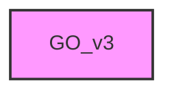

# GO_V3

## Overview
Functionality for GO_v3.

## 📦 Contents
- `[1_uniprot_ID_extract.py](1_uniprot_ID_extract.py)`
- `[2_genetogo.py](2_genetogo.py)`
- `[3_genetogotoanno.py](3_genetogotoanno.py)`
- `[4_genetogo_summary.py](4_genetogo_summary.py)`

## 📊 Structure



## Usage
Import module:
```python
from metainformant.GO_v3 import ...
```
