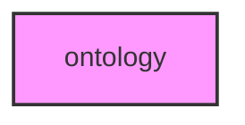

# ONTOLOGY

## Overview
Functionality for ontology.

## 📦 Contents
- **[GO_v3/](GO_v3/)**

## 📊 Structure


```mermaid
graph TD
    ontology[ontology]
    style ontology fill:#f9f,stroke:#333,stroke-width:2px
```

## Usage
Import module:
```python
from metainformant.ontology import ...
```
