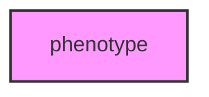

# PHENOTYPE

## Overview
Functionality for phenotype.

## 📦 Contents


## 📊 Structure


```mermaid
graph TD
    phenotype[phenotype]
    style phenotype fill:#f9f,stroke:#333,stroke-width:2px
```

## Usage
Import module:
```python
from metainformant.phenotype import ...
```
