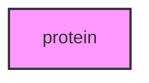

# PROTEIN

## Overview
Functionality for protein.

## Contents


## Structure


```mermaid
graph TD
    protein[protein]
    style protein fill:#f9f,stroke:#333,stroke-width:2px
```

## Usage
Import module:
```python
from metainformant.protein import ...
```
