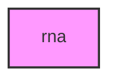

# RNA

## Overview
Functionality for rna.

## 📦 Contents
- **[curate/](curate/)**

## 📊 Structure


```mermaid
graph TD
    rna[rna]
    style rna fill:#f9f,stroke:#333,stroke-width:2px
```

## Usage
Import module:
```python
from metainformant.rna import ...
```
