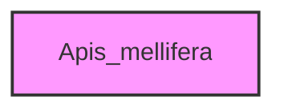

# APIS_MELLIFERA

## Overview
Functionality for Apis_mellifera.

## 📦 Contents
- **[tables/](tables/)**

## 📊 Structure



## Usage
Import module:
```python
from metainformant.Apis_mellifera import ...
```
