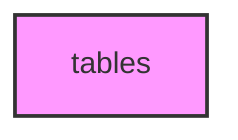

# TABLES

## Overview
Functionality for tables.

## 📦 Contents


## 📊 Structure


```mermaid
graph TD
    tables[tables]
    style tables fill:#f9f,stroke:#333,stroke-width:2px
```

## Usage
Import module:
```python
from metainformant.tables import ...
```
