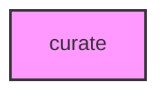

# CURATE

## Overview
Functionality for curate.

## 📦 Contents
- **[Apis_mellifera/](Apis_mellifera/)**

## 📊 Structure



## Usage
Import module:
```python
from metainformant.curate import ...
```
