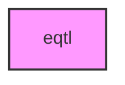

# EQTL

## Overview
Zero-mocks tests for the `metainformant.eqtl` eQTL pipeline: run-parameter
resolution, synthetic cohort generation, variant calling, and variant statistics.

## 📦 Contents
- `[__init__.py](__init__.py)`
- `[test_pipeline.py](test_pipeline.py)`
- `[test_support.py](test_support.py)`
- `[test_synthetic.py](test_synthetic.py)`
- `[test_variant_calling.py](test_variant_calling.py)`
- `[test_variant_stats.py](test_variant_stats.py)`

## 📊 Structure



## Usage
Import module:
```python
from metainformant.eqtl import ...
```
