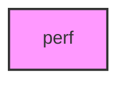

# PERF

## Overview
Performance benchmarks and fast pytest wrappers: campaign-scale batch memory
hygiene, ortholog bridge-table parsing/classification, and tau tissue-specificity.

## 📦 Contents
- `[bench_batches_memory.py](bench_batches_memory.py)`
- `[bench_ortholog_classification.py](bench_ortholog_classification.py)`
- `[bench_tau_expression.py](bench_tau_expression.py)`
- `[test_perf_benchmarks.py](test_perf_benchmarks.py)`

## 📊 Structure



## Usage
Import module:
```python
from metainformant.perf import ...
```
